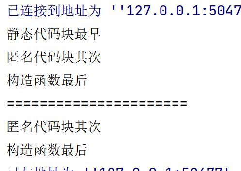
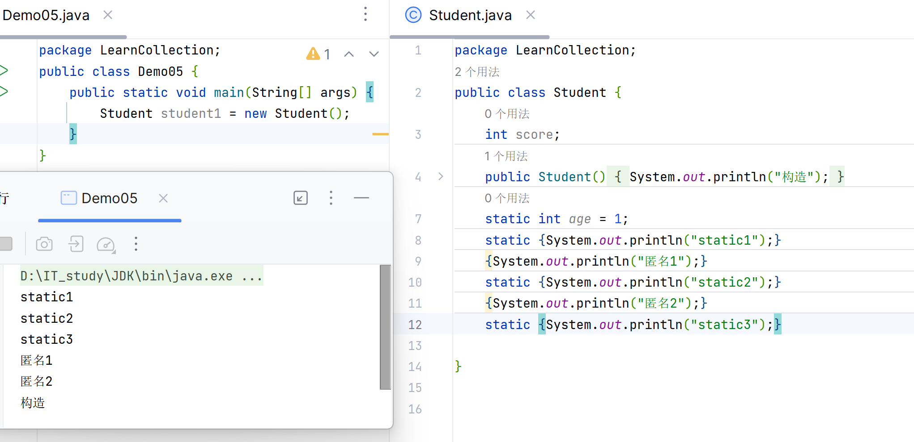

## 匿名代码块和静态代码块

写在类里

``` java
public class Main {
    public Main() {
        System.out.println("构造函数最后");
    }

    {
        //匿名代码块,和对象一起加载
        //常用于日志记录操作或初始化环境,初始化数据
        System.out.println("匿名代码块其次");
    }
    static {
        //static代码块,和类一起加载，因为类只加载一次,它也只加载一次,永久只执行一次
        //常用于初始化类,给static属性赋值(如果赋值的语句很长很复杂的时候)
        System.out.println("静态代码块最早");
    }


    public static void main(String[] args) {
        Main main1=new Main();//看谁先加载
        System.out.println("======================");
        Main main2=new Main();//为了验证“只执行一次”
    }
}

```


输出结果：







方法里也能写代码块

```java
public void hi(){
    {
        System.out.println("in 1");
    }
    System.out.println("out");
    {
        System.out.println("in 2");
    }
}
```

方法里static不行
