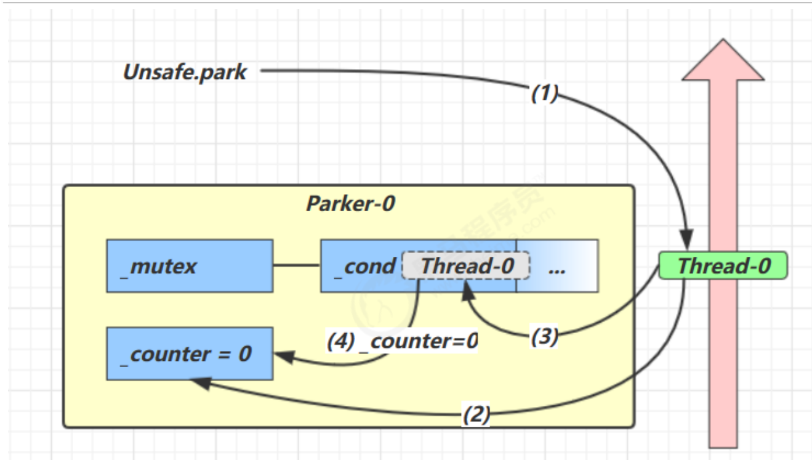
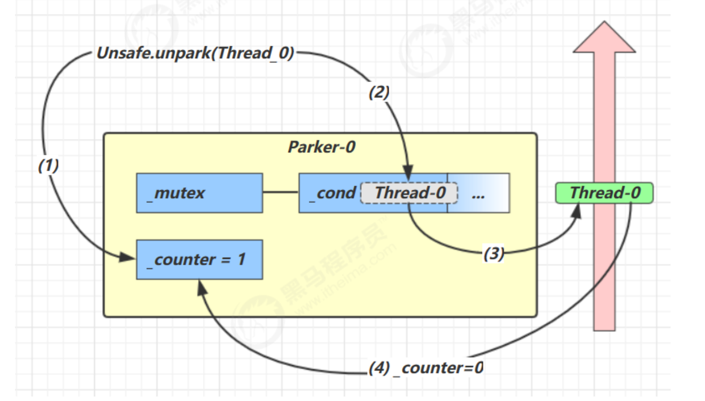
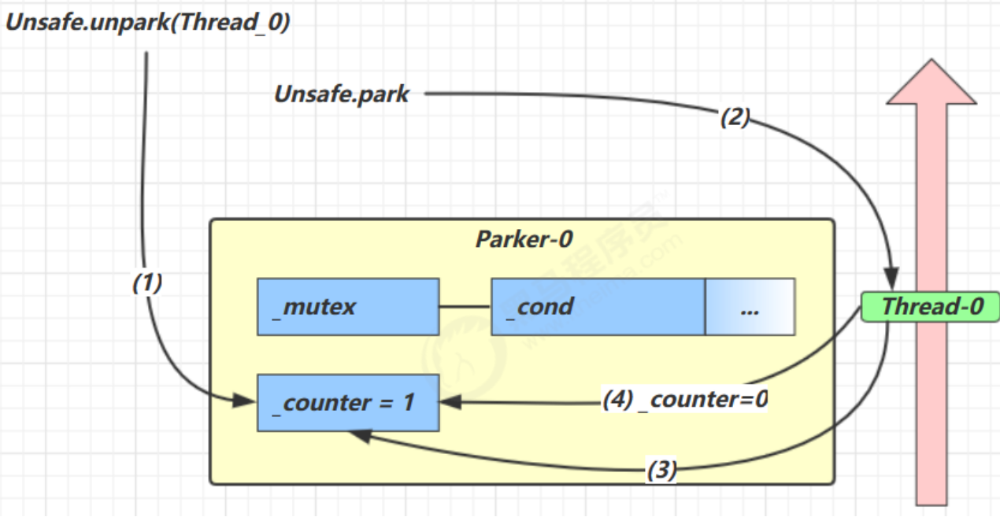

# LockSupport

## park#unpark

### 使用

```java
// 静态字段Thread t1,t2,t3
t1 = new Thread(() -> {
    log.info("<====================================>");
    LockSupport.unpark(t2);
}, "t1");

t2 = new Thread(() -> {
    LockSupport.park();
    log.info("<====================================>");
    LockSupport.unpark(t3);
}, "t2");

t3 = new Thread(() -> {
    LockSupport.park();
    log.info("<====================================>");
}, "t3");
t1.start();
t2.start();
t3.start();
try {
    t3.join();
} catch (InterruptedException e) {
    throw new RuntimeException(e);
}
log.info("<====================================>");
```

### 原理

每个线程维护一个Parker对象, 由`_counter`, `_cond`, `_mutex`

-   `_cond` condition
-   `_counter` 
    -   0 可阻塞
    -   1 不可阻塞
-   `park()` 检查`_counter`, 如果可以, 就进行阻塞
-   `unpark()` 使 `_counter`置为1, 然后唤醒线程, 线程检查`_counter`, 不可阻塞, 然后继续执行
-   线程在运行时(在`park()`调用之前调用`unpark()`), 那么`park()`不会生效, 多次


####park->unpark

调用park

1.  检查`_counter` 如果是0, 获取_mutex互斥锁
2.  线程进入`_cond`, Condition阻塞
3.  设置`_counter`为0



调用unpark

1.  设置`_counter`置为1
2.  将阻塞的线程唤醒
3.  线程恢复运行
4.  设置`_counter`为0



### unpark->park

1.  调用unpark()
2.  `_counter`置为1
3.  调用park
4.  检查`_counter`
5.  设置`_counter`为0
6.  不等待, 继续运行



##`parkNanos(long)` 和`parkUntil(long millis)`

-   `LockSupport#parkNanos(long)` , 单位纳秒
-   `LockSupport#parkUntil(long)` , 单位毫秒