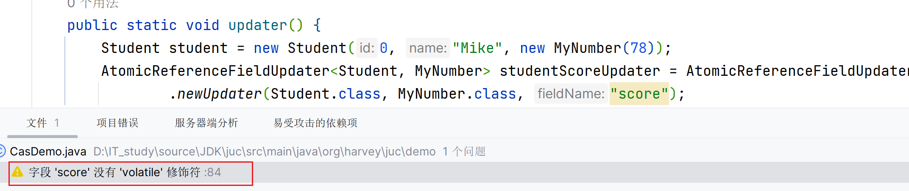
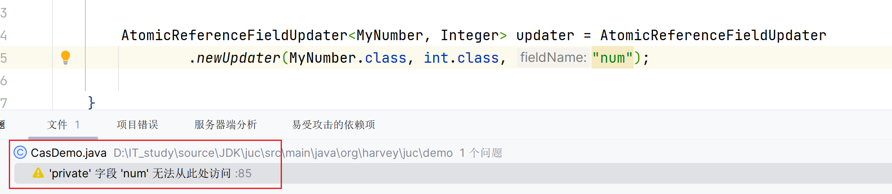

# Atomic包

## 原子数值

-   AtomicBoolean
-   AtomicLong
-   AtomicInteger

### 构造

```java
/**
 *维护volatile字段value
 */
public AtomicInteger(int initialValue) {
    this.value = initialValue;
}

/**
 * 默认velue为0
 */
public AtomicInteger() {
}
```

### CSA: `#compareAndSet()`

```java
private final AtomicInteger num;

public Account() {
    this.num = new AtomicInteger(1000);
}

private void sub(int delta) {
    Integer last, next;
    do {
        last = num.get();
        next = last - delta;
    } while (!num.compareAndSet(last, next));
}
```

### 自增自减

```java
AtomicInteger atom = new AtomicInteger(0);
System.out.println(atom.incrementAndGet()); // 1 ++atom
System.out.println(atom.getAndIncrement()); // 1 atom++
System.out.println(atom.getAndDecrement()); // 2 atom--
System.out.println(atom.decrementAndGet()); // 0 --atom
```

```java
System.out.println(atom.getAndAdd(2));  // 0
System.out.println(atom.getAndAdd(-2)); // 2
System.out.println(atom.addAndGet(2));  // 2
System.out.println(atom.addAndGet(-2)); // 0
```

### update

以`updateAndGet()`为例

```java
AtomicInteger atom = new AtomicInteger(4);
System.out.println(atom.updateAndGet(v -> v * v)); // 16
```

源码简单的

```java
int prev = get(), next = 0;
for (boolean haveNext = false;;) {
    if (!haveNext){
        // 获取结果
        next = updateFunction.applyAsInt(prev);
    }
    if (weakCompareAndSetVolatile(prev, next)){
        // CAS成功
        return next;
    }
    // CAS失败
    // prev发生改变, 才有必要执行updateFunction, 
    // 那就返回
    haveNext = (prev == (prev = get()));
}
```

## 原子引用

基于泛型实现

-   AtomicReference
-   AtomicMarkableReference
-   AtomicStampedReference


### compareAndSet

此compare基于引用的地址, 故使用如下代码

```java
private void sub(MyNum delta) {
    num.updateAndGet(v -> {
        v.num -= delta.num;
        return v;
    });
}
```

Atomic无法判断是否发生了变化, 故正确的方式应该是创建一个新的对象, 而不是直接去改字段的值

## ABA问题

对于Atomic类, 发生以下变化

1.  被包装的类本身处于状态A

2.  被包装的类本身更新到状态B

3.  被包装的类本身更新到状态A

4.  此时, 调用`compareAndSet()`, 能否感知道, 两次状态A之间发生过改变?

    **不行**

```java
AtomicInteger num = new AtomicInteger(1);
int a = num.get();
int b = -a;
System.out.println(num.compareAndSet(a, b));
b = num.get();
a = -b;
System.out.println(num.compareAndSet(b, a));
a = num.get();
b = -a;
System.out.println(num.compareAndSet(a, b));
```

现在有一个需求, 例如, 状态A转化为状态B极其消耗内存资源, 如果要转换, 要求只会被转换一次, 不能再转换第二次

对于Atomic 的包装类, 怎么感知到变化并防止进行第二次的改变?

### 版本号-`AtomicStampedReference`

对于每一次更改, 都维护一个版本号, 版本号作为是否更改, 第几次更改的一个依据和唯一标识

```java
AtomicStampedReference<Integer> num = new AtomicStampedReference(1, 0);
int a = num.getReference();
int stamp = num.getStamp();
int b = -a;
System.out.println(num.compareAndSet(a, b, stamp, stamp + 1));
```

```java
private void sub(BigInteger delta) {
    BigInteger newReference;
    BigInteger reference;
    int stamp;
    do {
        stamp = num.getStamp(); // 获取reference对应的版本号
        reference = num.getReference();
        newReference = reference.subtract(delta);
        // 此时, 突然去执行另一个线程, 把num的状态从A->B, 再B->A
        // 此时, reference是一样的, 但是stamp不一样了
        // compare失败, reference更改失败
    } while (num.compareAndSet(reference, newReference, stamp, stamp + 1));
}
```

### 标记-`AtomicMarkableReference`

不关心是否版本号具体是多少, 只关心是否出现过这个情况

```java
public Account() {
    this.num = new AtomicMarkableReference<>(new BigInteger("1"), true);
}

private void sub(BigInteger delta) {
    BigInteger reference = num.getReference();
    BigInteger newReference = reference.subtract(delta);
    // 只修改一次
    num.compareAndSet(reference, newReference, true, false);
}
```

## 原子数组

-   AtomicIntegerArray
-   AtomicLongArray
-   AtomicIntegerArray

### 线程不安全操作

```java
int[] array = new int[10];
List<Thread> threads = new ArrayList<>();
for (int i = 0; i < array.length; i++) {
    threads.add(new Thread(() -> {
        for (int j = 0; j < 10000; j++) {
            int index = j % array.length;
            array[index]++;
        }
    }));
}
threads.forEach(Thread::start);
threads.forEach(t -> {
    try {
        t.join();
    } catch (InterruptedException e) {
        throw new RuntimeException(e);
    }
});
System.out.println(Arrays.toString(array));
```
原子数组保证线程安全

### 创建

```java
AtomicIntegerArray array = new AtomicIntegerArray(10);
```

### 访问与更新

```java
array.getAndIncrement(index);
```

### 读取

```java
System.out.println(array);
```

## 字段更新器

-   AtomicReferenceFieldUpdater
-   AtomicIntegerFieldUpdater
-   AtomicLongFieldUpdater

### 创建更新器


```java
AtomicReferenceFieldUpdater<Student, MyNumber> studentScoreUpdater = AtomicReferenceFieldUpdater
        .newUpdater(Student.class, MyNumber.class, "score");
```




修饰了volatile之后



尝试过了, 真的对private毫无办法, 真的菜!

顶多, 也只能对自己写的类里准备一个提供自己字段的更新器的方法了吧

### 更新

```java
AtomicReferenceFieldUpdater<Student, MyNumber> updater = AtomicReferenceFieldUpdater
        .newUpdater(Student.class, MyNumber.class, "score");
MyNumber score = new MyNumber(78);
Student student = new Student(0, "Mike", score);
updater.compareAndSet(student, score, new MyNumber(99));
```

###

