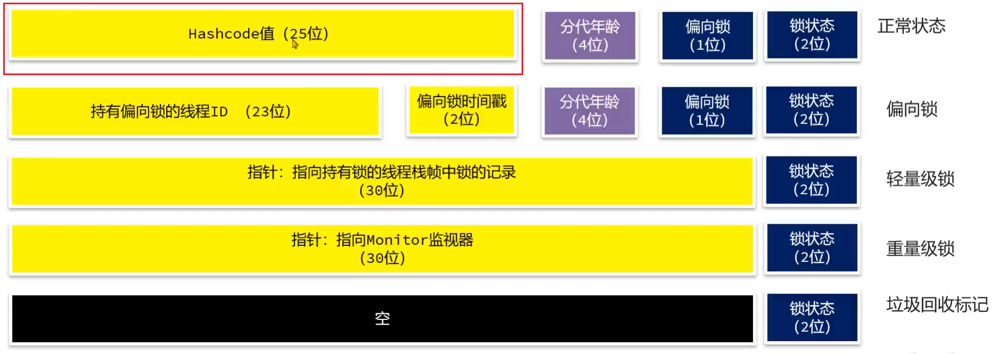
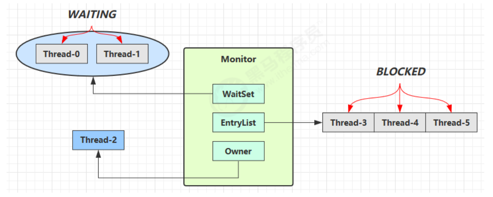

# Monitor

>   监视器/ 管程

Monitor锁, 即重量级锁

## Java对象头

Java对象头(*Object Header*), 以32位虚拟机为例

-   普通对象的对象头 *64 bit*
    -   Mark Word *32 bit*
    -   Klass Word *32 bit* 类对象指针
-   数组对象对象头 *96 bit*
    -   Mark Word *32 bit*
    -   Klass Word *32 bit*
    -   array length *32 bit*


-   Mark Word (32位虚拟机)

    

    锁状态

    -   00 轻量级锁
    -   01 无锁/偏向锁
    -   10 重量级锁/Monitor锁
    -   11 GC

## Monitor概述

每个JAVA对象都可以关联一个Monitor对象

如果使用synchronized给对象上锁(**重量级**)之后, 该对象头的MarkWord中就被设置指向Monitor对象指针

Monitor对象由操作系统提供



1.  当线程Thread对象遇到`synchronized(obj)`

2.  从Obj的Monitor指针获取Monitor对象, 

    Thread对象成为Monitor的所有者

    (Monitor的Owner字段被赋值该Thread对象)

3.  此时有另一个线程对象Thread2也遇到`synchronized(obj)`了

4.  从Obj的Monitor指针获取Monitor对象,  一看Monitor已经有Owner了

5.  不能成为Monitor的Owner, 只能存在Monitor的EntryList里

6.  Thread3也来了, 同Thread2, 加在Thread2后面

7.  Thread结束了对锁的占用

8.  Monitor从EntryList中选择新的Thread作为自己的Owner, 规则比较复杂, 依据JDK的底层实现

## 字节码

```java
public class Main {
    public static int num = 0;
    public static final Object LOCK = new Object();

    public static void main(String[] args) {
        synchronized (LOCK) {
            num++;
        }
    }
}
```

```shell
 0 getstatic #2 <org/harvey/juc/Main.LOCK : Ljava/lang/Object;> # 静态字段lock引用
 3 dup		
 4 astore_1 													# lock引用存入slot 1
 5 monitorenter													# 将lock对象的MarkWord置为Monitor指针
 6 getstatic #3 <org/harvey/juc/Main.num : I>					# 获取静态字段num
 9 iconst_1														# 准备常数1
10 iadd															# 将常数1和静态字段的值相加
11 putstatic #3 <org/harvey/juc/Main.num : I>					# 将结果存入静态字段num
14 aload_1														# 获取lock引用
15 monitorexit													# lock对象MarkWord重置,唤醒EntryList
16 goto 24 (+8)													# 跳转到24行(当前行+8)
	# 有异常而跳出的情况
19 astore_2														# 保存异常对象的引打到slot 2
20 aload_1 														# 获取锁的引用
21 monitorexit													# lock对象MarkWord重置,唤醒EntryList
22 aload_2														# 加载slot内的异常对象的引用
23 athrow														# 抛出这个异常
24 return														# 返回
```

