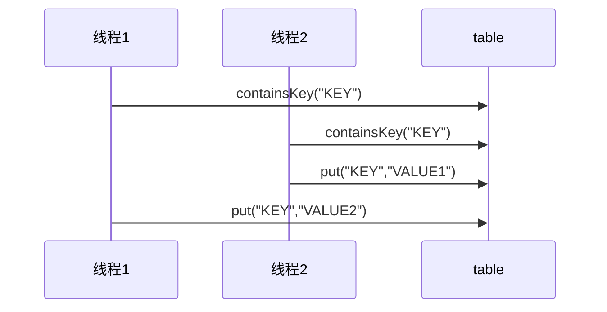

# 线程安全类

-   String

-   Integer等包装类

-   Random

-   Vector

-   Hashtable

-   java.util.concurent.*

    *JUC*


此线程安全指, 多个线程调用它们同一个实例的某个方法时, 是线程安全的

它们的每个方法都是原子的(把synchronized修饰public方法)

但是它们多个方法的组合不是原子的

## 例

```java
Map<String, String> table = new Hashtable<>();
new Thread(() -> {
    if (table.containsKey("KEY")) {
        table.put("KEY", "VALUE1");
    }
}, "线程1").start();
new Thread(() -> {
    if (table.containsKey("KEY")) {
        table.put("KEY", "VALUE1");
    }
},"线程2").start();
```



## 不可变类

>   以String和Integer为例

String和Integer中的属性, 都是只能读, 不能写的, 故实现了线程安全

