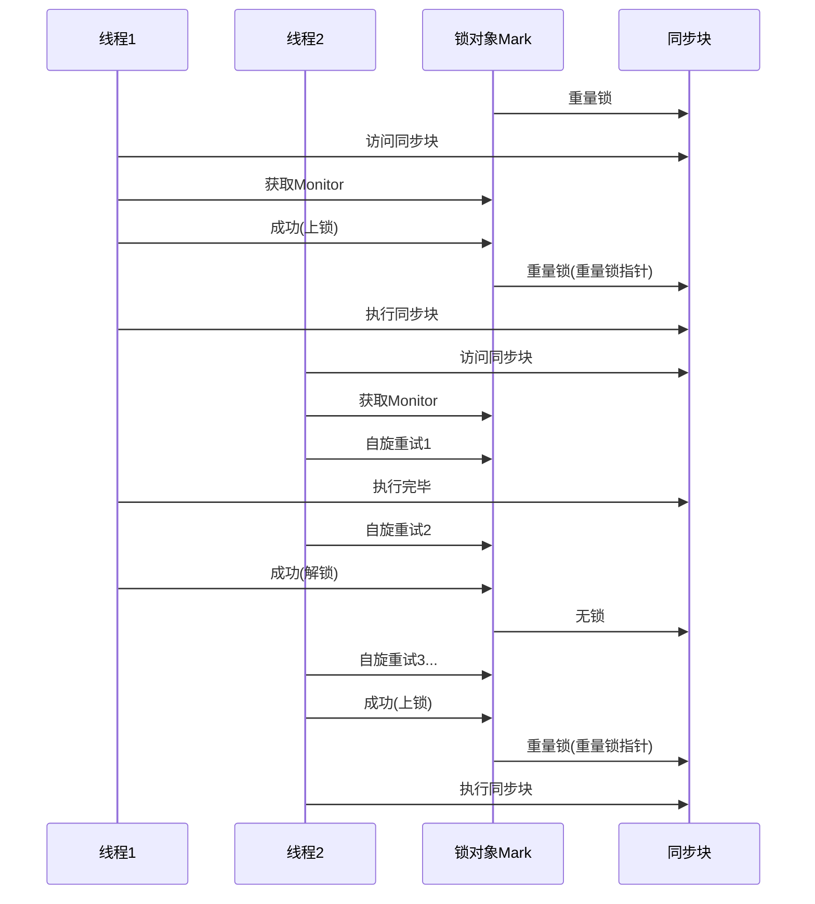
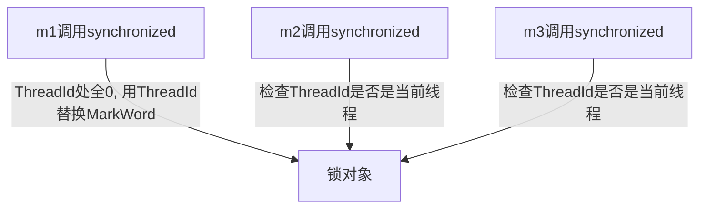

# synchronized优化


## 轻量级锁

一个对象虽然有多线程访问, 但多线程访问的时间是错开的(也就是没有竞争), 那么可以用轻量级锁来优化

### 语法

轻量级锁对使用者是"透明的", 语法依然是`synchronized`

JVM优先用轻量级锁加锁, 轻量级锁失败了, 再升级成重量级锁

### 上锁流程

```java
static final Object LOCK = new Object();
public static void out(){
    synchronized(LOCK){
		// 同步块 A
        in();
    }
}
public static void in(){
    synchronized(LOCK){
		// 同步块 B
    }
}
```

#### 上锁

1.  创建**锁记录(Lock Record)**对象

    -   锁记录

        每个线程的栈帧都会包含一个锁记录

        内部存储锁定对象的**MarkWord**和锁对象对象指针(**ObjectReference**)

2.  锁记录的ObjectReference指向锁对象

3.  尝试用CAS替换Object中的MarkWord, 将MarkWord值存入锁记录

    -   将锁记录中的Lock Recod的地址和Object的MarkWord进行交换
    -   此时, 对象头的MarkWord保存Lock Record的地址, 锁状态为00
    -   Lock Record保存对象头的MarkWord

    如果对象锁的锁状态不是01(无锁/偏向锁), 表示现在不是可以加上轻量级锁的状态, 就失败

    失败则进入"锁膨胀"过程

4.  如果锁中再上synchronized锁, 那么再增加一条Lock Record

    如果两重锁的锁对象一样, 是相同的锁对象, 那么第二条锁记录的CAS交换操作将失败

    但是依据锁对象的对象头, 可以获取到锁记录的地址, 依据地址找到锁记录, 发现两条记录处于同一条线程

    谓之**synchronized的锁重入**

    此时失败的Lock Record的存MarkWord的字段存入null

#### 解锁

1.  退出synchronized代码块/解锁 时

2.  如果有取值为null的锁记录, 表示重入

    -   清除此锁记录,  表示解开一把锁

3.  如果取值不为null时

    用CAS将锁对象Object的MarkWord还原

    -   此时失败(锁状态不为00), 说明轻量级锁进行了锁膨胀或依据升级为重量级锁

        进入重量级锁解锁流程

### 锁膨胀

在尝试加轻量级锁的过程, CAS操作无法成功

此时可能是其他线程为此对象加上了轻量级锁(有竞争)

此时认为轻量级锁不能满足这段代码的锁的需求

此时进行所膨胀, 将轻量级锁变为重量级锁

#### 流程

1.  为Object锁对象省区Monitor锁, Objeict指向重量级锁地址, 并将锁状态置为10(重量级锁)

2.  锁膨胀的线程进入Monitor的EntryList 的 BLOCKED

3.  获取到轻量级锁的线程解锁过程中, 发现锁状态不再是轻量级锁, 是为重量级锁, 故CAS失败

    进入重量级锁解锁流程

    1.  将Owner变为空
    2.  从EntryList中竞选
    3.  唤醒竞选成功的锁

## 自旋优化

重量级锁竞争时, 可用自旋来进行优化

由于阻塞会导致上下文切换, 而自旋, 即循环重试, 尝试在几次冲时候就能获取到锁, 避免了阻塞

如果当前线程自旋成功(持锁线程退出同步块, 释放了锁), 即可拥有当前对象锁

自旋只适合在多核的情况下使用, 单核的情况下, 一个线程在自旋, 一个线程在指向代码块的内容, 没有CPU可用, 就没有意义



-   Java6之后的自旋锁是自适应的

    例如, 对象刚刚的以此自旋锁操作成功过, 那么认为这次自旋成功的可能性会高, 就会多自旋几次

    反之, 就会少自旋甚至不自旋

-   自旋占用CPU时间, 单核CPU自旋就是浪费, 多核

-   Java7之后不能控制是否开启自旋功能

## 偏向锁

>   Biased

轻量级锁在每一次**锁重入**的时候需要进行CAS操作

Java6中引入偏向锁

只有在第一次使用CAS将**线程ID**设置到对象的MarkWord头

之后检查这个线程ID是自己的, 表示没有发生竞争, 不用重新CAS

以后只要不发生竞争, 这个对象就归该线程所有



偏向锁不只是对于锁重入(一个synchronized内嵌套synchronized)避免CAS操作

其本质上是针对一个锁的, 而不是synchronized之间的结构

一个锁对象, 在进入synchronized之后, 如果还没有被标记偏向锁的ThreadId, 就会被标记上ThreadId, 之后锁释放了, 这个ThreadId不会删除(置0), 只要这个锁对象一直被同一个线程, 那么就会一直被标记为这个线程的偏向锁, 直到有其他线程覆盖这个锁对象, 让这个锁进行转换(变为轻量级锁, 有竞争则锁膨胀为重量级锁, 看情况)

### 状态


-   **锁状态** *2 bit*, 01, 同正常状态

-   **偏向锁** *1bit*, 表明是否启用了偏向锁(1表示开启偏向锁, 0表示正常状态)

-   **偏向锁时间戳** *2bit* , 用于 *批量重偏向* 和 *批量撤销*

-   **线程ID** 操作系统提供, 和从Java层面获取的线程ID不同

-   如果开启了偏向锁(默认开启), 那么MarkWord的值为0x5, 即 *线程ID* 和 *偏向锁时间戳* , *分代年龄*都是0

-   偏向锁的开启是有延迟的, 在程序启动几秒后生效

    可添加JVM参数来禁用延迟

    ```shell
    -XX:BiasedLockingStartupDelay=0
    ```

-   禁用偏向锁(一个程序的业务就是都是一个对象锁反复被多个锁使用的情况)

    禁用偏向锁, 这是是Normal状态

    ```shell
    -XX:-UseBiasedLocking
    ```

    启用偏向锁(默认)

    ```shell
    -XX:+UseBiasedLocking
    ```

-   **`hashCode()`**  调用锁对象的hashCode方法, 将会撤销该对象的偏向锁, 转为正常状态 *Normal*

    HashCode也是用了才会产生, 只有在调用了HashCode方法之后, 才会将HashCode填充到MarkWord中去, 并转为Normal状态

### 撤销

-   调用hashCode(), 偏向锁转为Normal
-   当有其他线程使用偏向锁时, 偏向锁升级为轻量级锁, 轻量级锁释放之后将恢复为Normal不可偏向
-   调用wait-notify(All)也会撤销偏向锁, 因为wait-notify(All)是重量级锁持有的操作, 轻量级锁和偏向锁的目的就是为了避免阻塞

撤销偏向也会造成性能损失

### 批量重偏向

如果对象虽然被多个线程访问, 但没有竞争(达到轻量级锁的条件)

这是, 偏向了线程A的对象仍有机会重新偏向线程T2

重偏向会重置对象的ThreadID

当撤销偏向锁达到阈值(20次)后, JVM将考虑给这些锁对象枷锁时重新偏向至上锁线程

```java
int loop = 30;
Vector<MyLock> locks = new Vector<>();
for (int i = 0; i < loop; i++) {
    MyLock lock = new MyLock();
    locks.add(lock);
}
t1 = new Thread(() -> {
    log.info("<====================================>");
    for (int i = 0; i < loop; i++) {
        MyLock lock = locks.get(i);
        debugMarkWord(i, lock);
        synchronized (lock) { // 使用偏向锁
            debugMarkWord(i, lock);
        }
        debugMarkWord(i, lock);
    }
    LockSupport.unpark(t2);
}, "t1");

t2 = new Thread(() -> {
    LockSupport.park();
    log.info("<====================================>");
    for (int i = 0; i < 15; i++) {
        MyLock lock = locks.get(i);
        debugMarkWord(i, lock);
        synchronized (lock) { // i=19之前的lock被降为Normal故直接转轻量级锁
            debugMarkWord(i, lock);
        }
        debugMarkWord(i, lock);
    }
    LockSupport.unpark(t3);
}, "t2");

t3 = new Thread(() -> {
    LockSupport.park();
    log.info("<====================================>");
    for (int i = 15; i < 30; i++) {
        MyLock lock = locks.get(i);
        debugMarkWord(i, lock);
        synchronized (lock) {// i=19之前的lock被降为Normal故直接转轻量级锁,
            // 19及之后的lock被重偏向(即使是不同的线程, 也就是说, 这种撤销是记录在锁对象的类上的)
            debugMarkWord(i, lock);
        }
        debugMarkWord(i, lock);
    }
}, "t3");
t1.start();
t2.start();
t3.start();
```

### 批量撤销

在撤销超过批量重偏向的阈值, 达到另一阈值(40次)之后, JVM认为这个类被好多线程使用,  不适合用偏向

自此之后, 该类的新创建的对象, 将直接失去偏向锁的能力, 创建出来直接就是Normal状态

```java
static class MyLock {
}

static Thread t1, t2, t3;

public static void main(String[] args) {
    Main.test0();
}

public static void test0() {
    int loop = 39; // loop=38不会触发批量撤销
    Vector<MyLock> locks = new Vector<>();
    for (int i = 0; i < loop; i++) {
        MyLock lock = new MyLock();
        locks.add(lock);
    }
    t1 = new Thread(() -> {
        log.info("<====================================>");
        loopToLock(loop, locks);
        LockSupport.unpark(t2);
    }, "t1");

    t2 = new Thread(() -> {
        LockSupport.park();
        log.info("<====================================>");
        loopToLock(loop, locks);
        LockSupport.unpark(t3);
    }, "t2");

    t3 = new Thread(() -> {
        LockSupport.park();
        log.info("<====================================>");
        loopToLock(loop, locks);
    }, "t3");
    t1.start();
    t2.start();
    t3.start();
    try {
        t3.join();
    } catch (InterruptedException e) {
        throw new RuntimeException(e);
    }
    log.info("<====================================>");
    // 此时已经有39(loop)次撤销操作, 直接不可偏向
    // loop=38不会触发批量撤销, 新对象依旧可偏向
    log.debug(markWordMessage(new MyLock()));
}

private static void loopToLock(int loop, Vector<MyLock> locks) {
    for (int i = 0; i < loop; i++) {
        MyLock lock = locks.get(i);
        debugMarkWord(i, lock);
        synchronized (lock) { // i=19之前的lock被降为Normal故直接转轻量级锁,
            // 19及之后的lock被重偏向
            debugMarkWord(i, lock);
        }
        debugMarkWord(i, lock);
    }
}

private static void debugMarkWord(int index, MyLock lock) {
    log.debug(index + "\t" + markWordMessage(lock));
}

private static String markWordMessage(MyLock lock) {
    ClassLayout classLayout = ClassLayout.parseInstance(lock);

    String printable = classLayout.toPrintable();
    return printable.substring(192, 200);
}
```

## 锁消除

>   Eliminate Locks

Java中的JIT即时编译, 能帮助热点代码去除没有实际意义的synchronized, 以提高效率

```java
static int x = 0;
public void fun(){
    Object lock = new Object(); // lock一定不会被共享, 也一定不会发生线程安全问题
    synchronized(lock){ // 此锁就是没有意义的, 会被JIT优化以提高效率
        x++;
    }
}
```

关闭锁消除(默认开启)

```shell
-XX:-EliminateLocks
```

```java
public static void testEliminateLock(boolean useSynchronized) {
    List<Thread> list = new ArrayList<>();
    List<Object> locks = new ArrayList<>();
    for (int i = 0; i < 20; i++) {
        list.add(new Thread(() -> {
            LockSupport.park();
            if (useSynchronized) {
                safeMethod(locks);
            } else {
                unsafeMethod(locks);
            }
        }));
    }
    for (int i = 0; i < 20; i++) {
        list.get(i).start();
    }
    for (int i = 0; i < 20; i++) {
        LockSupport.unpark(list.get(i));
    }
}

private static void safeMethod(List<Object> locks) {
    synchronized (locks) {
        for (int i = 0; i < 1000; i++) {
            locks.add(new Object());
            locks.remove(0);
        }
    }
}

private static void unsafeMethod(List<Object> locks) {
    // IndexOutOfBoundException
    for (int i = 0; i < 1000; i++) {
        locks.add(new Object());
        locks.remove(0);
    }
}
```

## 锁粗化

>   未有确切测试, 能体现 JVM 的锁粗化的优化

