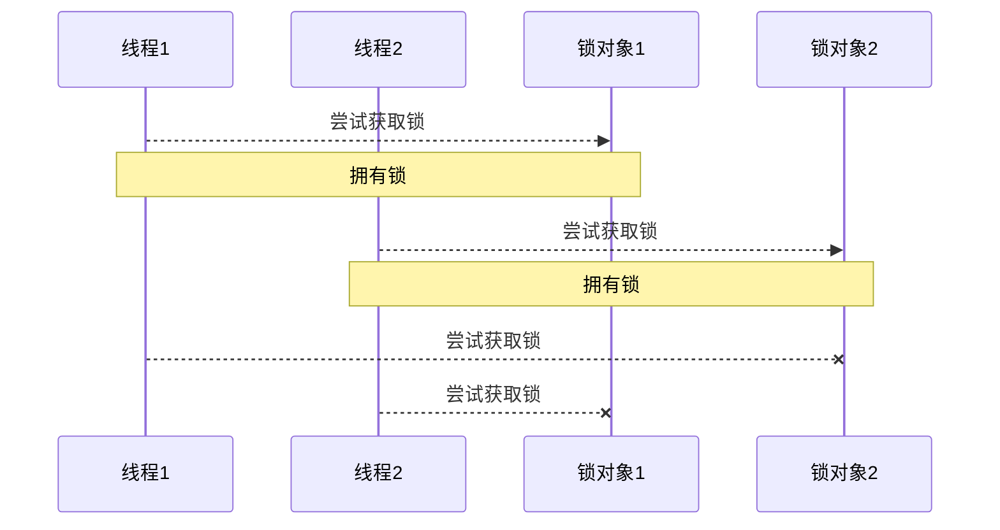

# 线程的活跃性

线程的代码是有限的, 但是由于因素的干扰, 代码运行不完

## 死锁

### 现象

线程需要同时获得多把锁, 容易产生死锁

Thread1获取了A对象锁, Thread1想获得B对象锁

Thread2获取了B对象锁, Thread2想获得A对象锁

```java
private static final Object LOCK1 = new Object();
private static final Object LOCK2 = new Object();

public static void task1() {
    synchronized (LOCK1) {
        log.debug("task1");
        sleep(1);
        log.debug("task1 finished");
        synchronized (LOCK2) {
            log.debug("task1 in");
            sleep(1);
            log.debug("task1 in finished");
        }
    }
}

public static void task2() {
    synchronized (LOCK2) {
        log.debug("task2");
        sleep(2);
        log.debug("task2 finished");
        synchronized (LOCK1) {
            log.debug("task2 in");
            sleep(1);
            log.debug("task2 in finished");
        }
    }
}

public static void demo() {
    new Thread(MultipleLock::task1,"Thread1").start();
    new Thread(MultipleLock::task2,"Thread2").start();
}
```

### 检查死锁

1.  Java命令行的`Jstack`

    ```
    ... 
    "Thread1" #21 prio=5 os_prio=0 cpu=15.62ms elapsed=102.00s tid=0x000001d4b5bc4000 nid=0xe44 waiting for monitor entry  [0x000000add41ff000]
       java.lang.Thread.State: BLOCKED (on object monitor)
            at org.harvey.juc.demo.DeathLockDemo.task1(DeathLockDemo.java:32)
            - waiting to lock <0x0000000713995648> (a java.lang.Object)
            - locked <0x0000000713995638> (a java.lang.Object)
            at org.harvey.juc.demo.DeathLockDemo$$Lambda$5/0x00000008000be840.run(Unknown Source)
            at java.lang.Thread.run(java.base@11.0.21/Thread.java:829)

    "Thread2" #22 prio=5 os_prio=0 cpu=0.00ms elapsed=102.00s tid=0x000001d4b5c0c800 nid=0xbec waiting for monitor entry  [0x000000add42ff000]
       java.lang.Thread.State: BLOCKED (on object monitor)
            at org.harvey.juc.demo.DeathLockDemo.task2(DeathLockDemo.java:45)
            - waiting to lock <0x0000000713995638> (a java.lang.Object)
            - locked <0x0000000713995648> (a java.lang.Object)
            at org.harvey.juc.demo.DeathLockDemo$$Lambda$6/0x00000008000bec40.run(Unknown Source)
            at java.lang.Thread.run(java.base@11.0.21/Thread.java:829)

    ...

    Found one Java-level deadlock:
    =============================
    "Thread1":
      waiting to lock monitor 0x000001d4b5615f00 (object 0x0000000713995648, a java.lang.Object),
      which is held by "Thread2"
    "Thread2":
      waiting to lock monitor 0x000001d4b5616a00 (object 0x0000000713995638, a java.lang.Object),
      which is held by "Thread1"

    Java stack information for the threads listed above:
    ===================================================
    "Thread1":
            at org.harvey.juc.demo.DeathLockDemo.task1(DeathLockDemo.java:32)
            - waiting to lock <0x0000000713995648> (a java.lang.Object)
            - locked <0x0000000713995638> (a java.lang.Object)
            at org.harvey.juc.demo.DeathLockDemo$$Lambda$5/0x00000008000be840.run(Unknown Source)
            at java.lang.Thread.run(java.base@11.0.21/Thread.java:829)
    "Thread2":
            at org.harvey.juc.demo.DeathLockDemo.task2(DeathLockDemo.java:45)
            - waiting to lock <0x0000000713995638> (a java.lang.Object)
            - locked <0x0000000713995648> (a java.lang.Object)
            at org.harvey.juc.demo.DeathLockDemo$$Lambda$6/0x00000008000bec40.run(Unknown Source)
            at java.lang.Thread.run(java.base@11.0.21/Thread.java:829)

    Found 1 deadlock.

    ```

2.  Java命令行, `jconsol`

    

    

### 哲学家就餐

五位哲学家, 围坐在圆桌旁

1.  哲学家, 只会思考和吃饭, 思考后吃饭, 吃饭后思考
2.  吃东西的时候, 他们就停止思考, 思考的时候也停止吃东西
3.  餐桌中间有一大碗意大利面, 每两个哲学家之间有一只餐叉. 因为用一只餐叉很难吃到意大利面, 所以假设哲学家必须用两只餐叉吃东西
4.  他们只能使用自己左右手边的那两只餐叉

```java
private static void sleep(double timeout) {
    try {
        TimeUnit.MILLISECONDS.sleep((int) (timeout * 1000));
    } catch (InterruptedException e) {
        throw new RuntimeException(e);
    }
}

@AllArgsConstructor
@Getter
private static class Fork {
    public final String name;
}

private static class Philosopher extends Thread {
    private final PhilosopherDinner.Fork fork1;
    private final PhilosopherDinner.Fork fork2;

    public Philosopher(PhilosopherDinner.Fork fork1, PhilosopherDinner.Fork fork2, String name) {
        super(name);
        this.fork1 = fork1;
        this.fork2 = fork2;
    }

    @Override
    public void run() {
        while (true) {
            snatchForks();
        }
    }

    private void snatchForks() {
        synchronized (fork1) {
            log.debug("get " + fork1.getName());
            synchronized (fork2) {
                log.debug("get " + fork2.getName());
                eat();
            }
        }
    }

    private static void eat() {
        PhilosopherDinner.sleep(0.1* RANDOM.nextInt(20));
        log.debug("eat");
    }
}

public static void demo() {
    PhilosopherDinner.Fork fork1 = new PhilosopherDinner.Fork("fork1");
    PhilosopherDinner.Fork fork2 = new PhilosopherDinner.Fork("fork2");
    PhilosopherDinner.Fork fork3 = new PhilosopherDinner.Fork("fork3");
    PhilosopherDinner.Fork fork4 = new PhilosopherDinner.Fork("fork4");
    PhilosopherDinner.Fork fork5 = new PhilosopherDinner.Fork("fork5");
    new PhilosopherDinner.Philosopher(fork1,fork2,"Philosopher1").start();
    new PhilosopherDinner.Philosopher(fork2,fork3,"Philosopher2").start();
    new PhilosopherDinner.Philosopher(fork3,fork4,"Philosopher3").start();
    new PhilosopherDinner.Philosopher(fork4,fork5,"Philosopher4").start();
    new PhilosopherDinner.Philosopher(fork5,fork1,"Philosopher5").start();
}
```

## 活锁

### 现象

两个线程互相改变对方的结束条件, 结果都没法结束

```java
static int count = 0;

public static void task1() {
    while (count > -5) {
        sleep(0.2);
        count--;
        log.debug(count + "");
    }
}

public static void task2() {
    while (count < 5) {
        sleep(0.2);
        count++;
        log.debug(count + "");
    }
}

public static void demo() {
    new Thread(LiveLockDemo::task1, "Thread1").start();
    new Thread(LiveLockDemo::task2, "Thread2").start();
}
```

### 解决

设置一个随机的睡眠时间, 错开两个会产生活锁的线程

## 饥饿

死锁: 



顺序加锁解决问题

```mermaid
sequenceDiagram

participant t1 as 线程1
participant t2 as 线程2
participant l1 as 锁对象1
participant l2 as 锁对象2

t1 -->>+ l1 : 尝试获取锁
Note over t1,l1: 拥有锁对象1
t2 --x  l1 : 尝试获取锁
t1 -->>+ l2 : 尝试获取锁
Note over t1,l2: 拥有锁对象2
t2 --x  l1 : 尝试获取锁
t1 -->>- l2 : 释放锁
t2 --x  l1 : 尝试获取锁
t1 -->>- l1 : 释放锁
t2 -->>+  l1 : 尝试获取锁
Note over t2,l1: 拥有锁对象1
t2 -->>+  l2 : 尝试获取锁
Note over t2,l2: 拥有锁对象2
t2 -->>- l2 : 释放锁
t2 -->>- l1 : 释放锁
```

```java
public static void demo() {
    PhilosopherDinner.Fork fork1 = new PhilosopherDinner.Fork("fork1");
    PhilosopherDinner.Fork fork2 = new PhilosopherDinner.Fork("fork2");
    PhilosopherDinner.Fork fork3 = new PhilosopherDinner.Fork("fork3");
    PhilosopherDinner.Fork fork4 = new PhilosopherDinner.Fork("fork4");
    PhilosopherDinner.Fork fork5 = new PhilosopherDinner.Fork("fork5");
    new PhilosopherDinner.Philosopher(fork1,fork2,"Philosopher1").start();
    new PhilosopherDinner.Philosopher(fork2,fork3,"Philosopher2").start();
    new PhilosopherDinner.Philosopher(fork3,fork4,"Philosopher3").start();
    new PhilosopherDinner.Philosopher(fork4,fork5,"Philosopher4").start();
    // 改为顺序加锁
    new PhilosopherDinner.Philosopher(fork1,fork5,"Philosopher5").start();
}
```

一段时间后, 统计每个哲学家吃到的次数

```
philosopher1 = 56
philosopher2 = 109
philosopher3 = 232
philosopher4 = 528
philosopher5 = 75
```

1和5特别少, 4特别多

## 死锁和饥饿的解决

[ReentrantLock](../juc/Day04-ReentrantLock.md)

