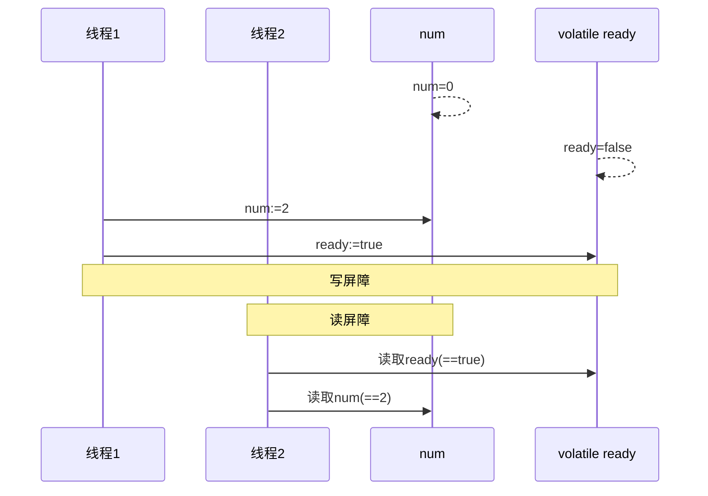
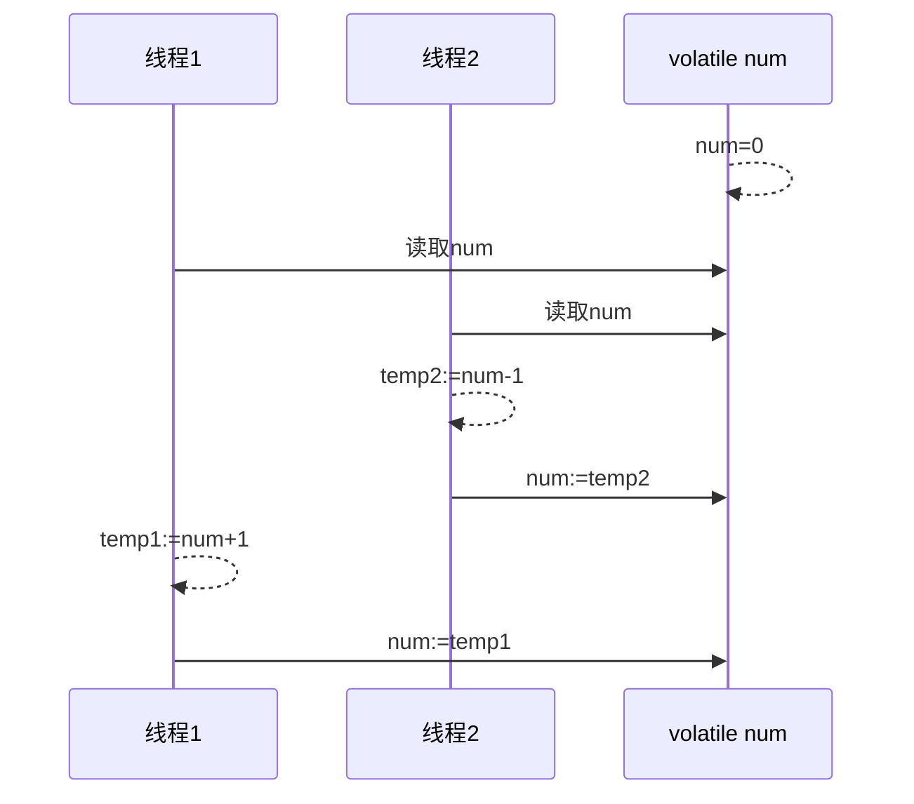

# volatile

==***在 JDK1.5 之后才会生效***==

## 屏障

底层原理实现的内存屏障(*Memory Barrier* or *Memory Fence*)

-   对volatile变量的写指令后加入**写屏障**
-   对volatile变量的读指令前加入**读屏障**

### 写屏障( *sfence* )

-   对volatile变量的写指令后加入**写屏障**
-   保证在该屏障之前的对共享变量(字段)的改动, 都**同步**到**主存**当中
-   保证在该屏障之前的代码, 不会在**指令重排序**时, 排到**写屏障**之后

### 读屏障( *lfence* )

-   对volatile变量的写指令后加入**写屏障**
-   保证在该屏障之后的变量的读取, **加载**的是**主存**中的最新数据
-   保证在该屏障之后的代码, 不会在**指令重排序**时, 排到**读屏障**之前

## 保证可见性分析

### 写屏障

生成在变量之后

保证在该屏障之前的对共享变量(字段)的改动, 都同步到主存当中

```java
public void act2(){
    num = 2;
    ready = true; // ready 是 volatile修饰的变量
    // 赋值是写操作
    // 在其后生成写屏障
    // 对该共享变量极其之前的一切共享变量的写操作, 同步到主存
}
```

### 读屏障

生成在变量之前

保证在该屏障之后的变量的读取, 加载的是主存中的最新数据

```java
public void act1(Result r){
    // 读屏障
    // 在读操作之前生成读屏障
    // 对该共享变量极其之后的一切共享变量的读取, 加载的是主存中的最新数据
    if(ready){ // if条件判断是读操作
        r.set(num+num);
    }else{
        r.set(1);
    }
}
```

### 流程



## 保证有序性分析

### 写屏障

生成在变量之后

保证在该屏障之前的代码, 不会在指令重排序时, 排到写屏障之后

```java
public void act2(){
    num = 2;
    ready = true; // ready 是 volatile修饰的变量
    // 赋值是写操作
    // 在其后生成写屏障
    // 在指令重排序时, 不会将该屏障之前一切代码的排序, 排到写屏障之后
}
```

### 读屏障

生成在变量之前

保证在该屏障之后的代码, 不会在指令重排序时, 排到读屏障之前

```java
public void act1(Result r){
    // 读屏障
    // 在读操作之前生成读屏障
    // 在指令重排序时, 不会将该屏障之后一切代码的排序, 排到读屏障之前
    if(ready){ // if条件判断是读操作
        r.set(num+num);
    }else{
        r.set(1);
    }
}
```

### 流程


## 读写屏障与指令交错

读写屏障仅仅是保证之后的读能够读到最新的结果, 但不能保证读操作在写操作(更新)之前

而有序性的保证也只是保证了同线程内的相关代码不被重排序

多线程之间的代码先后, 是由CPU的时间片来决定的



## Double-Checked Locking

[犹豫模式](../设计模式/Day05-犹豫模式.md)

```java
public void run() {
    if (executed) {
        // 绝大多数都从这里出去, 减少synchronized而产生的资源消耗
        return;
    }
    synchronized (this) {
        if (executed) {
            return;
        }
    	singleExecuteTarget.run();
        executed = true;
    }
}
```
此时考虑`executed`的指令重排和高速缓存的volatile保护

### 有序性上的错误

>   以单例模式的实例化为例(更贴近实际生产)

```java
public Singleton instance(){
    if(INSTNACE!=null){
        return INSTANCE;
    }
    synchronized(Singleton.class){
        if(INSTNACE!=null){
        	return INSTANCE;
  		}
        INSTANCE = new Singleton();
    }
}
```

注意到: 

-   在Java字节码中`INSTANCE = new Singleton();`不具有原子性
-   分为
    1.  实例化Singleton对象(开辟内存空间)
    2.  调用Singleton的构造函数并执行
    3.  将Singleton对象的引用赋值给INSTANCE 
-   考虑`INSTANCE = new Singleton();`在字节码层面的重排序(交换2,3两步):
    1.  实例化Singleton对象(开辟内存空间)
    2.  将Singleton对象的引用赋值给INSTANCE 
    3.  调用Singleton的构造函数并执行

1.  运行到  *将Singleton对象的引用赋值给INSTANCE*  时, `INSTANCE  != null`
2.  此时, 突然, 有线程进入该方法, 马上去判断第一个 `INSTANCE  != null`,  为true, 马上返回
3.  然后那个马上返回的线程一直都会认为确实已经构造出了实例, ==但是, 真的构造了吗? 没有==

### 解决

谁做判断(读操作), 谁用 *volatile* 修饰

实例化Singleton, 就在`INSTANCE`变量上修饰 *volatile* 

执行singleExecuteTarget, 就在`excuted`变量上修饰 *volatile* 

## happenes-before

没有好的例子, 故略

