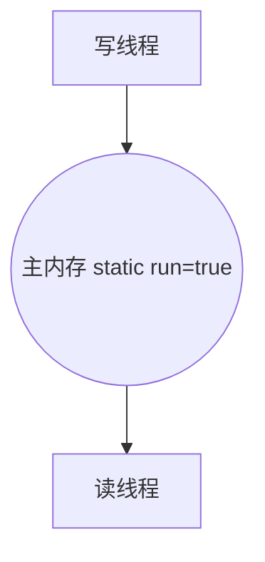
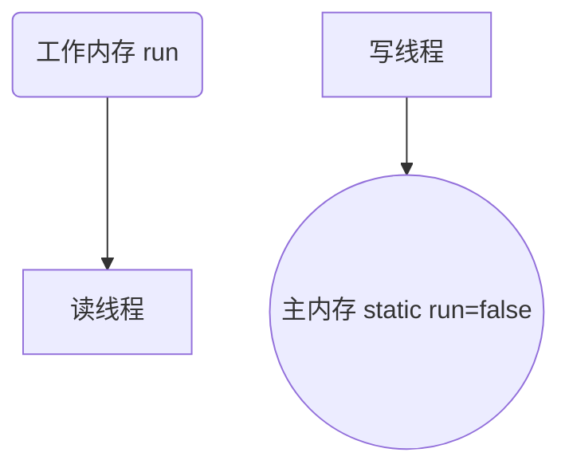

# 可见性

## 现象

```java
private static boolean run = true;

public static void demo() {
    new Thread(() -> {
        while (run) {
            // ...
        }
        log.debug("stopped");
    }, "t1").start();
    sleep(1);
    run = false;
    log.debug("has changed");
}
```

运行代码, 发现即使run更改成false之后, 另一线程依然循环不断

## 不可见

### 原因分析

JVM的JIT发现代码`while(run){}`反复运行, 是热点代码, 

线程t1反复读取静态字段`run`的值, 此值在堆内存, JVM为了提高效率, 对`run`进行了优化

将`run`的值拷贝了一份给t1线程独有的**工作内存**空间, 这样就不需要反复从**主内存**读取, 而是从线程**工作内存**读取, 提高了效率

但是, 当对静态字段run进行了写操作`run = false;`之后, **主内存**中的静态字段的`run`的值发生了改变, 而**工作内存**中的`run`的拷贝却没有被修改

这就产生了读写不一致, 读线程无法发现字段已经被改变了, 循环也无法停止了

**写线程**对**主内存**进行修改后对**读线程**的**工作内存**, 于是出现了**不可见问题**

JIT优化前: 



JIT进行优化后: 



### 工作内存

>   高速缓存

这片工作内存是直接将run的值修改为常量还是将开辟了一片新的空间存储**变量**run的值?

答案是变量, 验证如下:

```java
private static int run = 1;

public static void demo() {
    new Thread(() -> {
        while (run > 0) {
            run += 1;
            if (run > 10) {
                run = 1;
            }
            // ...
        }
        log.debug("stopped");
    }).start();
    sleep(2);
    run = -10000000;
    log.debug("has changed");
}
```


依旧无法被停止

## 解决不可变

### volatile关键字

>   volatile 易变的

-   被 *volatile* 修饰的**字段**不会被JIT优化到工作内存
-   降低部分性能, 保证资源的可见性
-    *volatile* 只能用来修饰字段(静态字段和成员变量), 而不能修饰方法的局部变量, 因为方法的局部变量是线程独一份的,  *volatile* 修饰无意义


```java
private volatile static boolean run = 1;
```


### synchronized

synchronized加锁部分的变量不会被放入工作内存

```java
private static boolean run = true;
private static Object lock = new Object();

public static void demo() {
    new Thread(() -> {
        while (run) {
            synchronized (lock){}
        }
        log.debug("stopped");
    }).start();
    sleep(2);
    run = false;
    log.debug("has changed");
}
```

==如果只是想要防止变量被放入工作内存, 建议使用 **volatile**, 因为**volatile**不需要创建**Monitor**, 更为轻量级==

```java
while (run) {
    // 此时run有可见性
	synchronized (lock){}
}
```

```java
while (true) {
    // 此时run有可见性
	synchronized (lock){
        if(!run){
            break;
        }
    }
}
```

```java
synchronized (lock){}
while (run) {
    // 此时run无可见性
}
```

```java
synchronized(lock){
    while (run) {
        // 此时run无可见性
    }
}
```


其中的规律, 不好说, 测试不严谨, 故如果只是为了可见性, 用 *volatile*, 而不是 *synchronized*

## 可见性与原子性

保证原子性(用synchronized, 经测试ReentrantLock也能使资源具有可见性), 一定能保证可见性

但是保证可见性不一定能保证原子性

如果两个线程对一个被 *volatile* 修饰的资源, 如果同时被两个线程读写, 不能保证原子性

保证原子性还是要用`synchronized`, 用了`synchronized`就保证了可见性, 资源也不需要用volatile修饰了

==*volatile*适合在资源被一个线程读, 一个线程写的情形下使用==

测试略

## 原理

[volatile](Day05-volatile.md)

