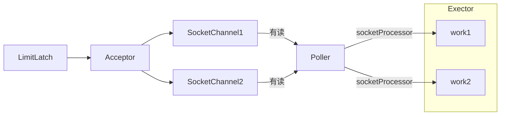
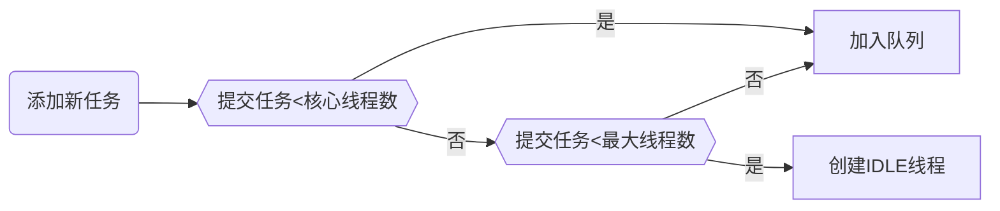

# Tomcat

-   连接器 Connector
    -   对外交流沟通
-   容器 Container
    -   实现Servlet规范
    -   运行Servlet组件

## NIO EndPoint



-   LimitLatch 用来测流, 可以控制最大连接个数, 类似 `JUC` 的`Semaphone`
-   Acceptor 负责 **接收新的Socket连接**
    -   原理是轮询
-   Poller   负责监听 *Socket Channle* 是否有**可读的IO时间**
    -   一旦可读, 封装一个任务对象 `SocketProcessor` 提交给Executor线程池
-   Executor 线程池中的工作现场最终负责处理 **请求**

## Tomcat线程池

### 任务队列与线程创建

TaskQueue拓展了阻塞队列





### 异常处理机制

如果总线程数达到MaxiumPoolSize

-   不抛出RejectedExecption
-   再次尝试将任务放入队列
-   如果还是失败, 再抛出异常

### 配置

`server.xml`


```xml
<conector port="8080" protocol="HTTP/1.1" 
          connectionTimeout="20000"
          redirectPort="8443"/>
```

| 配置 | 默认 | 说明 |
| ---- | ---- | ---- |
|`acceptorThreadCount` |    1 	|	acceptor 线程数量|
|`pollerThreadCount`	|  1 	|	poller 线程数量|
|`minSpareThreads`		|	10 	|	核心线程数|
|`maxThreads `		|	200 |	最大线程数|
|`executor` 		|	-	| Executor  name引用，用来引用下面的 Executor |


```xml
<Executor name="tomcatThreadPool" namePrefix="catalina-exec" 
          maxThreads="150" minSpareThread="4"/>
```

| 配置                  | 默认 | 说明                                   |
| --------------------- | ---- | -------------------------------------- |
| `name` | - | Executor唯一标识 |
| `threadPriority` | 5    | 线程优先级                    |
| `daemon`   |  true     | 是否守护线程                      |
| `minSpareThreads`     | 25   | 核心线程数|
| `maxThreads `         | 200  | 最大线程数       |
| `maxIdleTime`            | 60000    | 线程生存时间，单位是毫秒 |
|`maxQueueSize`|Integer.MAX_VALUE |任务队列长度|
|`prestartminSpareThreads`|false |核心线程是否在服务器开启时创建(默认懒惰创建)|

