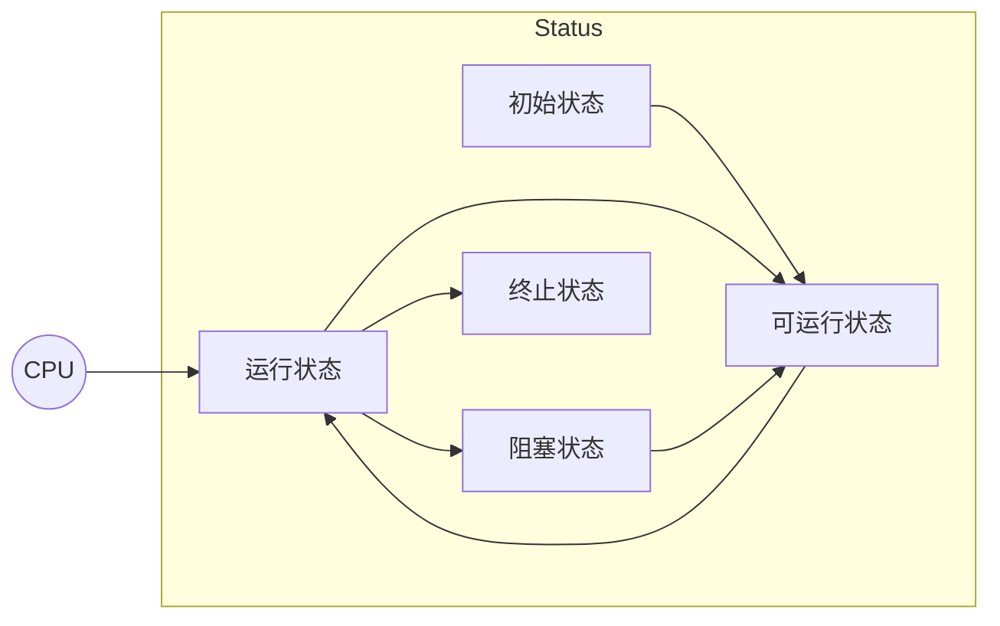

# 线程状态

## 五种状态说

从操作系统层面描述



-   初始状态
    -   在语言层面创建了线程对象
    -   未与操作系统的线程关联
    -   Java中new了Thread, 但是没有调用start
-   可运行状态
    -   线程已经被创建
    -   与操作系统线程关联
    -   可以由CPU调度使用
    -   未获取CPU的时间片
-   运行状态
    -   获取了CPU时间片运行中的状态
    -   当CPU时间片用完, 会从*运行状态* 转换至 *可运行状态*, *会导致上下文的切换*
-   阻塞状态
    -   线程实际不会用到CPU
    -   这种阻塞指IO(BIO)读写时的阻塞IO
    -   *导致上下文的切换*
    -   调度器不会考虑调度阻塞状态的线程, 会将时间片分给*可运行状态* 的线程而不是 *阻塞状态的线程*
-   终止状态
    -   线程已经执行完毕
    -   生命周期已经结束后
    -   不会再转换为其他状态

## 六种状态说

基于Java的Thread.Status中的枚举


-   `NEW`

    -   初始状态

-   `RUNNABLE`

    -   可运行状态+运行状态+阻塞状态

        ```java
        Thread t = new Thread(() -> {
            Scanner scanner = new Scanner(System.in);
            scanner.nextInt();
        });
        t.start();
        log.info("你好");
        ```
        

        

        

        Thread为 *正在运行* 表示RUNNABLE

-   `TIMED_WAITING`

    -   `Thread#sleep()`

    -   `obj#wait(int)`

    -   `obj#wait(int, int)`

        ```java
        Thread t = new Thread(() -> {
            try {
                synchronized (Main.class){
                    Main.class.wait(1000000);
                }
            } catch (InterruptedException e) {
                throw new RuntimeException(e);
            }
        });
        t.start();
        try {
            Thread.sleep(1000);
        } catch (InterruptedException e) {
            throw new RuntimeException(e);
        }
        System.out.println(t.getState()); // TIMED_WAITING
        ```

    -   `Thread#join(long, TimeUnit)`

-   `WAITING`

    -   `obj#wait()`
    -   `Thread#join()`

-   `BLOCKED`

    -   拿不到锁的状态

-   `TERMINATED`

    -   终止状态

## 状态转换


1.  `NEW`-->`RUNNABLE`  调用`Thread#start()`
2.  `WAITING`<-->`RUNNABLE`  调用`Object#wait()`-`Object#notify()`, `Thread#interrupt()`
    1.  `WAITING`-->`BLOCKED` 从Moniter的`WaitSet`到`EntryList`, 没竞争成功
3.  `WAITING`<-->`RUNNABLE`   `Thread#join()` 调用方法的线程等待直到线程结束,  `Thread#interrupt()`
4.  `WAITING`<-->`RUNNABLE`   `LockSupport#park()` `LockSupport#unpark(Thread)`,  `Thread#interrupt()`
5.  `RUNNABLE`<-->`TIMED_WAITING`  调用`Object#wait(long)`
6.  `RUNNABLE`<-->`TIMED_WAITING`  调用`Thread#join(long)`  调用方法的线程等待直到线程结束,
7.  `RUNNABLE`<-->`TIMED_WAITING`  `LockSupport#parkNanos(long)` `LockSupport#parkUntil(long)`
8.  `RUNNABLE`<-->`TIMED_WAITING`  `Thread#sleep(long)`
9.  `RUNNABLE`<-->`BLOCKED` 竞争锁成功`BLOCKED`->`RUNNABLE`; 竞争锁失败`RUNNABLE`->`BLOCKED`
10.  `RUNNABLE`-->`TERMINATED` 线程所有代码执行完毕, 进入`TERMINATED`

