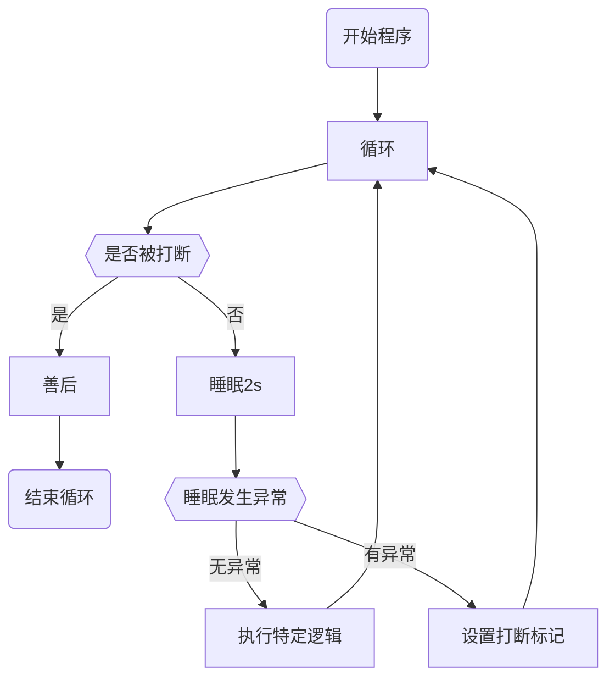

# 两阶段终止

在线程A中终止线程B

线程B能在接收到终止指令后完成善后工作后再终止

##stop(), interrupt()和System.exit(int)

-   stop杀死线程, 如果stop被调用时线程占用了锁资源, 锁资源将永远得不到释放
-   System.exit(int)终止程序, 而不是线程

## 流程

### 线程B两阶段终止




保证无论何时被打断都能返回跳出循环并执行善后

```java
/**
 * 两阶段终止的接口
 *
 * @author <a href="mailto:harvey.blocks@outlook.com">Harvey Blocks</a>
 * @version 1.0
 * @date 2024-09-05 21:30
 */
public interface TwoPhaseTermination extends Runnable {
    /**
     * 执行特定程序
     */
    void execute();

    void shutdown();
}
```

```java
@AllArgsConstructor
@NoArgsConstructor
public abstract class AbstractTwoPhaseTermination implements TwoPhaseTermination {
    private final long timeout = 0;

	public AbstractTwoPhaseTermination() {
        this(10);
    }
    
    public void run() {
        Thread thread = Thread.currentThread();
        while (true) {
            // 回去看看API, 看看isInterrupted和Thread.interrupted有什么区别
            if (thread.isInterrupted()) {
                this.shutdown();
                break;
            }
            try {
                TimeUnit.MILLISECONDS.sleep(timeout);
                this.execute();
            } catch (InterruptedException e) {
                e.printStackTrace(System.err);
                // 在睡眠时被打断
                thread.interrupt();
            }
        }
    }
}
```

### 线程A控制线程B

```java
Thread thread = new Thread(new AbstractTwoPhaseTermination(1000) {
    @Override
    public void execute() {
        log.info("执行特定程序");
    }

    @Override
    public void shutdown() {
        log.info("执行关闭逻辑");
    }
});
thread.start();
try {
    Thread.sleep(3500); // 主线程睡眠
} catch (InterruptedException e) {
    throw new RuntimeException(e);
}
log.info("主线程打断");
thread.interrupt();
```

### 测试

```log
21:47:49.290 [Thread-0] INFO org.harvey.juc.Main -- 执行特定程序
21:47:50.342 [Thread-0] INFO org.harvey.juc.Main -- 执行特定程序
21:47:51.344 [Thread-0] INFO org.harvey.juc.Main -- 执行特定程序
21:47:51.768 [main] INFO org.harvey.juc.Main -- 主线程打断
21:47:51.770 [Thread-0] INFO org.harvey.juc.Main -- 执行关闭逻辑
java.lang.InterruptedException: sleep interrupted
	at java.base/java.lang.Thread.sleep(Native Method)
	at java.base/java.lang.Thread.sleep(Thread.java:334)
	at java.base/java.util.concurrent.TimeUnit.sleep(TimeUnit.java:446)
	at org.harvey.juc.AbstractTwoPhaseTermination.run(AbstractTwoPhaseTermination.java:30)
	at java.base/java.lang.Thread.run(Thread.java:829)
```

##用volatile改进

###接口

```java
public interface TwoPhaseTermination extends Runnable {
    /**
     * 执行特定程序
     */
    void execute();

    void shutdown();

    /**
     * @param thread 本类被哪个线程运行run()方法, 参数的线程就是哪个
     */
    void stop(Thread thread);
}
```

###实现

```java
public abstract class AbstractVolatileTwoPhaseTermination implements TwoPhaseTermination {
    /**
     * 执行多个{@link #execute()}逻辑之间的暂停时间
     */
    private final long executeTimeInterval;
    /**
     * 为true, 线程立即停止, 否则会等待sleep完毕再停止线程
     */
    private final boolean force;
    private volatile boolean stop;

    public AbstractVolatileTwoPhaseTermination(long executeTimeInterval, boolean force) {
        this.executeTimeInterval = executeTimeInterval;
        this.force = force;
        this.stop = false;
    }

    public AbstractVolatileTwoPhaseTermination() {
        this(10, false);
    }

    public void run() {
        Thread thread = Thread.currentThread();
        while (true) {
            if (stop) {
                this.shutdown();
                break;
            }
            try {
                TimeUnit.MILLISECONDS.sleep(executeTimeInterval);
                this.execute();
            } catch (InterruptedException e) {
                // e.printStackTrace(System.err);
                // 在睡眠时被打断, 不会更新打断标记
                // 没必要更新打断标记, 但是写了让我更放心
                thread.interrupt();
            }
        }
    }

    /**
     * @param thread 本类被哪个线程运行run()方法, 参数的线程就是哪个<br>
     *               给线程已经不是必须的需求了, 只有在{@link #force}{@code ==true}的时候才有意义
     */
    @Override
    public final void stop(Thread thread) {
        stop = true;
        if (force) {
            thread.interrupt();
        }
    }
}
```

### 测试Demo

```java
public static void demo() {
    TwoPhaseTermination target = new AbstractVolatileTwoPhaseTermination(1000, true) {
        @Override
        public void execute() {
            log.debug("执行特定程序");
        }

        @Override
        public void shutdown() {
            log.debug("执行关闭逻辑");
        }
    };
    Thread thread = new Thread(target);
    thread.start();
    try {
        Thread.sleep(3500); // 主线程睡眠
    } catch (InterruptedException e) {
        throw new RuntimeException(e);
    }
    log.debug("在主线程打断");
    target.stop(thread);
}
```