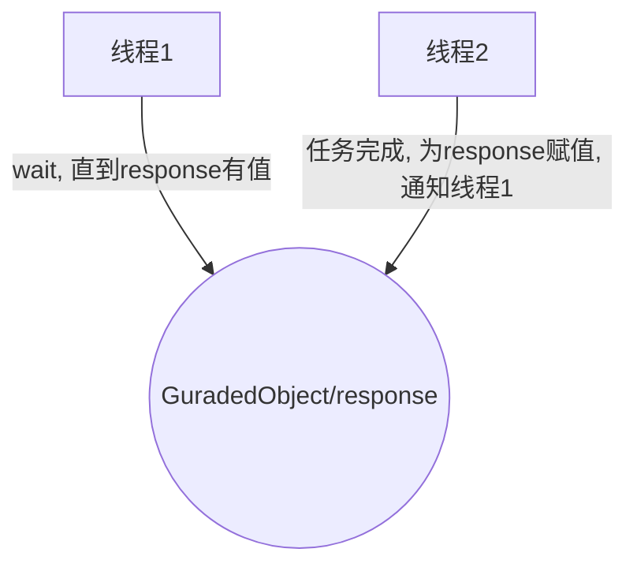

# 保护性暂停

>   Guarded Suspension

用在一个线程等待另一个线程的执行结果

## 要点

-   有一个结果需要从一个线程传递到另一个线程, 让它们关联同一个GuardedObject
-   如果有结果不断从一个线程到另一个线程, 可以使用消息队列(生产者/消费者模式)
-   JDK中, join, feature的实现, 就采用了此模式



## 实现

### 标记结果类

```java
public final class FutureResponse<R> {
    private R result;
    private boolean finished;

    public synchronized R getResult() {
        return result;
    }

    public synchronized boolean isFinished() {
        return finished;
    }

    public synchronized void setResult(R result) {
        this.result = result;
    }

    public synchronized void setFinished(boolean finished) {
        this.finished = finished;
    }
}
```

### 等待类

```java
@Accessors(chain = true)
public final class GuardedSuspensionWaitPattern<R> extends AbstractWaitStandardPattern {
    private final FutureResponse<R> futureResponse;
    @Getter
    @Setter
    private Consumer<R> listener;

    public GuardedSuspensionWaitPattern(FutureResponse<R> futureResponse) {
        super(futureResponse);
        this.futureResponse = futureResponse;
        this.futureResponse.setFinished(false);
    }

    @Override
    protected boolean isPrepared() {
        return futureResponse.isFinished();
    }

    @Override
    protected void executeIfPrepared() {
        listener.accept(futureResponse.getResult());
        futureResponse.setFinished(false); // 为了和后面消息队列/任务队列对接
        // 都是一个while(true){保护性暂停操作}
    }

    @Override
    protected void executeIfUnprepared() {
    }
}
```

### 唤醒类

```java
@Accessors(chain = true)
public final class GuardedSuspensionNotifyPattern<R> extends AbstractNotifiedStandardPattern {
    private final FutureResponse<R> futureResponse;
    @Getter
    @Setter
    private Supplier<R> supplier;

    public GuardedSuspensionNotifyPattern(
        WaitStandardPattern waitPattern, 
        FutureResponse<R> futureResponse) {
        super(waitPattern);
        this.futureResponse = futureResponse;
    }

    public GuardedSuspensionNotifyPattern(FutureResponse<R> futureResponse, Supplier<R> supplier) {
        super(futureResponse);
        this.futureResponse = futureResponse;
        this.supplier = supplier;
    }

    @Override
    protected void finishPreTask() {
        futureResponse.setResult(this.supplier.get());
        futureResponse.setFinished(true);
    }
}
```

### 保护暂停类

```java
public class GuardedSuspension<R> {

    private final GuardedSuspensionWaitPattern<R> waitPattern;
    private final GuardedSuspensionNotifyPattern<R> notifyPattern;
    private final FutureResponse<R> futureResponse;
    private static final Supplier<Object> DEFAULT_SUPPLIER = () -> null;
    private static final Consumer<Object> DEFAULT_LISTENER = r -> {
    };

    public GuardedSuspension(Supplier<R> supplier, Consumer<R> listener) {
        this.futureResponse = new FutureResponse<>();
        this.waitPattern = new GuardedSuspensionWaitPattern<>(this.futureResponse);
        this.waitPattern.setListener(listener);
        this.notifyPattern = new GuardedSuspensionNotifyPattern<>(this.waitPattern, this.futureResponse);
        this.notifyPattern.setSupplier(supplier);
    }

    @SuppressWarnings("unchecked")
    public GuardedSuspension() {
        this((Supplier<R>) DEFAULT_SUPPLIER, (Consumer<R>) DEFAULT_LISTENER);
    }

    public GuardedSuspension<R> setListener(Consumer<R> listener) {
        waitPattern.setListener(listener);
        return this;
    }

    public GuardedSuspension<R> setSupplier(Supplier<R> supplier) {
        notifyPattern.setSupplier(supplier);
        return this;
    }

    public Runnable getListener() {
        return waitPattern;
    }

    public Runnable getSupplier() {
        return notifyPattern;
    }

    @SuppressWarnings("unchecked")
    public R getResult() {
        new GuardedSuspensionWaitPattern<>(futureResponse)
            .setListener((Consumer<R>) DEFAULT_LISTENER).run();
        return futureResponse.getResult();
    }
}
```

## 使用

```java
Random random = new Random(System.currentTimeMillis());
GuardedSuspension<Integer> guardedSuspension = new GuardedSuspension<>(
        () -> {
            try {
                Thread.sleep(5000);
            } catch (InterruptedException e) {
                throw new RuntimeException(e);
            }
            return random.nextInt();
        }, (i) -> {
    log.debug(i.toString());});
log.info("start");
new Thread(guardedSuspension.getSupplier(), "supplier").start();
// 法一 异步式:
// new Thread(guardedSuspension.getListener(), "listener").start();
// 法二 阻塞式:
// guardedSuspension.getListener().run();
// 法三 阻塞式:
// log.info(guardedSuspension.getResult().toString());
log.info("end");
```

## 拓展-超时

参考`Thread#join()`

