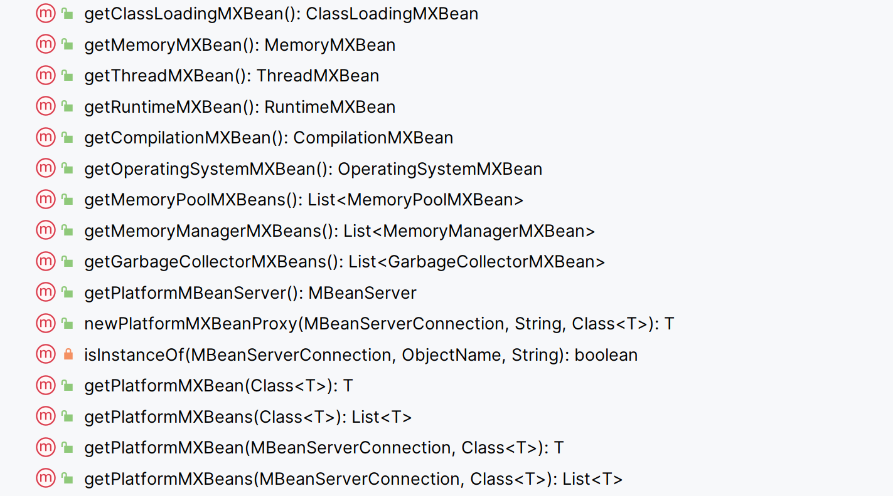
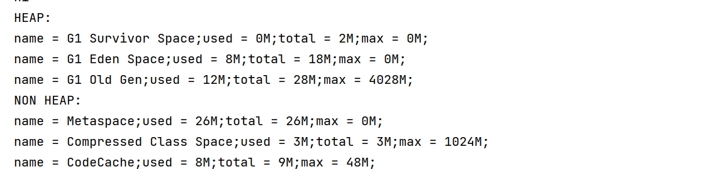
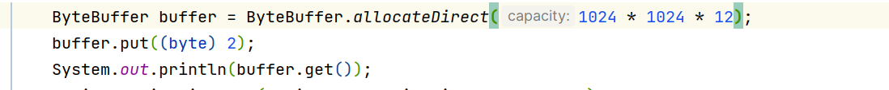

# 内存使用

## JMX技术

>   Java Management Extensions

从JDK1.5开始提供

JVM将信息保存在各种**`MBean`**对象中

```java
MemoryMXBean memoryMXBean = ManagementFactory.getMemoryMXBean();
```


通过对Mbean对象的写入和获取,实现

-   运行时配置的获取和更改
-   应用程序运行时信息的获取(线程栈, 内存, 类信息)



## JVM内存信息

```java
protected void show() {
    List<MemoryPoolMXBean> memoryPoolMXBeans = ManagementFactory.getMemoryPoolMXBeans();
    // 堆内存
    System.out.println("HEAP:");
    showMemoryInfo(memoryPoolMXBeans, MemoryType.HEAP);
    // 非堆内存
    System.out.println("NON HEAP:");
    showMemoryInfo(memoryPoolMXBeans, MemoryType.NON_HEAP);
}

private static void showMemoryInfo(List<MemoryPoolMXBean> memoryPoolMXBeans, MemoryType type) {
    memoryPoolMXBeans.stream().filter(bean -> bean.getType().equals(type)).forEach(
            bean -> {
                System.out.println(getMemoryInfo(bean));
            }
    );
}

private static String getMemoryInfo(MemoryPoolMXBean bean) {
    return "name = " + bean.getName() + ";" +
            "used = " + bean.getUsage().getUsed() / 1024 / 1024 + "M;" +
            "total = " + bean.getUsage().getCommitted() / 1024 / 1024 + "M;" +
            "max = " + bean.getUsage().getMax() / 1024 / 1024 + "M;";
}
```



-   0M是因为使用了默认配置`-1`.


## 直接内存信息

特指NIO里面提供的直接内存, 而不是元空间, 元空间在JVM内存获取中已经被显示了

```java
// PlatformMXBeans可以更宽泛的获取的MXBean
// 有多个内存分区, 要返回List, 方法要是`Beans`, 复数
ManagementFactory.getPlatformMXBeans(BufferPoolMXBean.class).forEach(
        bean -> {
            System.out.println(getMemoryInfo(bean));
        }
);
```

```java
private static String getMemoryInfo(BufferPoolMXBean bean) {
    return "name = " + bean.getName() + ";" +
            "used = " + bean.getMemoryUsed() / 1024 / 1024 + "M;" +
            "total capacity = " + bean.getTotalCapacity() / 1024 / 1024 + "M";
}
```


在被监控程序处使用直接内存



实验结果


## 生成内存快照

```java
private void createHeapDump(String targetPath, boolean live) throws IOException {
    HotSpotDiagnosticMXBean platformMXBean = ManagementFactory.getPlatformMXBean(HotSpotDiagnosticMXBean.class);
    platformMXBean.dumpHeap(targetPath, live);
}
```

