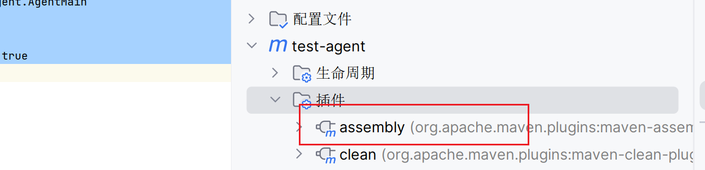
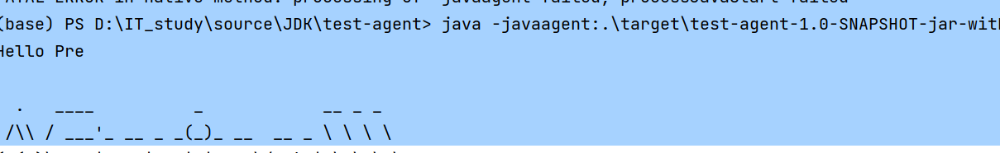

# 环境搭建

## 添加插件

`maven-assembly-plugin`

```xml
<build>
    <plugins>
        <plugin>
            <groupId>org.apache.maven.plugins</groupId>
            <artifactId>maven-assembly-plugin</artifactId>
            <!--不要写版本!!!!!!!!-->
            <configuration>
                <!--将所有的依赖打进一个jar包-->
                <descriptorRefs>
                    <descriptorRef>jar-with-dependencies</descriptorRef>
                </descriptorRefs>
                <archive>
                    <manifestFile>src/main/resources/MANIFEST.MF</manifestFile>
                </archive>
            </configuration>
        </plugin>
    </plugins>
</build>
```

## MANIFEST.MF文件

用于描述Java agent的配置属性, 比如使用哪一个类的premain方法

```makefile
Manifest-Version: 1.0
Premain-Class: com.harvey.jvm.agent.AgentMain
Agent-Class: com.harvey.jvm.agent.AgentMain
Can-Redefine-Classes: true
Can-Retransform-Classes: true
Can-Set-Native-Method-Prefix: true

```

-   版本自定

    ```makefile
    Manifest-Version: 1.0
    ```

-   二选一, 一个Pre静态加载, 一个Agent动态加载

    ```makefile
    Premain-Class: com.harvey.jvm.agent.AgentMain
    Agent-Class: com.harvey.jvm.agent.AgentMain
    ```

-   Java Agent里能不能重新定义新的类

    ```makefile
    Can-Redefine-Classes: true
    ```

-   能不能把老的类转为新的类

    ```makefile
    Can-Retransform-Classes: true
    ```

-   能不能在Java Agent创建本地(C/C++)方法

    ```makefile
    Can-Set-Native-Method-Prefix: true
    ```

-   回车, 格式要求

    ```makefile

    ```

## 打包

### 写了版本的下场



很奇妙的是, 不会把自己的代码打包进去, 能把依赖的代码打包????

解决方法是源码用生命周期的pacage打包之后, 拷贝到agent的jar包中

### 不要写版本


## 启动

```shell
 java -javaagent:.\target\test-agent-1.0-SNAPSHOT-jar-with-dependencies.jar -jar .\spring-demo\target\spring-demo-0.0.1-SNAPSHOT.jar
```



## 获取进程列表

把写死的进程ID以用户输入的方式确定监控对象

获取当前PID

```java
private static String getNowPid() {
    String nowPid = ManagementFactory.getRuntimeMXBean().getName().split("@")[0];
    if (nowPid == null || nowPid.isEmpty()) {
        System.exit(-1);
    }
    return nowPid;
}
```

在Java程序中执行`jps`命令

```java
private static void execJps() throws IOException {
    Process jps = Runtime.getRuntime().exec("jps");
    InputStream jpsInputStream = jps.getInputStream();
    try (InputStreamReader in = new InputStreamReader(jpsInputStream);
         BufferedReader bufferedReader = new BufferedReader(in);) {
        String line;
        for (int i = 0; (line = bufferedReader.readLine()) != null;i++ ) {
            System.out.println(line);
        }
    }
}
```

