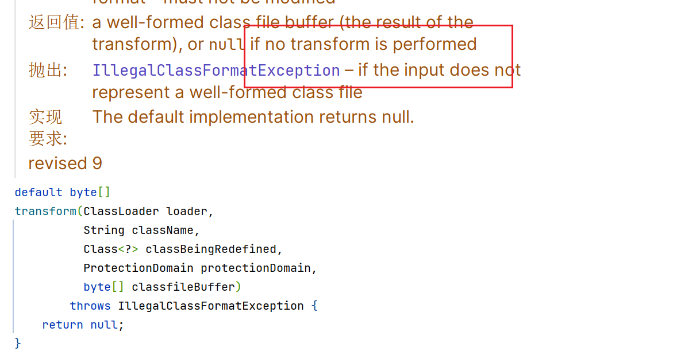
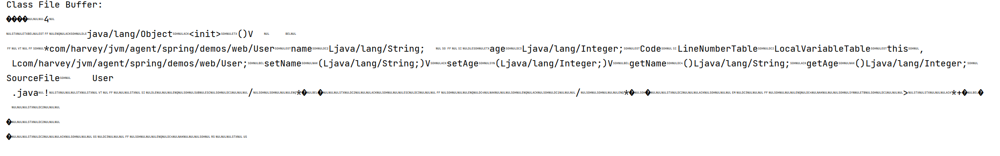
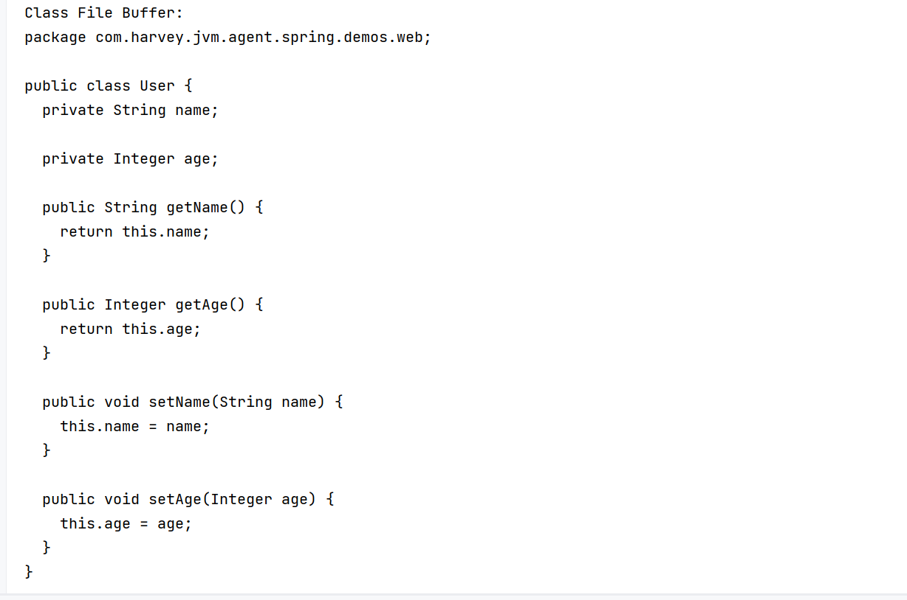

# 类加载

## Instument

```java
public static void agentmain(String agentArgs, Instrumentation inst) throws IOException {
    saveArgs(agentArgs, inst);
}
```

-   redefine重新设置字节码信息
-   re-transform 对现有的字节码信息进行增强
-   获取所有已加载类的信息
-   [doc](https://docs.oracle.com/en/java/javase/17/docs/api/java.instrument/java/lang/instrument/package-summary.html)

## 打印类加载器

```java
Instrumentation inst = AgentMain.getInst();
// 打印所有的类加载器
Arrays.stream(inst.getAllLoadedClasses())
        .map(Class::getClassLoader)
        .map(loader -> loader == null ?
                "bootstrap" : loader.getName())
        .filter(name -> name != null && !name.isEmpty())
        .distinct() // 去重
        .sorted(String::compareTo)
        .forEach(System.out::println);
```

```
bootstrap
app
platform
```

## 打印类的源码

### 获取内存类的字节码信息

```java
Instrumentation inst = AgentMain.getInst();
Map<SourceCodeArgKey, String> newArg = newArgMap(argv, SourceCodeArgKey::valueOf);
if (newArg == null) {
    return;
}
String className = newArg.get(SourceCodeArgKey.CLASS_NAME);
if (className == null || className.isEmpty()) {
    showAbsentArgumentMsg(String.valueOf(SourceCodeArgKey.CLASS_NAME));
    return;
}
Arrays.stream(inst.getAllLoadedClasses()).filter(
        clazz -> className.equals(clazz.getName())
).forEach(clazz->{
   // TODO 
});
```

### 转换器对类增强

1.  实现转换器`ClassFileTransFormer`接口

    返回值为null, 表示不对该类做增强

    

    ```java
    public static final ClassFileTransformer PRINT_CLASS_FILE_TRANSFORMER = 
        new ClassFileTransformer() {
        @Override
        public byte[] transform(ClassLoader loader,
                                String className, Class<?> classBeingRedefined,
                                ProtectionDomain protectionDomain, byte[] classfileBuffer
        ) throws IllegalClassFormatException {
            System.out.println("Class File Buffer:");
            System.out.println(new String(classfileBuffer, StandardCharsets.US_ASCII));
            return ClassFileTransformer.super.transform(
                    loader, className, classBeingRedefined, protectionDomain, classfileBuffer);
        }
    };
    ```

2.  将转换器注册(`inst.addTransformer`)到`Instrumentation`

    ```java
    AgentMain.getInst().addTransformer(PRINT_CLASS_FILE_TRANSFORMER);
    ```

3.  手动触发(`inst.retransformClasses`)转换器, 调用转换器中的方法

    ```java
    Arrays.stream(inst.getAllLoadedClasses()).filter(
            clazz -> className.equals(clazz.getName())
    ).forEach(clazz->{
        try {
            inst.retransformClasses(clazz);
        } catch (UnmodifiableClassException e) {
            throw new RuntimeException(e);
        }
    });
    ```

4.  删除转换器

    ```java
    AgentMain.getInst().removeTransformer(PRINT_CLASS_FILE_TRANSFORMER);
    ```



### 反编译

[jd-core](https://github.com/java-decompiler/jd-core), 版本最高12, 12以上又可能不正确

#### 引入依赖

```xml
<dependency>
    <groupId>org.jd</groupId>
    <artifactId>jd-core</artifactId>
    <version>1.1.3</version>
</dependency>
```

#### 官方提供的方法

依据文件路径从文件中载入

```java
// 字节码载入方式
public static final Loader LOADER = new Loader() {
    @Override
    public byte[] load(String internalName) throws LoaderException {
        InputStream is = this.getClass().getResourceAsStream("/" + internalName + ".class");

        if (is == null) {
            return null;
        } else {
            try (InputStream in = is; ByteArrayOutputStream out = new ByteArrayOutputStream()) {
                byte[] buffer = new byte[1024];
                int read = in.read(buffer);

                while (read > 0) {
                    out.write(buffer, 0, read);
                    read = in.read(buffer);
                }

                return out.toByteArray();
            } catch (IOException e) {
                throw new LoaderException(e);
            }
        }
    }

    @Override
    public boolean canLoad(String internalName) {
        return this.getClass().getResource("/" + internalName + ".class") != null;
    }
}
```
在end方法是最终会被调用的方法

```java
// 源码输出格式
public static final Printer PRINTER = new Printer() {
    private static final String TAB = "  ";
    private static final String NEWLINE = "\n";

    private int indentationCount = 0;
    private final StringBuilder stringBuilder = new StringBuilder();
    @Override
    public void end() {
        // 注册之后在反编译时自动调用该方法
    }
    @Override
    public String toString() {
        return stringBuilder.toString();
    }

    @Override
    public void start(int maxLineNumber, int majorVersion, int minorVersion) {
    }

    @Override
    public void printText(String text) {
        stringBuilder.append(text);
    }

    @Override
    public void printNumericConstant(String constant) {
        stringBuilder.append(constant);
    }

    @Override
    public void printStringConstant(String constant, String ownerInternalName) {
        stringBuilder.append(constant);
    }

    @Override
    public void printKeyword(String keyword) {
        stringBuilder.append(keyword);
    }

    @Override
    public void printDeclaration(int type, String internalTypeName, String name, String descriptor) {
        stringBuilder.append(name);
    }

    @Override
    public void printReference(int type, String internalTypeName, String name, String descriptor, String ownerInternalName) {
        stringBuilder.append(name);
    }

    @Override
    public void indent() {
        this.indentationCount++;
    }

    @Override
    public void unindent() {
        this.indentationCount--;
    }

    @Override
    public void startLine(int lineNumber) {
        stringBuilder.append(TAB.repeat(Math.max(0, indentationCount)));
    }

    @Override
    public void endLine() {
        stringBuilder.append(NEWLINE);
    }

    @Override
    public void extraLine(int count) {
        while (count-- > 0) {
            stringBuilder.append(NEWLINE);
        }
    }

    @Override
    public void startMarker(int type) {
    }

    @Override
    public void endMarker(int type) {
    }
};
```

#### 本处实现

加载(直接就有inst的字节码)

```java
public class JdCoreDecompileLoader implements Loader {

    private final byte[] data;

    public JdCoreDecompileLoader(byte[] data) {
        this.data = data;
    }

    @Override
    public byte[] load(String internalName) throws LoaderException {
        return data;
    }

    @Override
    public boolean canLoad(String internalName) {
        return this.getClass().getResource("/" + internalName + ".class") != null;
    }
}
```

打印机

```java
public class JdCoreDecompilePrinter implements Printer {
    // ...

    private final StringBuilder stringBuilder = new StringBuilder();

    @Override
    public void end() {
        System.out.println(stringBuilder);
    }
	// ... 
};
```

执行

```java
public static final ClassFileTransformer PRINT_DECOMPILED_SOURCE_TRANSFORMER = new ClassFileTransformer() {
    @Override
    public byte[] transform(ClassLoader loader,
                            String className, Class<?> classBeingRedefined,
                            ProtectionDomain protectionDomain, byte[] data
    ) throws IllegalClassFormatException {
        System.out.println("Class File Buffer:");
        /*System.out.println(new String(classfileBuffer, StandardCharsets.US_ASCII));*/
        Decompiler decompiler = new ClassFileToJavaSourceDecompiler();
        try {
            decompiler.decompile(new JdCoreDecompileLoader(data),
                    new JdCoreDecompilePrinter(),
                    className);
        } catch (Exception e) {
            throw new RuntimeException(e);
        }
        return ClassFileTransformer.super.transform(
                loader, className, classBeingRedefined, protectionDomain, classBeingRedefined);
    }
};
```

结果



