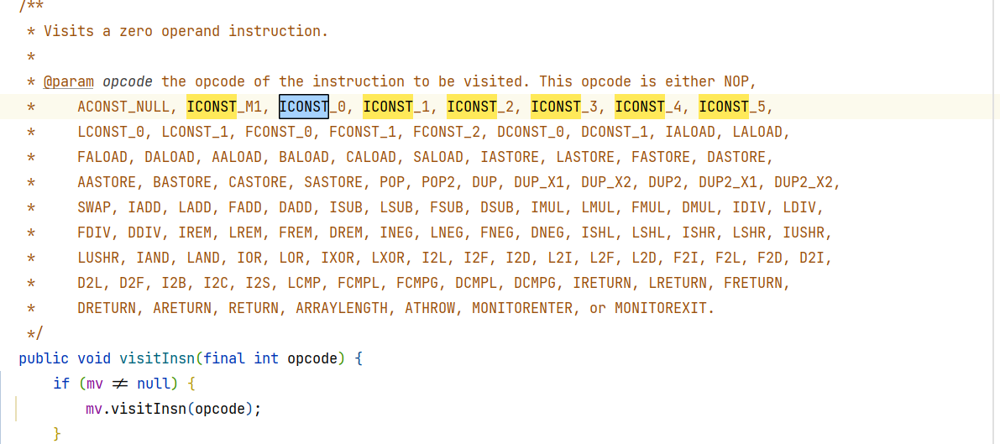

# 方法跟踪

>   Trace

## 打印栈信息

```java
@Override
public void show(Map<String, String> argv) {
    ThreadMXBean bean = ManagementFactory.getThreadMXBean();
    boolean lockedMonitors = bean.isObjectMonitorUsageSupported();// 当前虚拟机是否允许监视器
    boolean lockedSynchronizes = bean.isSynchronizerUsageSupported();// 同步器
    int stackDepth = Integer.MAX_VALUE; // 展示越完整, 性能越差, 默认最大
    ThreadInfo[] threadInfos = bean.dumpAllThreads(lockedMonitors, lockedSynchronizes, stackDepth);
    // 获取当前栈信息
    System.out.println("THREAD INFO:");
    Arrays.stream(threadInfos)
        .map(StackTraceCommand::getThreadInfo)
        .forEach(System.out::println);
}

private static String getThreadInfo(ThreadInfo info) {
    StringBuilder stackInfoBuilder = new StringBuilder();
    Arrays.stream(info.getStackTrace())
            .forEach(element -> stackInfoBuilder.append(element).append("\n"));
    return "name = " + info.getThreadName() + ";" +
            "id = " + info.getThreadId() + ";" +
            "state = " + info.getThreadState() + ";\n" +
            stackInfoBuilder;
}
```

## 字节码增强

Spring框架也有面向切面增强, 但是与Spring框架强耦合

字节码增强技术, 向原始的字节码信息中插入新的字节码指令

### ASM

[官网](https:\\asm.ow2.io)

通用的Java字节码操作和分析框架

可以用于直接以二进制形式修改现有类或动态生成类

ASM重点关注性能, 让操作尽可能小且尽可能快

适合在动态系统中使用

但是代码复杂, 要十分熟悉java字节码指令qwq, 故不做时间增强

```xml
<dependency>
  <groupId>org.ow2.asm</groupId>
  <artifactId>asm</artifactId>
  <version>9.7</version>
</dependency>
```

ASM的代码生成可以安装IDLE上有关的插件`ASM Bytecode Outline`, 可以依据原码文件生成字节码文件和使用ASM的代码

#### 字节码更改

以原有的字节码的字节数组为参数, 以增强后的字节码数组为返回值

```java
public byte[] advice(byte[] data, Class<? extends MethodVisitor> visitorType) throws IOException {
    ClassWriter classWriter = new ClassWriter(0);
    // Visit的设计模式
    ClassVisitor classVisitor = new ClassVisitor(Opcodes.ASM7, classWriter) {
        // ASM7 对应 JDK 17
        @Override
        public MethodVisitor visitMethod(
                int access,
                String name,
                String descriptor,
                String signature,
                String[] exceptions) {
            MethodVisitor methodVisitor = super.cv.visitMethod(access, name, descriptor, signature, exceptions);
            // 描述对方法进行增强, this.api即ASM7
            try {
                // 构造出一个对象
                return visitorType.getConstructor(Integer.class, MethodVisitor.class).newInstance(this.api, methodVisitor);
            } catch (NoSuchMethodException | InvocationTargetException | InstantiationException |
                     IllegalAccessException e) {
                throw new RuntimeException(e);
            }
        }
    };
    // 将字节码信息数组转换成内存中的字节码对象, 使其可解析
    ClassReader classReader = new ClassReader(data);
    classReader.accept(classVisitor, 0);
    return classWriter.toByteArray();
}
```

#### 方法时间增强

```java
public class AsmHelloAdvice extends MethodVisitor {

    public TimeMethodVisitor(int api, MethodVisitor methodVisitor) {
        super(api, methodVisitor);
    }

    /**
     * 刚开始执行时的增强
     */
    @Override
    public void visitCode() {
        super.visitCode();
    }

    /**
     * 为特定的方法执行特定的操作, 例如返回
     *
     * @param opcode ???
     */
    @Override
    public void visitInsn(int opcode) {
        super.visitInsn(opcode);
    }

    /**
     * 设定方法的最大升读和局部便改良表的大小
     */
    @Override
    public void visitEnd() {
        /*if (super.mv != null) {
            // 这里配置了栈和局部变量表, 如果栈的深度超过这里的配置, 就会报错
            super.mv.visitMaxs(MAX_STACK, MAX_LOCALS);
        }*/
        super.visitEnd();
    }
}
```

#### visitCode

字节码指令与ASM的Opcode对应关系, 可以在MethodVisitor里面查看



```java
public TimeMethodAdvice(int api, MethodVisitor methodVisitor) {
    super(api, methodVisitor);
}
//方法执行一开始，调用System.out.println（"开始执行"）方法
@Override
public void visitCode() {
    mv.visitFieldInsn(Opcodes.GETSTATIC,"java/lang/System","out","Ljava/io/PrintStream;");
    mv.visitLdcInsn("开始执行");
    mv.visitMethodInsn(INVOKEVIRTUAL,"java/io/PrintStream","println","(Ljava/lang/String;)V",false);
    super.visitCode();
}

//返回时，执行System.out.println("结束执行")
@Override
public void visitInsn(int opcode) {
    if(opcode == ARETURN || opcode == RETURN ) {
        mv.visitFieldInsn(Opcodes.GETSTATIC,"java/lang/System","out","Ljava/io/PrintStream;");
        mv.visitLdcInsn("结束执行");
        mv.visitMethodInsn(INVOKEVIRTUAL,"java/io/PrintStream","println","(Ljava/lang/String;)V",false);
    }
    super.visitInsn(opcode);
}

//指定最大栈深度20，最大局部变量表大小是50
@Override
public void visitEnd() {
    mv.visitMaxs(20,50);
    super.visitEnd();
}
```

#### 代码加载到内存

转换器

```java
public class AdviceTransformer implements ClassFileTransformer {
    private final Class<? extends MethodVisitor> adviceType;

    public AdviceTransformer(Class<? extends MethodVisitor> adviceType) {
        this.adviceType = adviceType;
    }

    @Override
    public byte[] transform(ClassLoader loader,
                            String className, Class<?> classBeingRedefined,
                            ProtectionDomain protectionDomain, byte[] data
    ) {
        try {
            return AsmClassAdvice.advice(data, adviceType);
        } catch (IOException e) {
            throw new RuntimeException(e);
        }
    }
}
```

转换

```java
INST.addTransformer(transformer, CAN_RE_TRANSFORM);
try {
    Arrays.stream(INST.getAllLoadedClasses())
            .filter(clazz -> className.equals(clazz.getName()))
            .forEach(clazz -> {
                try {
                    // 加载到内存
                    INST.retransformClasses(clazz);
                } catch (UnmodifiableClassException e) {
                    throw new RuntimeException(e);
                }
            });
} finally {
    INST.removeTransformer(transformer);
}
```

### ByteBuddy

代码生成和操作库, 用于在Java应用程序运行时创建和修改Java类, 而无需编译器的帮助

底层基于ASM, 提供了便利的ASM

[官网](https://bytebuddy.net/#/)

#### 依赖引入

```xml
<dependency>
    <groupId>net.bytebuddy</groupId>
    <artifactId>byte-buddy-agent</artifactId>
    <version>1.14.17</version>
</dependency>
<dependency>
    <groupId>net.bytebuddy</groupId>
    <artifactId>byte-buddy</artifactId>
    <version>1.14.17</version>
</dependency>
```

#### 搭建框架

```java
public static void advice(String className, Class<?> adviceClass) {
    new AgentBuilder.Default()
            .disableClassFormatChanges()// 禁止ByteBuddy在增强时更改类名
            .with(AgentBuilder.RedefinitionStrategy.RETRANSFORMATION)// 使用re-transform的形式增强
            .with(new AgentBuilder.Listener.WithTransformationsOnly( // 做Transform时
                    AgentBuilder.Listener.StreamWriting.toSystemOut()))// 把日志进行输出
            .type(ElementMatchers.named(className))// 匹配什么类, ElementMatchers.?用什么方法匹配(类上注解,类名前缀...)
            .transform((builder, typeDescription, classLoader, javaModule, protectionDomain)
                    -> builder.visit(Advice.to(adviceClass) // 使用哪个类进行增强
                    .on(ElementMatchers.any())))// 对所有的方法进行增强
            .installOn(AgentMain.getInst()); // 将增强的代码增加到Inst里去

}
```

#### 增强类

```java
public class TimeAdvice {
    /**
     * 方法开始时被调用
     * 打印所有的参数
     *
     * @return 开始的时间
     */
    @Advice.OnMethodEnter
    static long enter(@Advice.AllArguments  Object... args) {
        System.out.println(Arrays.toString(args));
        return System.currentTimeMillis();
    }

    /**
     *
     * @param startTimeMillis 用注解获取返回值
     */
    @Advice.OnMethodExit
    static void exit(@Advice.Enter long startTimeMillis) {
        System.out.println("cost " + (System.currentTimeMillis() - startTimeMillis) / 1000.0 + " s");
    }
}
```

#### 执行增强

```java
ByteBuddyClassAdviser.advice(className, adviceClass);
```

