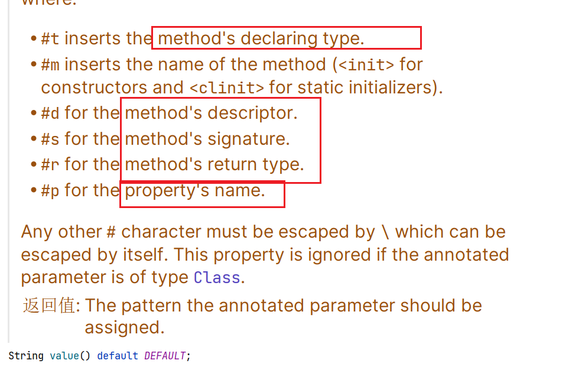
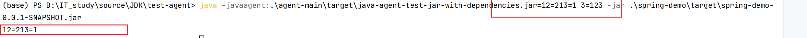

# APM

>   Application Perfoermance Monitor

采集运行程序的实时数据并使用可视化的方式展示

使用APM确保系统的可用性, 优化服务性能和响应时间, 持续改善用户体验

-   [Apache  SkyWalking](..\..\微服务和分布式\skywalking\Day10-Skywalking.md)
-   Zipkin


## APM的Java Agent组件

静态加载

想办法捕获外界(Client)对JVM的请求响应和JVM对外界(DB等)的请求和响应

## 实践-监控所有Controller

### 增强Controller


所有被注解`@Controller/@RestController`的方法

```java
private static final String ANNOTATION_CONTROLLER = "org.springframework.stereotype.Controller";
private static final String ANNOTATION_REST_CONTROLLER = "org.springframework.web.bind.annotation.RestController";
```


byteDubby的`AgentBuilder`

```java
.type(ElementMatchers.isAnnotatedWith(ElementMatchers.named(annotationName)))// 匹配什么注解
    //isAnnotatedWith接收Class对象, 要用ElementMatchers进行包装, 方便与应用程序连接时才能获取对应类对象
```

```java
public static void annotationAdvice(String annotationName, Class<?> adviceClass) {
    new AgentBuilder.Default()
            .disableClassFormatChanges()// 禁止ByteBuddy在增强时更改类名
            .with(AgentBuilder.RedefinitionStrategy.RETRANSFORMATION)// 使用re-transform的形式增强
            .with(new AgentBuilder.Listener.WithTransformationsOnly( // 做Transform时
                    AgentBuilder.Listener.StreamWriting.toSystemOut()))// 把日志进行输出
            .type(ElementMatchers.isAnnotatedWith(ElementMatchers.named(annotationName)))// 匹配什么注解
            .transform((builder, typeDescription, classLoader, javaModule, protectionDomain)
                    -> builder.visit(Advice.to(adviceClass) // 使用哪个类进行增强
                    .on(ElementMatchers.any())))// 对所有的方法进行增强
            .installOn(AgentMain.getInst()); // 将增强的代码增加到Inst里去
}
```

也做了一个or的版本不知道行不行(经测试可行)

```java
public static void annotationAdviceOr(Class<?> adviceClass, String... annotationNames) {
    if (annotationNames == null || annotationNames.length == 0) {
        return;
    }
    ElementMatcher.Junction<NamedElement> elementMatchersNames = ElementMatchers.named(annotationNames[0]);
    for (int i = 1; i < annotationNames.length; i++) {
        elementMatchersNames = elementMatchersNames.or(ElementMatchers.named(annotationNames[i]));
    }
    new AgentBuilder.Default()
            .disableClassFormatChanges()// 禁止ByteBuddy在增强时更改类名
            .with(AgentBuilder.RedefinitionStrategy.RETRANSFORMATION)// 使用re-transform的形式增强
            .with(new AgentBuilder.Listener.WithTransformationsOnly( // 做Transform时
                    AgentBuilder.Listener.StreamWriting.toSystemOut()))// 把日志进行输出
            .type(ElementMatchers.isAnnotatedWith(elementMatchersNames))// 匹配什么注解
            .transform((builder, typeDescription, classLoader, javaModule, protectionDomain)
                    -> builder.visit(Advice.to(adviceClass) // 使用哪个类进行增强
                    .on(ElementMatchers.any())))// 对所有的方法进行增强
            .installOn(AgentMain.getInst()); // 将增强的代码增加到Inst里去
}
```

😓很多Spring自带的Controller也会被监控, 无所谓吧?

### 增强类

获取调用当前增强的类名

```java
@Advice.OnMethodExit
static void exit(@Advice.Enter long nanoTime,
                 @Advice.Origin("#t") String className,
                 @Advice.Origin("#m") String methodName) {
    System.out.println(className + "#" + methodName + "cost " + (System.nanoTime() - nanoTime) / 1000.0 + " ms");
}
```



### 启动测试

重命名包名

```xml
<build>
    <finalName>
        java-agent-test
    </finalName>
    <plugins>
        <!--...-->
    </plugins>
</build>
```

启动

```shell
java -javaagent:.\agent-main\target\java-agent-test-jar-with-dependencies.jar -jar .\spring-demo\target\spring-demo-0.0.1-SNAPSHOT.jar 
```

## Java Agent传参

```shell
java -javaagent:.agent-with-dependencies.jar=param1=value1,param2=value2 -jar .\spring-demo-0.0.1-SNAPSHOT.jar 
```

传入agentArgs

```java
public static void premain(String agentArgs, Instrumentation inst) throws IOException {
	System.out.println(agentArgs);
    System.exit(0);
}
```

经测试不能传space字符, space字符之前的作为参数



### ByteBuddy传参进入增强类

```java
@Target(ElementType.PARAMETER)
@Retention(RetentionPolicy.RUNTIME)
public @interface AgentParam {
    String value();
}
```

```java
.transform((builder, typeDescription, classLoader, javaModule, protectionDomain)
        -> builder.visit(Advice
        .withCustomMapping()
        .bind(AgentParam.class,value)// 自定义注解
        .to(adviceClass) // 使用哪个类进行增强
        .on(ElementMatchers.any())))// 对所有的方法进行增强
```

```java
public static void annotationAdvice(Class<?> adviceClass, Object value, String annotationNames) {
    new AgentBuilder.Default()
            .disableClassFormatChanges()// 禁止ByteBuddy在增强时更改类名
            .with(AgentBuilder.RedefinitionStrategy.RETRANSFORMATION)// 使用re-transform的形式增强
            .with(new AgentBuilder.Listener.WithTransformationsOnly( // 做Transform时
                    AgentBuilder.Listener.StreamWriting.toSystemOut()))// 把日志进行输出
            .type(ElementMatchers.isAnnotatedWith(ElementMatchers.named(annotationNames)))// 匹配什么注解
            .transform((builder, typeDescription, classLoader, javaModule, protectionDomain)
                    -> builder.visit(Advice
                    .withCustomMapping()
                    .bind(AgentParam.class, value)
                    .to(adviceClass) // 使用哪个类进行增强
                    .on(ElementMatchers.any())))// 对所有的方法进行增强
            .installOn(AgentMain.getInst()); // 将增强的代码增加到Inst里去
}
```

