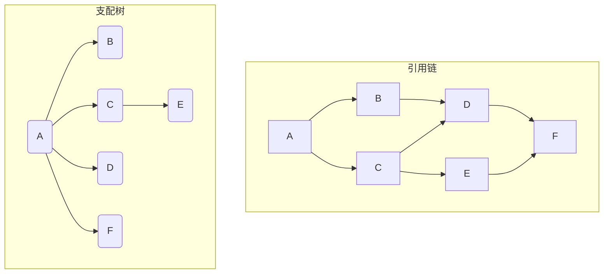

# 内存溢出解决

## 监控告警

### Linux查看内存

```shell
top 
```

[Linux Top](..\..\..\Linux\系统\Day06-主机状态.md)

### VisualVM

在Oracle JDK 6-8 自带

在Oracle JDK 9之后不在了, 要自行安装[VisualVM: Home](https://visualvm.github.io/)

这个好像IDEA有插件

生产环境不要用VisualVM, 给JVM产生不稳定


这俩按钮会阻塞用户进程

通过Sample查看内存占用最大的对象


### JMX

JMX提供JVM进程信息, 默认不对远程服务器开放, 而VisualVM是可以对JVM进行远程监控的

配置对远程服务器开放


```shell
# localhost不能用来测试, 悲
-Djava.rmi.server.hostname=localhost \
# 开启远程访问
-Dcom.sun.management.jmxremote \
-Dcom.sun.management.jmxremote.port=9122 \
# 关闭安全协议做测试
-Dcom.sun.management.jmxremote.ssl=false \
# 关闭用户认证
-Dcom.sun.management.jmxremote.authenticate=false
```

### Arthus-tunnel

tunnel管理微服务中的多服务多实例项目

将JAVA程序(Host+Port)注册到Tunnel服务上

通过网页和Arthus对多个实例进行管理


#### 配置依赖

支持Spirng-boot2.0以上

```xml
<dependency>
    <groupId>com.taobao.arthas</groupId>
    <artifactId>arthas-spring-boot-starter</artifactId>
    <!--和Arthas版本一致-->
    <version>3.7.1</version>
</dependency>
```


#### 配置

```yaml
arthas:
  # tunnel地址，目前是部署在同一台服务器，正式环境需要拆分, 7777是服务注册的默认端口
  tunnel-server: ws://localhost:7777/ws
  # tunnel显示的应用名称，直接使用应用名
  app-name: ${spring.application.name}
  # http访问的端口和远程连接的端口, 以供arthas链接使用
  http-port: 8888
  telnet-port: 9999

server:
  # Tomcat端口号
  port: 8881
  tomcat:
    threads:
      min-spare: 50
      max: 500
```


#### 安装Tunnel

版本和Arthus, Maven依赖一致

将Tunnel.jar包放到Linux服务器上

```shell
nohup \ # 不因用户退出终端而终止该命令
	java -jar\
	-Darthuas.enable-detail-pages=true \ # 提供可视化页面
	arthas-tunnel-server-3.7.1-fatjar.jar \
	& # 后台运行不占用当前终端
```

#### 启动项目Jar包

```shell
nohup java -jar -Dserver.port=8081 -Darthas.http-port=3661 -Darthas.telnet-port=8565 my.jar &
```

#### 查看页面

Tunnel的页面端口号是8080

```http
GET http:\\centos:8080/apps.html
```

### Prometheus+Grafana

Prometheus(普罗米修斯)能采集Redis, Mysql, Java进程

Grafana可视化界面展示监控数据

#### 依赖配置Prometheus

使用actuator与Promethus进行连接, 将指标对外暴露

```xml
<dependency>
    <groupId>org.springframework.boot</groupId>
    <artifactId>spring-boot-starter-actuator</artifactId>

    <exclusions><!--去掉springboot默认配置-->
        <exclusion>
            <groupId>org.springframework.boot</groupId>
            <artifactId>spring-boot-starter-logging</artifactId>
        </exclusion>
    </exclusions>
</dependency>
```


```xml
<!--收集JVM数据, 数据库连接池数据, 磁盘IO等-->
<dependency>
    <groupId>io.micrometer</groupId>
    <artifactId>micrometer-registry-prometheus</artifactId>
    <scope>runtime</scope>
</dependency>
```

#### 配置Prometheus

```yaml
management:
  endpoint:
    metrics:
      enabled: true # 支持metrics
    prometheus:
      enabled: true # 支持Prometheus
  metrics:
    export:
      prometheus:
        enabled: true
    tags:
      application: jvm-export-app # 实例名采集, 暴露JVM信息的应用
  endpoints:
    web:
      exposure:
        include: '*' # 开放所有端口

```

####查看Prometheus收集的信息


```http
GET localhost:8081/actuator/prometheus
```


#### Ali云版Promethus

只恨财力不足

装MicroMeter组件


## 诊断

通过分析内存监控趋势图分析是否出现内存

-   正常情况

    

    -   上下起伏(Minor GC)
    -   手动FullGC后内存大小骤降
    -   曲线在一定范围内

-   内存泄漏

    

    -   持续内存升高, MinorGC不能把大部分对象回收
    -   手动Full GC之后内存使用没有好转


通过分析工具，诊断问题的 产生原因，定位到出现问题 的源代码

### MAT内存快照

>   Heap Profile

在堆内存溢出时将整个堆内存保存下来, 使用MAT打开hprof文件, 并选择内存泄漏检测功能, MAT会自行根据快照中保存的数据分析泄漏的根源

[下载](https://eclipse.dev/mat/downloads.php)

MAT本身的堆内存只有1G, 要使其检测10G的内存快照, 就要调整其内存大小

找MAT目录下的`MemoryAnalyzer.ini`文件, 建议调成文件大小的1.5倍左右

```ini
-Xmx15G
```


#### 生成内存快照

打开内存快照功能

在内存溢出时启动内存快照

```shell
-XX:+HeapDumpOnOutOfMemoryError
```

在FullGC前启动内存快照

```shell
-XX:+HeapDumpBeforeFullGC
```


指定hprof文件的输出路径

```shell
-XX:HeapDumpPath=D:jvm\dump\the_dump_file.hprof
```

#### 在运行中系统导出内存快照

之前要么在FullGC, 要么在OutOfMemoryError,限制有点大

想在任意时刻导出

且只需要导出标记为存活的对象

使用JDK自带的命令

```shell
jmap -dump:live,format=b,file=C:\Users\27967\Desktop <PID>
```

-   `-dump`
    -   `live` 只保留存活对象
-   `format`  
    -   `b`二进制
-   `file` 保存的目标路径
-   `<PID>`进程ID

使用Arthas的命令

```shell
heapdumo --live C:\Users\27967\Desktop
```

#### 在服务器上分析快照

[下载](https://eclipse.dev/mat/downloads.php)服务器版本的MAT

执行脚本

```shell
./ParseHeapDump.sh ~/dump/heap_dump.hprof org.eclipse.api:suspects org.eclipse.mat.api:overview org.eclipse.mat.api:top_components
```

-   `suspects`内存泄漏检测报告
-   `overview` 总览图
-   `top_components` 组件图

### MAT检测原理

#### 支配树

>   Dominator Tree

支配树, 即对象图. 展示对象实例之间的支配关系.

在对象引用图中, 所有指向对象B的路径都经过对象A, 则认为对象A支配对象B

引用链



从引用链看

-   指向对象B的只有对象A, 对象A支配对象B
-   指向对象C的只有对象A, 对象A支配对象C
-   指向对象D的有对象B和对象C, 对象B和C都不能支配对象D, 只有对象A能支配对象D
-   指向对象E的只有对象C, 对象C支配对象E
-   指向对象F的有对象D和对象E, 对象D和对象E不能支配对象F, 只有对象A能支配对象F

查看支配树


#### MAT对堆的划分

-   深堆
    -   Swallow Heap
    -   某一对象本身占用的空间
-   浅堆
    -   Retained Heap
    -   也称作保留集 Retained Set
    -   某一对象及其所有子树(包括孙子等)的空间
    -   深堆的大小-------该对象如果可以被回收, 能释放多大的内存空间


单位: 字节

#### 检测流程

根据支配树, 从叶子节点向根节点遍历

如果发现**深堆的大小超过整个堆内存的一定比例阈值**, 就将其标记为内存泄漏的嫌疑对象


### Jol查看对象组成

JOL框架

#### 引入依赖

```xml
<dependency>
    <groupId>org.openjdk.jol</groupId>
    <artifactId>jol-core</artifactId>
    <version>0.9</version>
</dependency>
```


#### 使用

```java
//使用JOL打印String对象
ClassLayout classLayout = ClassLayout.parseClass(String.class);
String printable = classLayout.toPrintable();
System.out.print(printable);
```

虽然不加也没关系, 但它会警告取加一个配置, 可能是JDK版本的问题, 我用了JDK17版本太高了

```shell
-Djdk.attach.allowAttachSelf
```


对齐, 笨蛋

### 在线定位

动态获取堆内存快照会阻塞服务器, 如果堆内存很大, 那么就会花很长的时间

在线定位不需要生成内存快照, 通过Arthas或者btrace工具调测, 信息不详细

#### 步骤

1.  将内存中存活的对象以直方图的形式保存到文件中

    ```shell
    jmap -histo:live PID > 文件名
    ```

    会阻塞用户进程, 消耗一定的时间, 但时间较短

2.  分析内存占用最多的对象

3.  追踪对象创建的方法被调用的路径, 找到对象创建的根源

    -   arthus

        ```shell
        stack 全类名 [方法名] -n
        ```

        -   方法省略表示所有方法
        -   `-n` 输出次数

        只要追踪构造器, 就可以查看该对象在哪里被创建

    -   也可以使用btrace工具编写脚本追踪方法执行的过程

        1.  btrace脚本一般是Java文件. 

        2.  将btrace工具和脚本上传服务器, 配置环境变量

        3.  在服务器上运行

            ```shell
            btrace PID 脚本文件
            ```

#### Btrace脚本

更多选择, 更高自由

引入依赖, POM.xml不用上传服务器, 只是编译环境用起来不会报错罢了

```xml
<dependencies>
    <dependency>
        <groupId>org.openjdk.btrace</groupId>
        <artifactId>btrace-agent</artifactId>
        <version>${btrace.version}</version>
        <scope>system</scope>
        <!--引入本地文件依赖-->
        <systemPath>C:\Users\27970\Desktop\jvm\tools\btrace-v2.2.4-bin\libs\btrace-agent.jar</systemPath>
    </dependency>

    <dependency>
        <groupId>org.openjdk.btrace</groupId>
        <artifactId>btrace-boot</artifactId>
        <version>${btrace.version}</version>
        <scope>system</scope>
        <systemPath>C:\Users\27970\Desktop\jvm\tools\btrace-v2.2.4-bin\libs\btrace-boot.jar</systemPath>
    </dependency>

    <dependency>
        <groupId>org.openjdk.btrace</groupId>
        <artifactId>btrace-client</artifactId>
        <version>${btrace.version}</version>
        <scope>system</scope>
        <systemPath>C:\Users\27970\Desktop\jvm\tools\btrace-v2.2.4-bin\libs\btrace-client.jar</systemPath>
    </dependency>
</dependencies>
```

文件内容

```java
import org.openjdk.btrace.core.BTraceUtils;
import org.openjdk.btrace.core.annotations.BTrace;
import org.openjdk.btrace.core.annotations.OnMethod;

@BTrace // 代表当前是BTrace脚本
public class TracingUserEntity {
    @OnMethod(
            clazz = "com.harvey.jvm.optimize.entity.UserEntity",
            method = "/.*/" // 俩斜杠表表达式开始和结束, .*表所有
    )
    public static void traceExecute() {
        // 当clazz的类的指定method被调用的时候, 打印栈信息
        BTraceUtils.jstack();
    }
}
```

## HeapHero

[网站](heaphero.io)

