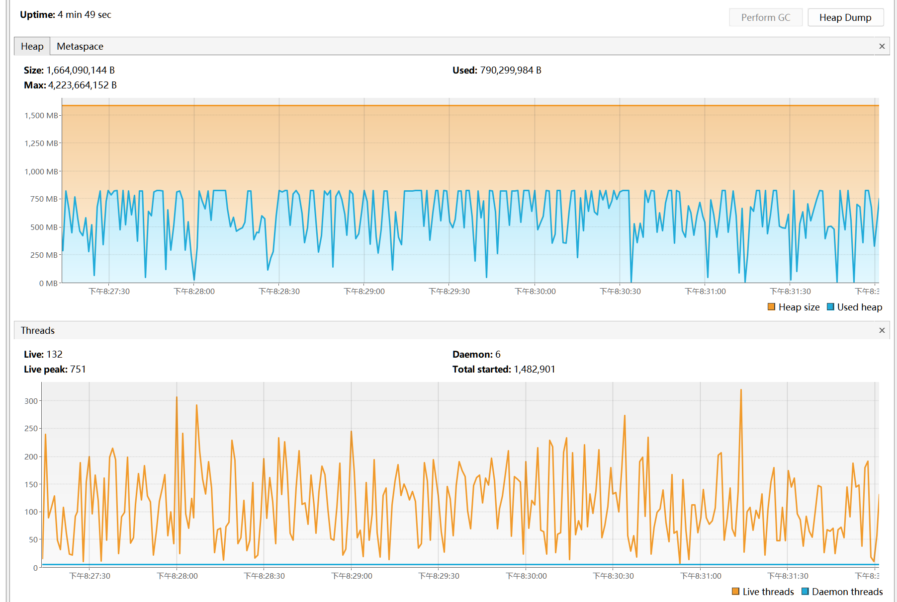
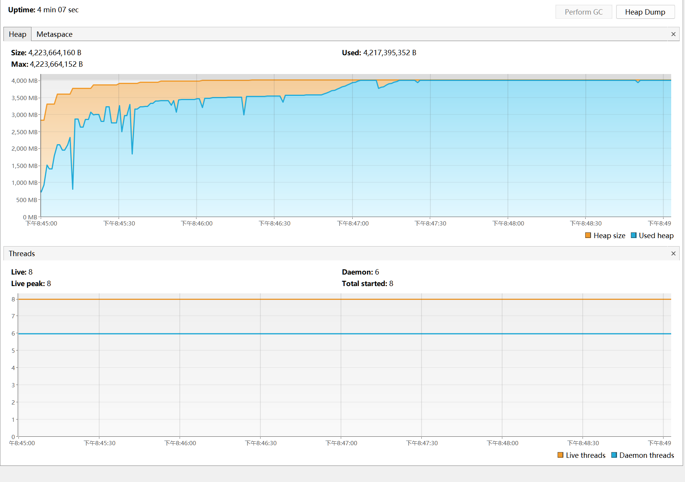
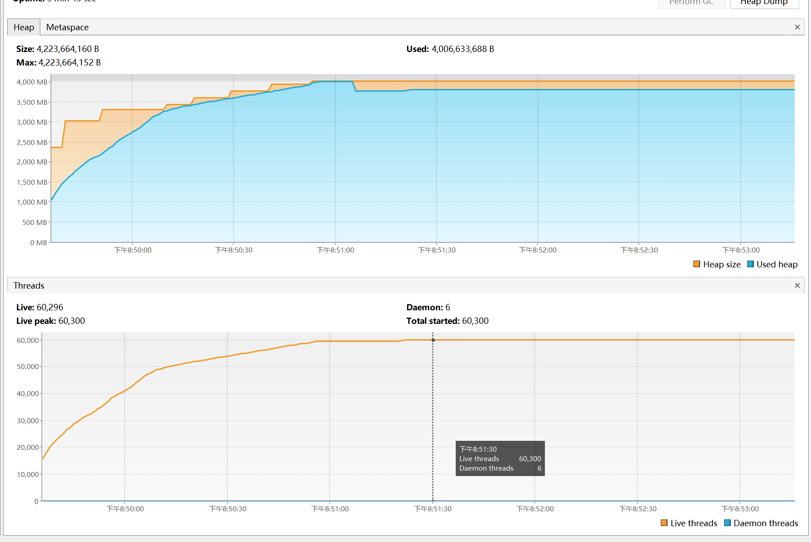

# 内存溢出

## equals()和hashCode()

### 出现条件

1.  `HashMap`和`equals,` `hashCode`联合使用

    ```java
    public static Map<Student, Long> map = new HashMap<>();
    ```

    -   以JDK8的HashMap实现为例

    1.  调用key的`hashCode`方法计算hash值

        `Student`的`hashCode`决定了其在HashMap中的位置

    2.  依据hash值决定存放的数组中的位置

    3.  没有元素直接相等, 有元素先用`equals`判断是否相等

        `Student的`的`equals`决定了元素是否相等, **是增加, 还是覆盖**

2.  `equals`,` hashCode`实现不正确

    如果实现不正确, 明明想的是覆盖数据, 结果总是增加数据,导致HashMap膨胀

    

### 解决方法

1.  新定义实体时, 始终重写`equals`和`hashCode`方法
2.  重写时确认使用了唯一表识区分不同对象, 比如ID
3.  HashMap使用应该使用ID作为数据存储的Key, 而不是实体对象做Key


## 内部类引用外部类

### 问题产生

-   非静态内部类默认会持有外部类, 尽管代码上不使用外部类

    -   非静态内部类被引用的情况下, 其外部类的数据也没办法被回收

    ```java
    public class Outer {
        private byte[] outerData = new byte[1024];
    
        class Inner {
            private byte[] innerData = new byte[1024];
    
            public Inner() {
                byte[] outerData1 = Outer.this.outerData;
            }
        }
    
        public Outer() {v
        }
    
        public static void main(String[] args) throws IOException, InterruptedException {
            ArrayList<Inner> inners = new ArrayList<>();
            int count = 0;
            Outer outer = new Outer();
            while (true) {
                if (++count % 1000 == 0) {
                    System.out.println(count / 1000);
                }
    			// inners.add(new Outer().new Inner()); // 1.982M 次循环后溢出
                // inners.add(new Inner()); // 3.979M
                // inners.add(outer.new Inner()); // 3.944M
            }
        }
    }
    ```
    
-   匿名内部类如果在非静态方法中被创建

    -   会持有创建对象, 垃圾回收器无法回收调用者

    ```java
    public class Outer {
        private byte[] outerData = new byte[1024];
    
        public static Object newObj() {
            return new Object() {
                private byte[] innerData = new byte[1024];
    
                @Override
                public String toString() {
                    byte[] outerData1 = Outer.this.outerData;
                    return super.toString();
                }
            };
        }
    
        public static void main(String[] args) throws IOException {
            ArrayList<Object> objects = new ArrayList<>();
            Outer outer = new Outer();
            int count = 0;
            while (true) {
                if (++count % 1000 == 0) {
                    System.out.println(count / 1000);
                }
                // objects.add(new Outer().newObj()); // 1.982M
                // objects.add(outer.newObj()); // 3.944M
                // objects.add(Outer.newObj()); // 3.973M
                // objects.add(1); // 532.254M
            }
        }
    }
    ```

    

### 解决

-   集合+内部类不要使用非静态, 要使用尽量静态内部类
-   看见循环里面有一个new放进了集合里就应该引起足够的注意了


## TreadLoacal


### 自建线程一般不会内存溢出

由于ThreadLoacl和线程一起创建, 即使不remove, 随线程销毁, 内存也会被释放

```java
public static void main(String[] args) throws InterruptedException {
    int count = 0;
    while (true) {
        new Thread(new Runnable() {
            public final ThreadLocal<Object> threadLocal = new ThreadLocal<>();

            @Override
            public void run() {
                threadLocal.set(new byte[1024 * 1024 ]);
            }
        }).start();
        System.out.println(++count);
    }
}
```




### 线程池的线程不回收造成的内存溢出

```java
public static ThreadLocal<Object> threadLocal = new ThreadLocal<>();

public static void main(String[] args) throws InterruptedException {
    ThreadPoolExecutor threadPoolExecutor = new ThreadPoolExecutor(
            Integer.MAX_VALUE, Integer.MAX_VALUE,
            0 // 线程不回收
            , TimeUnit.DAYS, new SynchronousQueue<>());
    ExecutorService executorService = Executors.newSingleThreadExecutor();
    int count = 0;
    while (true) {
        if (++count % 1000 == 0) {
            System.out.println(count / 1000);
        }
        // executorService.
        threadPoolExecutor.execute(() -> {
            threadLocal.set(new byte[1024 * 64]);
            // threadLocal.remove();
        });
    }
}
```

` Executors.newSingleThreadExecutor()`




`ThreadPoolExecutor`




### 解决

要显示地写出`remove()`来, remove写到finally里取, 保证确实的删除

## String#intern

### 产生条件

JDK6中字符串常量池在堆内存的PermGen永久代中, 永久代一般不会配置的特别大

如果不同的字符串的intern方法被大量调用, 字符串常量池会不断变大, 超过**永久代内存**上限, 就会产生内存溢出问题

JDK8中字符串常量池在堆中, 会被垃圾回收器回收, 但还是要注意如果存储在容器中被意想不到地引用的情况

### 解决

不要把随机出现的字符串放到常量池

 测试后增加永久代的空间

```shell
-XX:MaxPermSize=256M
```


## 静态字段保存对象

大量数据在静态字段中被长期引用, 数据就不会被释放

不是常常有可能将集合作为静态字段吗, 不是很危险吗?

### 解决方案

-   尽量减少将对象长时间保存在静态变量中, 如果不适用, 就将静态变量删除或将静态变量设为null

-   使用单例模式时, 尽量使用懒加载, 而不是立即加载

    ```java
    @Lazy //懒加载
    @Component
    public class TestLazy {
        // ..
    }
    ```

-   Spring的Bean中不要存放长期大对象

-   尽量将缓存的时间定期失效


## 资源未关闭

连接和通道等可关闭资源, 往往带有除了对象本身外的许多数据

对于个人的直接创建的连接和通道, 一般不调用`close()`方法, 只要没了引用, 就会释放内存

一部分连接池, 将连接放在静态变量或集合中等情况, 以为数据没有被引用了, 其实还是被池着的, 这样就又可能有内存溢出的风险

### 解决方法

养成try-with-resource的好习惯

