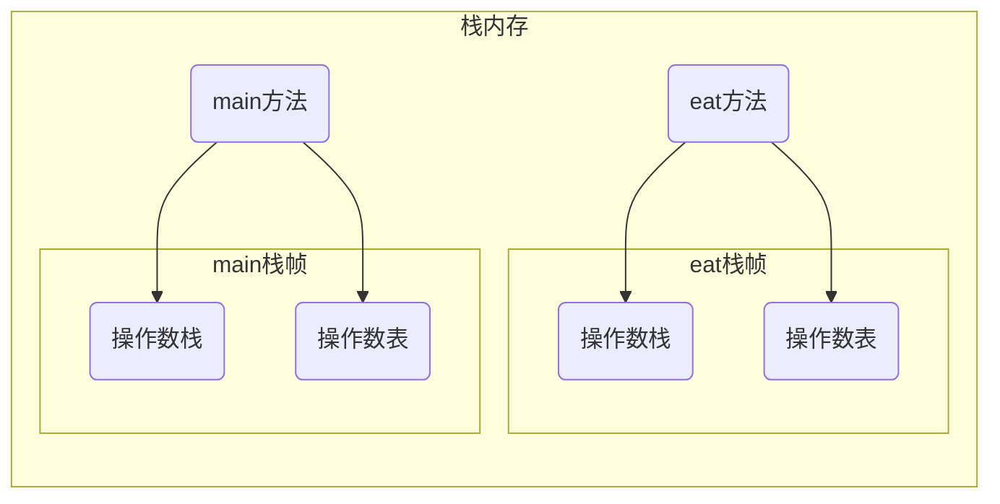
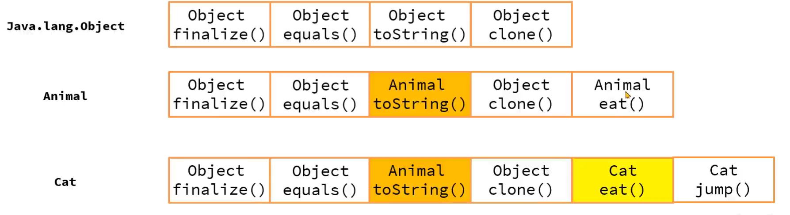

# 方法调用

>   方法本质是通过字节码指令的执行, 能在栈上创建栈帧, 并调用方法中的字节码执行

## 方法调用的字节码指令

| 字节码指令          | 作用                                                         |
| ------------------- | ------------------------------------------------------------ |
| **invokestatic**    | 调用静态方法                                                 |
| **invokespecial**   | 调用对象的private方法, 构造器, super调用父类实例的方法, 父类构造, 接口的默认实现 |
| **invokevirtual**   | 调用对象的非private方法                                      |
| **invokeinterface** | 调用接口对象的方法                                           |
| **invokedynamic**   | 调用动态方法, 主要用于Lambda表达式中, 机制极为复杂           |

这些指令之目的, 在于定位方法在内存中的位置, 然后进行调用

方法都保存在方法区的InstanceKlass中

方法定位的途径有二: 静态绑定和动态绑定

## 静态绑定

1.  编译期间, invoke指令会携带一个参数符号引用, 引用到常量池中的方法定义

    方法定义

    -   类名
    -   方法名
    -   参数列表
    -   返回值

2.  在**方法第一次调用**时, 这些符号引用被替换成内存地址的直接引用

适用于静态方法, 私有方法, finnal修饰的不会被重写的方法

因为多态, 如果子类对象重写了父类的方法, 应当使用子类的对象的方法实现逻辑

静态绑定没有解决这个问题

## 动态绑定

### 方法表

>   invokevirtual vtable 虚方法表
>
>   invokeinterface itable 接口方法表

数组, 在方法区的InstanceKlass对象中,每个节点记录方法所在的地址

### 调用流程

1.  每个类都有自己的虚方法表
2.  子类的虚方法表会先拷贝父类的虚方法表, 末尾增加自己独有的方法
3.  如果子类重写了父类的方法, 则使用自己类中方法的地址进行替换
4.  调用方法时, 对象通过自己头中`Klass Point`获取Instance Klass对象
5.  Instance Klass对象对应的虚方法表中找到方法的地址, 最后调用方法

