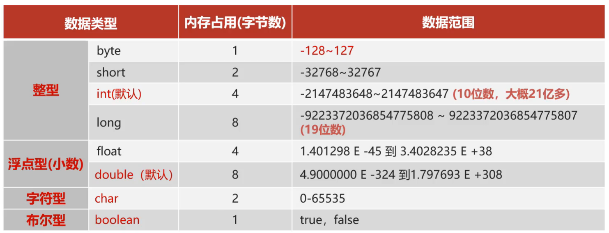
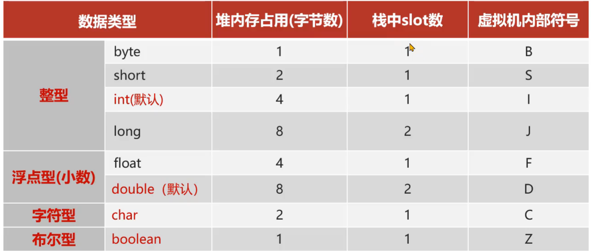

# 栈

## 基本数据类型



-   此处的内存占用指堆上, 或者数组中内存分配的空间大小, 而非栈上的


## 栈内存的分配

```java
int i = 0;
int j = i + 1;
```


```class
	# int i = 0;
iconst_0 			# 将数字0放入操作数栈中
istore_1			# 将操作数栈中的数据弹出, 放入局部变量表中位置为1的地方


	# int j = i + 1;
iload_1				# 将局部变量表中下标为1的数取出, 放入操作数栈
iconst_1			# 将数字1存入操作数栈中
iadd				# 将操作数栈顶往下的两个数相加, 放入操作数栈中
istore_2			# 将操作数栈的数据弹出, 放入局部变量表中位置为2的地方
return				# 返回
```


-   32位系统配套的JVM虚拟机的局部变量表中一个位置占用32位4个字节
-   64位J系统配套的VM虚拟机的局部变量表中一个位置占用64位8个字节
-   long和double占用两个slot槽的位置(在64位JVM虚拟机上占2个slot, 16个字节), 也就是会产生内存浪费
-   这种会产生浪费的设计原因是为了Java字节码的跨平台性
-   同时, 基本每个Slot, 无论什么类型都是对齐的, 拿出什么长度的数据, 不需要判断, 空间换时间




```java
boolean flag = true;
```

```class
iconst_1
istore_1
```

将boolean以int存储

```java
byte num = 1;
```

```class
iconst_1
istore_1
```

将byte以int存储

```java
float floatNum = 1;
```

```class
fconst_1
fstore_1
```

float的编码格式就和int不一样了

```java
long longNum = 1L;
```

```class
lconst_1;
lstore_1;
```

long就以自己的2个slot的方式存储

## boolean类型在栈上的存储

```java
boolean flag = true;
```

```class
iconst_1
istore_1
```

将boolean以int存储, 认为1为true, 0为false

```java
boolean flag = true;
if (flag){ // 字节码中判断flag是否为0, 是就进入else
    sout("true");
} else{
    sout("false");
}
if (flag == true){ // 字节码中判断flag和ture是否不相等, 不相等就进入else
    // 顺带一提, 是从局部变量表中取出flag, 存入操作数栈, 生成true存入操作数栈, 然后比较操作数栈顶的两个元素是否不相等
    sout("true");
} else {
    sout("false");
}
if (flag != false){  // 字节码中判断flag和false是否不相等, 不相等就进入else
    sout("true");
} else {
    sout("true");
}
```


通过ASM更改字节码, 将`flag=true`的`iconst_1`改为2会怎么样?

```java
iconst_2
istore
if (flag){ // 字节码中判断flag是否为0, 是就进入else
    // 2 和 0 相等吗? 不相等
    sout("true");
} else{
    sout("false");
}
if (flag == true){ // 字节码中判断flag和ture是否不相等, 不相等就进入else
    sout("true");
} else {
    // 2 和 ture(1) 不相等吗? 确实不相等, 所以flag不是ture
    sout("false");
}
if (flag == false){  // 字节码中判断flag和false是否不相等, 不相等就进入else
   
    sout("true");
} else {
    // flag是否和false(0)不相等? 确实不相等
    sout("true");
}
```

## 数据拷贝

堆上的数据存储时严格遵照数据原本需要占用的空间的, 例如long类型总是占用8个字节, 不会有空余和浪费

所以从堆到栈和从栈到堆的复制要考虑数据的增加和舍弃可能产生的影响

### 从堆到栈

考虑符号位

低位复制, 高位填充符号位的值

例如64位计算机+int, 低位是低4个字节, 32位, 直接复制

高位是高4个字节, 32位, 补int低32位最高位的数

bool和char不考虑符号位, 直接拷贝, 高位补0

### 从栈到堆

直接舍弃不被使用的高位, 拷贝到堆上

**对于boolean类型, 只取最后一位保存**


```java
static boolean a;
public static void testBooolean(){
    a = true; 
        iconst_0 // iconst_1 iconst_2 iconst_3
        istore
    if (flag){ // 字节码中判断flag是否为0, 是就进入else
    	// 2 和 0 相等吗? 不相等
    	sout("true");
    } else{
        sout("false");
    }
    if (flag == true){ // 字节码中判断flag和ture是否不相等, 不相等就进入else
        sout("true");
    } else {
        sout("false");
    }
    if (flag == false){  // 字节码中判断flag和false是否不相等, 不相等就进入else
        sout("true");
    } else {
        sout("true");
    }
}
```

