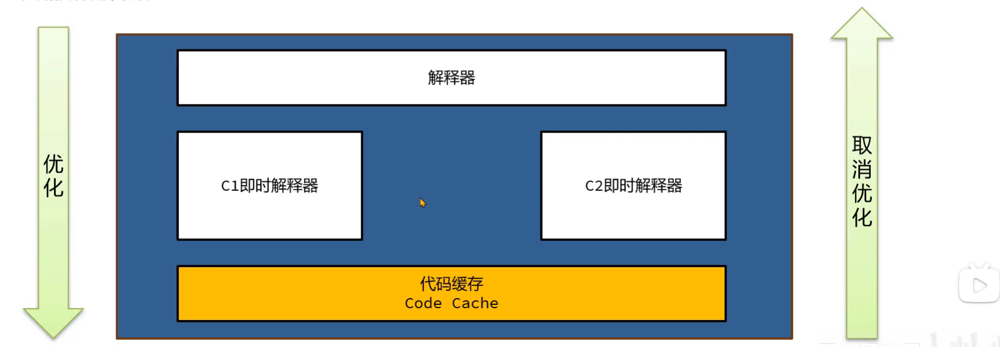

# JIT即时编译器

>   Just In Time

## 热点代码

字节码指令被Java虚拟机解释执行, 如果有一些指令执行频率高, 就称之为热点代码

热点代码将被从字节码编译成机器码

编译过程中,JIT还会做一些优化, 将编译完的机器码保存在内存中

## 即时编译器

Hotspot中的三款即时编译器

-   C1 编译效率高 适合优化执行时间短的代码
-   C2 优化效果好 适合优化执行时间长的代码
-   Graal

## 即时编译




1.  字节码指令有解释器解释执行
2.  方法或循环执行次数多
    -   C1 对代码进行优化, 并编译成机器码, 保存在Code Cache
3.  方法或循环执行次数越来越多
    -   C2 执行编译代码
4.  在某些情况下, C2的编译后的代码的执行效果不如之前的代码, 及时止损, 取消优化

### 分层编译

| 等级 | 组件   | 描述                                   | 保存数据                              | 性能 |
| ---- | ------ | -------------------------------------- | ------------------------------------- | ---- |
| 0    | 解释器 | 解释执行<Br>记录方法调用次数及循环次数 |                                       | 1/5  |
| 1    | C1     | 完整优化                               | 优化后的机器码                        | 4/5  |
| 2    | C1     | 完整优化<br>记录部分额外信息           | 优化后的机器码+方法调用次数/循环次数  | 3/5  |
| 3    | C1     | 完整优化<br>记录所有额外信息           | 优化后的机器码+分支跳转次数, 类型转换 | 2/5  |
| 4    | C2     | 完整优化                               | 优化后的机器码                        | 5/5  |

记录信息是为了将信息传给C2判断

### 开启配置

-   默认开启完全JIT即使编译

-   关闭JIT只是用解释器

    ```shell
    -Xint
    ```

-   分层编译下只使用1层C1进行编译

    ```shell
    -XX:TieredStopAtLevel=1
    ```

    

### 原理

-   C1和C2在独立的线程执行, 不会影响用户线程
-   C1和C2各自保存任务队列, 队列中存放需要编译的任务
-   一般是针对方法进行优化的, 对循环优化也有


### 执行流程


1.  C1执行过程中收集运行中信息: 方法执行次数, 循环执行次数, 分支执行次数
2.  等待次数触发阈值, 之后进入C2进行机器编译器进行深层次优化
3.  方法字节码执行数目过少, 先收集信息, JVM判断C1和C2优化性能差不多, 在那之后转为不收集信息, 由C1直接进行优化

## JIT Watch

[下载](https//github.com/AdoptOpenJDK/jitwatch/tree/1.4.2)

高于1.4.2好像会乱码

在目录下

```shell
mvn clean -DskipTests=true compile test exec:java
```


## 优化手段

主要通过**方法内联**和**逃逸分析**等

### 方法内联


方法体中的**字节码指令**直接复制到调用方的字节码指令中, 节省了创建栈帧的开销

要求

-   方法编译之后的字节码指令总大小<35字节, 可以**直接内联**

    ```shell
    -XX:MaxInlineSize=35
    ```

-   方法编译之后的字节码指令总大小<325字节且是一个**热**方法

    ```shell
    -XX:FreqInlineSize=325
    ```

-   方法编译器生成的机器码不能大于1000字节

    ```shell
    -XX:InlineSmallCode=1000
    ```

-   一个接口的实现必须小于等于2个, 大于等于3个就不会内联


Java有许多方法, 为了健壮性(例如toUpperCase为了适配多种语言), 就会写的很大, 就不会被内联

### 逃逸分析

```shell
-XX:-DoEscapeAnalysis
```

-   `-`减号表示不开启

JIT发现方法内创建的对象不会被外部引用, 就可以采用**锁消除, 标量替换**等方法进行优化

```java
whlie(flag){
    // ...
    Student student = new Student();
    int age = .age; // 没有被逃逸
}
```

```java
void demo(){
    // ...
    whlie(flag){
        // ...
        Student student = new Student();
        int age = executeMethod(student);
    }
}
static Student student; 
int executeMethod(Student student){
    Demo.student = student;  // 被逃逸
    return student.age;
}
```

#### 锁消除

如果对象被判断不会被逃逸出去, 那么对象就不存在并发访问问题, 对象上的锁处理都不会执行, 从而提高性能

```java
synchronized(new Test()){
    // ...
    // 反正获取不到 new Test() 里面的数据, 也无法多线程地区改变里面的数据, 就不会有线程安全问题
}
```

但是写代码了就不会出现这个问题啦

#### 标量替换

对象中的基本数据类型称为**标量**

引用其他对象类型称为**聚合量**

标量替换是指如果方法中的对象如果不会逃逸那么其中的标量就可以直接在栈上分配

`obj.value->value`

```java
class MyObject{
    int value=0;
    int exec(){
        this.value++;
    }
}
```

```java
while(flag){
    MyObject obj = new MyObject(); 
    obj.exec();
}
```

-exec方法足够短->方法内两

```java
while(flag){
    MyObject obj = new MyObject(); 
    obj.value++;
}
```

-obj不会逃逸->变量替换

```java
while(flag){
    int value = 0; // 聚合量替换成标量 
    value++ ;
}
```

## 优化方向

1.  编写比较小的代码, 使方法内联生效
2.  高频使用的代码, 内容复杂(框架, 第三方依赖, JDK原生为了健壮性和功能完善啊)而无法内联就自行实现一个
3.  注意接口的实现数量不要超过两个
4.  高频使用的方法中创建对象临时使用, 尽量不要让对象逃逸
