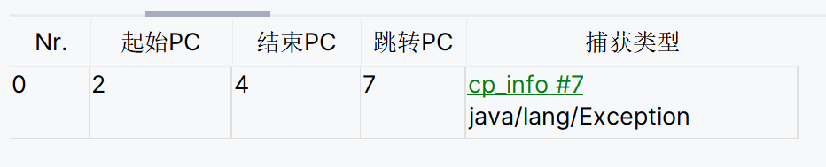
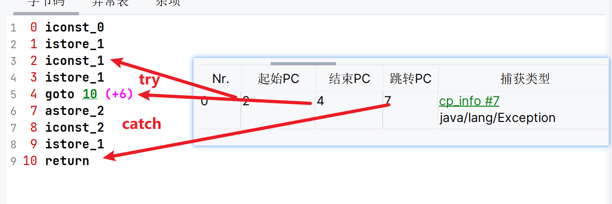
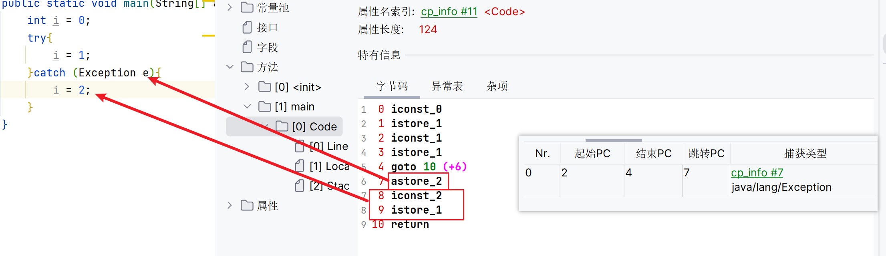
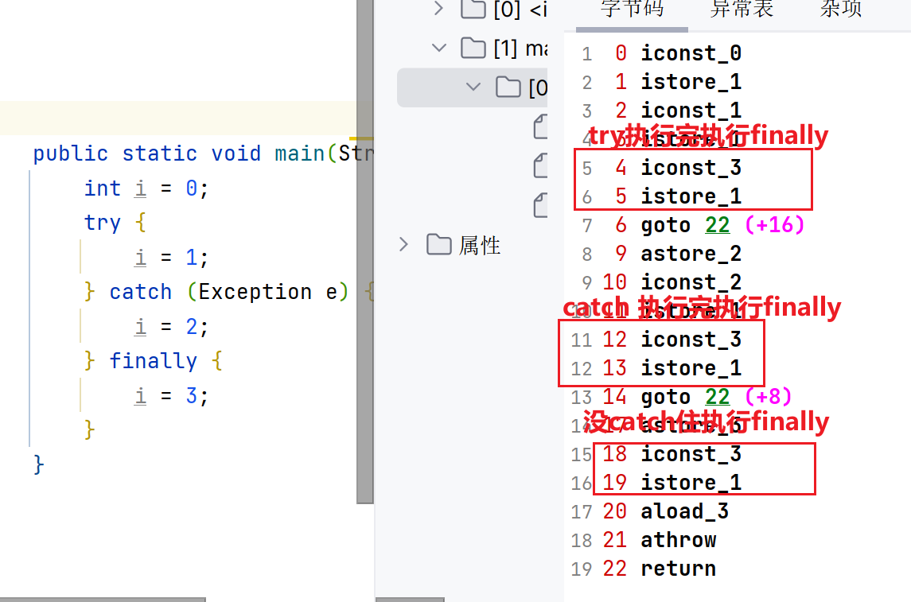
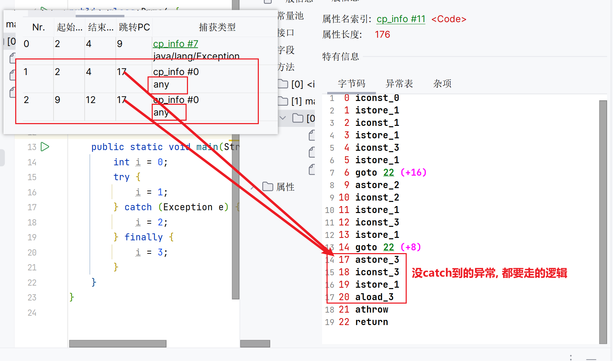

# 异常捕获

## 异常表

包含了**异常捕获**的生效范围以及异常发生后跳转到的字节码指令位置

-

-   起始PC **异常捕获**生效的起始位置
-   结束PC **异常捕获**生效的结束位置
-   跳转PC **异常捕获**之后跳转到的字节码位置

## 异常捕获

### try-catch

1.  将捕获到的异常存入局部变量表
2.  执行catch语句
3.  如果异常没有被捕获, 直接弹出栈帧, 在上一层的栈帧中进行异常捕获的查询

### finally

1.  直接插入到try-catch代码块之后

    

2.  没有catch住的异常, 让所有的异常都走一段finally

    

