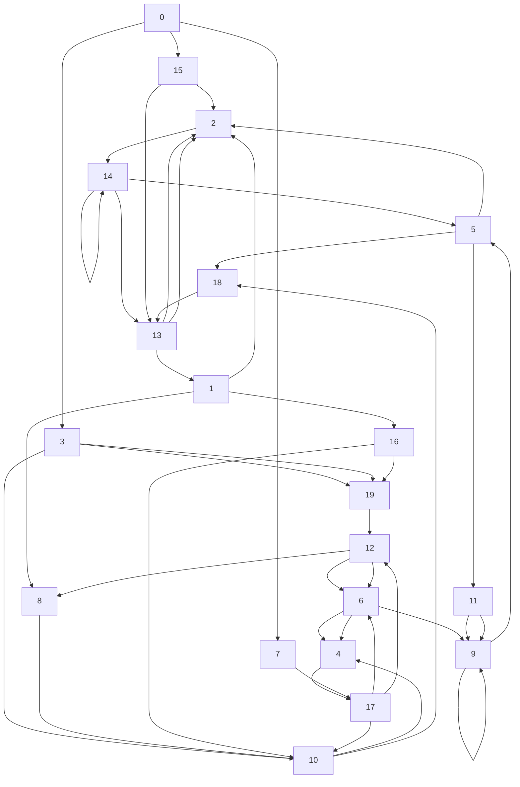

# 可回收判断

## 可回收条件

1.  对象是否被引用

    1.  变量(局部变量/字段)被设为null

    2.  栈里的局部变量的作用域结束

    3.  循环引用的情况呢?

## 引用计数法

为每个对象维护一个引用计数器, 对象被引用时+1, 取消引用时-1

C++的智能指针使用该方法

缺点

1.  每次引用建立和结束都需要维护计数器, 对系统性能有影响
2.  循环引用问题

## 可达性分析

### GC Root对象

将Heap上的对象分为垃圾回收的根对象(GC Root), 和普通对象

对象和对象之间存在引用关系

GCRoot对象一般是不可回收的

下列对象称之为GC Root对象

-   线程Thread对象
-   启动类加载器(Bootstrap)加载的`java.lang.Class`对象
-   监视器对象, 用来保存同步锁synchronized关键字持有的对象
-   本地方法调用时使用的全局对象

### 可达性分析的回收标准

GCRoot对象引用新的对象, 如果能通过引用链找到该对象, 则该对象不被回收, 否则该对象被回收

? 扫描一遍堆内存, 然后扫描一遍所有GCRoot的引用链?

反过来如果一个普通对象不能通过引用链找到任何一个GCRoot对象, 那么与这个对象相关的一整条引用链上的对象都是可以删除的?

### 不同GC Root的情形

-   线程Thread对象

    1.  线程Thread对象和栈关联

    2.  栈内的局部变量表中有各种局部变量

    3.  局部变量引用了一些对象

        => 这些对象处于线程Thread对象的引用链上

    4.  局部变量引用的对象不被回收

-   Bootstrap加载的对象

    1.  例如Launcher被Bootsrap加载
    2.  Laucher作为GC Root对象, 其引用AppClassLoader对象
    3.  AppClassLoader加载了某个类Class对象(你咋不说所有类的类对象呢?)
    4.  此Class对象中有静态变量,指向一个实体, 此实体在引用链上
    5.  静态字段引用的对象不会回收

-   同步锁synchronized关键字持有的对象

-   本地方法调用时使用的对象

### 查看GC Root对象

artuas, 将heap的快照保存到磁盘文件

```shell
heapdump > C:\Users\27970\Destop\heap.hprof
```

eckuose Memory Analyzer(MAT)工具(要求JVM17以上)打开对内存快照文件

GC Roots功能查看所有GC Root

思考以下循环依赖的情况怎么回收比较好(随机生成的)



