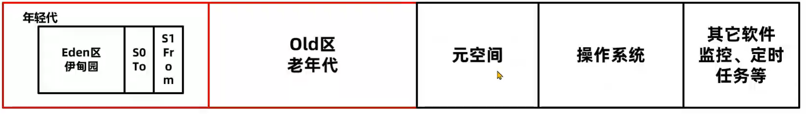
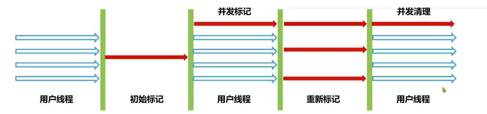

# GC调优

## 目标

避免由垃圾回收引起的程序性能下降

## 调优方向

-   JVM参数
-   选择垃圾回收器
-   解决频繁的FullGC

## 手段

-   优化基础JVM参数
-   减少对象产生
-   更换垃圾回收器
-   优化垃圾回收器参数

## JVM参数优化


### 堆内存

将-Xms和-Xmx设置成一样大

-   减少扩容的动作
-   防止在后期要扩容了反而不能向操作系统申请了
-   如果-Xms太小, JVM不得不反复GC+扩容, 导致启动太慢i


1.  根据最大并发量估算服务器配置

2.  根据服务器配置计算最大堆内存

    

    堆, 即可配置的部分, 是年轻代+老年区


### 元空间

```shell
-XX:MaxMetaspaceSize
-XX:MetaspaceSize
```

-   `MaxMetaspaceSize`
    -   默认比较大
    -   如果出现元空间内存泄漏会导致操作系统可用的内存不可控
    -   一般设置成256M
-   `MetaspaceSize`
    -   到达会该阈值触发FullGC, 触发了第一次FullGC之后, 到什么时候触发FullGC就由JVM决定
    -   如果设置得和`MaxMetaspaceSize`一样大, 不会FullGC, 也对象也不会回收
    -   可以不设置 

### 栈内存

```shell
-Xss
```

虚拟栈大小, 默认大小的栈和操作系统有关 , Linux-86的栈内存大小1M

一般情况下是减小这个栈


### 不建议配置的参数

```shell
-Xmn
```

年轻代的大小(Eden+Servivor), 默认是整个堆的1/3

G1会自动调整年轻代的大小

```shell
-XX:ServivorRatio
```

伊甸园区和幸存者区的大小比, 默认8

每个年龄阶段的对象求个数, 从年轻到年老逐个相加, 加到超过Survivor区域的50%, 比此时的年龄老, 就将放入老年区

### 其他配置

```shell
-XX:+DisableExplicitGC
```

在代码中使用的`System.gc()`无效

```shell
-XX:+HeapDumpOnOutOfMemoryError -xX:HeapDumpPath=<PATH>
```

启动`hprof`内存快照

```shell
-XX:+PrintGCDetails -XX:+PrintGCDateStampls -Xloggc:<PATH>
```

启用GC日志打印, JDK9之后`-Xlog:gc*:file=<PATH>`

### 配置模板

```shell
-Xms1024m
-Xmx1024m
-Xss256k
-XX:MaxMetaspaceSize=512m
-XX:+DisableExplicitGC
-XX:+HeapDumpOnOutOfMemoryError
-XX:HeapDumpPath=/opt/logs/service-heap.hprof
-XX:+PrintGCDetails
-XX:+PrintGCDateStamps
-Xloggc:/opt/logs/service-gc.log
```

## 减少对象产生

## 更换垃圾回收器

### PS+PO

JDK8下的默认组合, 注重并发量, 不适合高并发, 响应时间长


### ParNew+CMS

限制最长时间的垃圾回收, 将大的垃圾回收分成多次

```shell
-XX:+UseParNewGC -XX:+UseCOncMarkSweepGC
```


### G1

特别强, 高版本合适

## 优化垃圾回收器参数

先调代码, 调JVM参数, 换垃圾回收器, 别优化垃圾回收器参数

### CMS并发模式失败

由于CMS的垃圾清理线程和用户线程并行进行

如果在并发清理的过程中出现老年代的空间不足里放入新的对象, 会产生并发模式失败



其下场, 是JVM使用Serial Old单线程进行FullGC对老年代的回收, 会出现长时间的停顿

```shell
-XX:+UseCMSInitiatingOccupancyOnly \
-XX:CMSInitiatingOccupancyFraction=15
```

当老年代的大小达到该阈值(15表示老年代的15%), 会自动进行CMS垃圾回收, 提前进行老年代的回收, 减少其大小

调小之后反而会反复增加FullGC次数

JDK8中默认-1, 默认值的计算方式如下: 


$$
CMSInitiatingOccupancyFraction = 100-MinHeapFreeRadio+CMSTringgerRatio*\frac{MinHeapFreeRatio}{100}
$$

