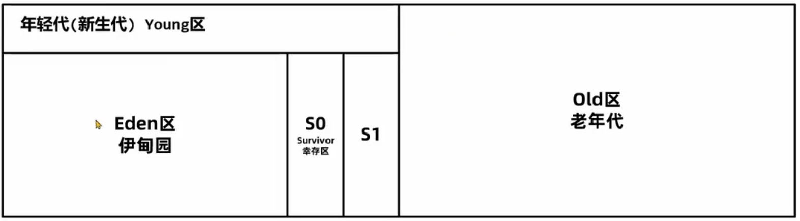
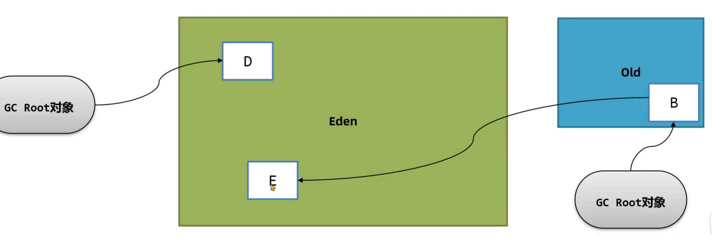
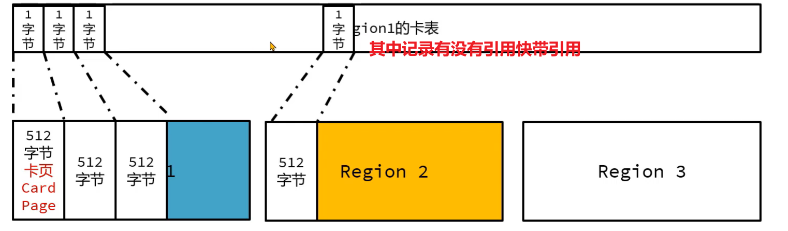

# G1

>   Gabage First


G1出现之前的垃圾回收器内存结构一般是连续的



G1的整个内存划分为多个大小相等的**Region**, 分为Eden, Survivor, Old

Region的大小通过对空间的大小/2048获得

配置Region的大小, 必须是2的指数幂, 范围是1M到32M

```shell
-XX:G1HeapRegionSize=32M
```


## 年轻代垃圾回收

>   Young GC 只回收年轻代的Eden和Servivor

用户停滞, 导致STW

配置Young GC每次垃圾回收时的最大暂停时间ms数, 默认200, G1尽可能保证时间

```shell
-XX:MaxGCPauseMillis=200
```

1.  新创建的对象保存在Eden区, G1判断年轻代区不足( 默认下达到60%), 无法分配对象时会执行Young GC

2.  标记Eden和Servivor区域中的存活对象

3.  G1根据最大暂停时间选择某些区域将存活对象复制到一个**新的Survivor区**中(年龄+1), 清空未存活对象

    

    

4.  根据每一个Region的耗时计算平均值, 这个平均值和配置做比较, 对每次回收几个区域做调整

5.  年龄大于15放入老年代(晋升)

    -   若对象的大小超过Regin的一半,直接放入老年代, 这类老年代称为Humongous(巨大的)区
    -   如果对象过大会跨越多个Region

### 引用标记

如果一个对象被老年代的对象引用, 在年轻代GC的时候, 必不会被回收



由于标记使用从GCRoot开始, 在引用链上的标记为引用, 然后再回收没有被标记为引用的

如何快速给E对象标记一个已被引用?

-   每次都要从GC Root对象检查引用
    -   效率太低则为之奈何?
-   维护一张表, 一个字段是老年代的对象, 一个字段是年轻代被引用的对象
    -   太占内存则位置奈何? 
    -   老年代对象如果不被引用, 而年轻代的对象被不被引用的老年代对象引用, 当被回收, 则为之奈何?

### 记忆集

记录`老年代编号=list(该老年代中的在年轻代有引用的对象的地址)`

-   **记忆集(Remember Set)**, 一种数据结构, 记录了从非收集区域对象(老年代)引用收集区域对象(年轻代)的这些关系的数据结构
-   扫描时将记忆集中的对象也加入GC Root中来进行扫描
-   那内些从原生GCroot出来的引用链不是还要再扫描一次? 干脆年轻代GC的时候GCRoot走到老年代就不走了

### 卡表

将所有区域中的内存按照一定大小划分为块, 每个块进行编号, 记忆集中只记录对块的引用关系

-   如果一个块中有多个对象, 只需要引用一次, 减少内存开销(真的减少了?)

-   **卡表(Card Table)** 每个Region都有自己的卡表,  将内存分为小块, 记为**卡页(Card Page)**

-   如果产生了跨代引用(老年代引用年轻代), 此时这个Region对应的卡表上就会将字节内容进行修改, JDK8源码中0代表引用了, 称为脏卡

    

    -   一个字节卡表-512字节卡页是固定配置

-   标记出当前Region被老年代中那些部分引用了.

-   只需要遍历整个卡表, 找到所有脏卡, 就可以依据卡表形成记忆集

-   又要维护一张表?内存这么不值钱?而且是一段连续的内存啊!(1G堆内存->2M卡表)


### 写屏障

>   Write Barrier

在执行引用关系建立代码时, 可以在代码前和代码后插入一段指令, 从而维护卡表

如果引用是从老年代到年轻代的, 就在卡表中标记为脏表

需要执行额外的指令, 损失用户线程5%-10%的性能

-   用户线程

    1.  发生垮代引用
    2.  写屏障更新脏页
    3.  将脏卡的信息放入脏卡的队列中(意义不明, 有这一步为什么要维护卡表, 既然说卡表为了节省内存开销, 但是卡表的卡页是可以通过计算得出的吧? 为什么要维护卡表啊)

-   Refinement线程

    -   消费脏卡队列, 同步记忆集

    -   异步完成, 保证了同步记忆集更新时的原子性

-   GC线程

    1.  将记忆集中的所有被标记为脏页的卡页中的所有对象标记为GCRoot
        -   ?????????????????????????????????????????????????????????这不是有很多没必要标记为GCRoot的对象也被标记为GCRoot了
    2.  从GCRoot开始引用, 标记引用的年轻代对象


### 总流程

1.  Root扫描所有的静态变量和局部变量(估计他俩的GCRoot不太一样, 可以单独拿出来扫描)
2.  将脏卡队列的任务处理完
3.  标记存活对象
    1.  记忆集中的对象加入GC Root对象集合
    2.  在GCRoot引用链上的对象被标记为存活对象
4.  将存活的对象复制到新的幸存者区, 释放原来的内存
5.  处理软弱虚终结器引用

## 混合垃圾回收

多次回收后, 会出现很多老年代, 此时总堆栈率占有率达到阈值(默认45%)

```shell
-XX:InitiatingHeapOccupancyPercent=45
```

会触发混合回收MixedGC, 回收所有年轻代, 部分老年代和大对象区, 采用复制算法完成

G1对老年代的清理会原则存货度最低(存活的最少)的区域来进行回收, 这样可以保证回收效率最高, 即Garbage First


1.  初始标记 Initial mark

    -   阻塞用户进程
    -   多线程并行执行
    -   ==**三色标记法**==标记GC Root可**直达**的对象
    -   被GC Root引用的对象标记为存活

2.  并发标记 concurrent mark

    -   用户线程并发执行
    -   单线程串行执行
    -   标记存活的对象引用的对象标记为存活

3.  最终标记 remark/Finalize Marking

    -   处理在并发标记过程中用户线程对对象引用产生新变化的处理

    -   阻塞用户进程

    -   多线程并发执行

    -   处理**==SATB==**相关的对象标记

    -   标记引用漏标的对象(即再次被引用而复活的), 不管刚刚被断开引用的对象(此次被认为是存活的)和不被关联的对象(一开始就卒了的)

        保证了效率

4.  并发清理 cleanup

    -   用户线程并行执行
    -   单线程串行
    -   将存活对象复制到别的Region, 不会产生内存碎片


### 三色标记法

#### 三色

-   黑(1)
    -   表示存活
    -   当前对象在GCRoot引用链上
    -   他引用的其他对象都标记完成
-   白(0)
    -   初始颜色
    -   在最终表示可回收
    -   不再GC Root引用链上
-   灰
    -   采用队列的方式保存标记为灰色的对象
    -   当前对象在GCRoot引用链上
    -   引用的其他对象未标记完成

使用位图(bitmap)来实现对黑白色的标记

一个对象用一位来标识标记的内容, 黑为1, 白为0

灰色不存储在位图中, 而是放入灰色队列

#### 流程

1.  从灰色队列中取出一个对象
2.  遍历这个对象引用的对象
3.  如果遍历到的对象是引用链的末节点,或遍历到的对象引用的对象已经完成标记, 则将遍历到的对象标记为黑色
4.  如果遍历到的对象依旧引用了其他对象, 且其引用的对象没有标记完, 则将遍历到的对象放入灰色队列
5.  将本对象标记为黑色
6.  返回步骤1


#### 缺憾

在标记过程中用户可以更改引用的状况, 就又可能产生错标

该回收的不回收也就算了

不该回收的回收掉了就完蛋了(崩溃)

不该回收又回收掉的情况

1.  A对象被标记为黑, B对象引用C对象, B为灰, C为白
2.  取出B对象, 还未处理B对象的标记工作
3.  用户线程将B对象的引用C释放, 转而让A对象引用C对象
4.  B对象没有引用的对象, B对象标记为黑色
5.  C对象没有被标记, 将来可能被释放

### SATB

>   初始快照

#### 流程

1.  标记开始时创建一个快照, 记录当前所有对象

2.  标记过程中新生成的对象(和快照进行比对)直接标记为黑色

    -   即使这一轮垃圾回收回收不掉, 下一轮也可以回收掉

3.  采用前置写屏障

    1.  在引用赋值(如`obj.value=null`或其他赋值操作)前, 将之前引用的对象放入SATB待处理队列中

        SATB队列每个线程持有一份

    2.  最终汇总到一个大的SATB队列中

4.  在最终标记阶段, 将所有的SATB队列中的所有元素汇总到大队列中

    -   其中所有元素作为存活处理

5.  取出大SATB队列中的元素, 标记为灰色, 执行灰色标记法的流程


#### 缺点

产生浮动垃圾, 本轮不清理, 要等到下一轮才会清理

### 转移

转移之本质乃复制, 将存活对象复制到新区域, 释放整个老区域

1.  根据最终标记的结果, 选择需要被优先转移的区域

    -   计算给一个区域的垃圾对象占用内存空间的大小

    -   根据停顿时间, 选择转移效率最高(垃圾对象最多, 需要转义的存活对象最少)的几个区域

2.  如果一个区域没有任何存活的对象, 就直接释放这个区域

3.  先转移GC Root直接引用的对象

4.  转移其他对象

5.  如果别的区域有对象引用的对象发生了转移, 就需要重新设置引用关系


## Full GC


如果出现内存内没有Region可以用来拷贝


就会触发**Full GC**对整个区域做一个回收, 导致**用户线程的暂停**

