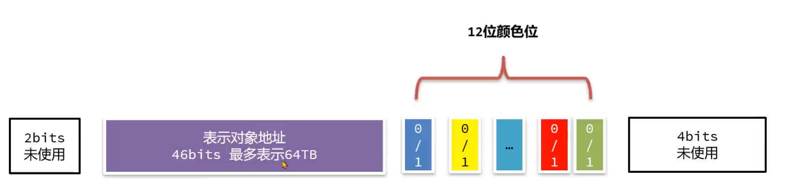

# ZGC

可拓展的低延迟(1ms)垃圾回收器

支持几百M到16TB的堆大小, 堆大小堆STW的时间基本没有影响

G1需要几百ms的时间垃圾回收, 其主要消耗在**转移**, 将对象**复制**到新的区域并且更改引用(**重映射**)消耗了大量时间

G1为什么要在阶段实行STW执行转移

0.  如果转移和用户线程并发执行
1.  对象复制到新的区域
2.  用户线程对对象进行了修改, 此时修改的对象是仍处于老旧位置的对象, 新对象没有被改变
3.  转移引用, 重映射, 当时更改的操作没有生效, 产生了读写不一致

## 流程

1.  初始标记
    -   STW
    -   多线程执行
    -   标记GC Roots引用对象为存活
    -   对象数量少, 停顿时间短
2.  并发标记
    -   和用户线程并发执行
    -   多线程执行
    -   遍历所有对象, 标记可以达到的每一个线程是否存活
3.  标记结束
    -   STW
    -   多线程执行
    -   整理工作, 为下一阶段做准备
4.  并发处理
    -   和用户线程并发执行
    -   多线程执行
    -   处理软弱对象引用
    -   卸载类
    -   清理空区域(ZGC中称为ZPage)
    -   下一阶段准备, 选择回收效率最高的转移区域
5.  转移开始
    -   STW
    -   多线程执行
    -   转移GC Root直接引用的对象
6.  ==并发转移, 并发重映射==
    -   和用户线程并发执行
    -   多线程执行
    -   将存活的对象转移到新的区域中
    -   将对象引用关系重新建立

## 并发转移并发重映射方案

### 读屏障

>   Load Barrier

当获取一个对象引用时, 会触发读后屏障指令, 如果对象指向的不是转移后的对象, 用户线程会将引用指向转移后的对象

-   如何判断指向的是转移前的对象
-   如何获取转移后的对象的位置

损失5%-10%的性能

### 着色指针

>   Colored Pointers

访问对象引用时, 使用的是对象地址

64位操作系统,8个字节标识地址, 地址的高位大多空缺而未使用

着色指针利用了多余的几位, 存储了状态信息

和指针压缩矛盾了, 不支持指针压缩, 也不支持32位操作系统

#### 结构

将原来的8个字节, 64位拆分成

-   最低44位
    -   标识对象地址, 最多可以表示16TB内存空间
    -   ZGC通过操作系统更改了获取地址的逻辑, 只有最低44位被看作地址
-   中间4位
    -   终结位, 1只能通过终结器访问
    -   重映射位(Remap): 转移完之后, 1对象的引用关系已经变更完成
    -   Marked0: 1该对象的表示已经完成可达标记
    -   Marked1: 1该对象的表示已经完成可达标记
-   16位未使用

### 内存划分

ZGC将内存划分位多个区域, 每个区域称为Zpage

管控力度比G1更细, 更容易控制停顿时间

-   小区域
    -   2M
    -   只保存256KB以内的对象
-   中区域
    -   32M
    -   保存256KB-4MB的对象
-   大区域
    -   只保存一个大于4M的对象

## 阶段

1.  初始标记阶段

    -   标记GC Roots 引用的对象`Marked0`位标记为1

2.  并发标记阶段

    -   将引用链上的对象的`Marked0`位都标记位1
    -   用户线程在读取对象引用的时候, 触发读屏障, 查看是否完成标记, 帮助完成对对象可达性的标注
    -   *完成上一个周期的重映射*

3.  并发处理阶段

    -   选择需要转移的ZPage, 创建Zpage对应的移表, 记录转移前对象和转移后对象地址
    -   *清理转移映射表*

4.  转移开始阶段

    -   将不转移的对象`Remapped`位标记为1, 表示转移完成, 避免重复进行判断
    -   复制需要对象, 记录到转移映射表
    -   如果转移的对象是GC Root直接引用的对象, 就将GC Root的指向移向转移后的对象
    -   释放旧ZPage内存
    -   用户线程访问对象, 发现引用的地址是已释放的空间, 就将依靠转移映射表帮助重映射

5.  ==下一轮==垃圾回收的并发标记阶段

    -   需要通过GC Root遍历访问所有的对象,在此期间通过访问映射表完成重映射

    -   为了区分上下两轮标记, 该轮标记使用`Marked1`来表示标记是否完成, 为0 依据转移映射表中进行重映射

ZGC在用户线程和GC线程更改转移映射表时(用户线程不是只对转移映射表有读吗? 不理解, 狗屁不通)

如果先有线程写入转移记录, 新线程发现转移映射表中有同一条转移记录, 就会放弃转移工作

## 分代设计

老年代回收采用和年轻代回收不同的线程, 可以并行执行

大部分对象在年轻代回收, 减少老年代的扫描次数

### 着色指针的修改

1.  最高2位未使用
2.  46位表示对象地址, 最多64TB的地址空间
3.  12位颜色位
4.  最低4位未使用

