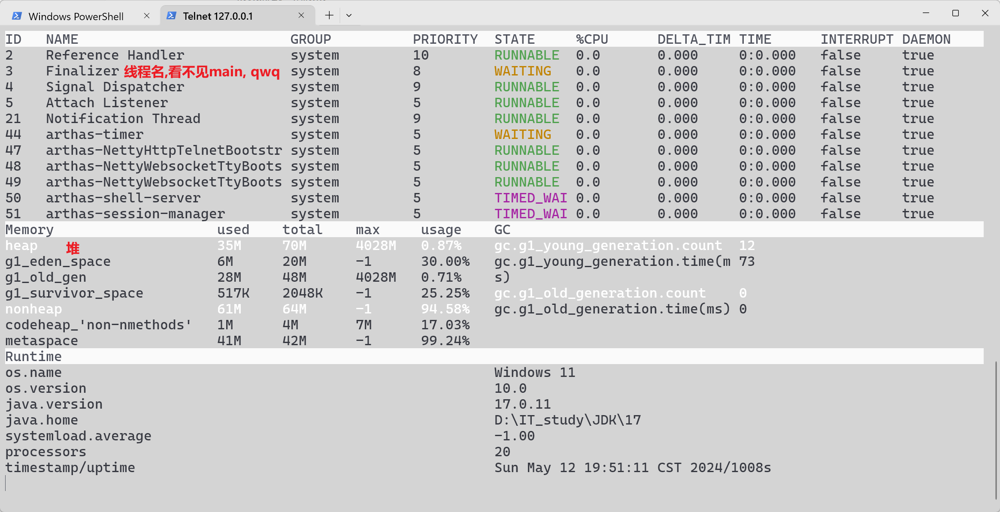
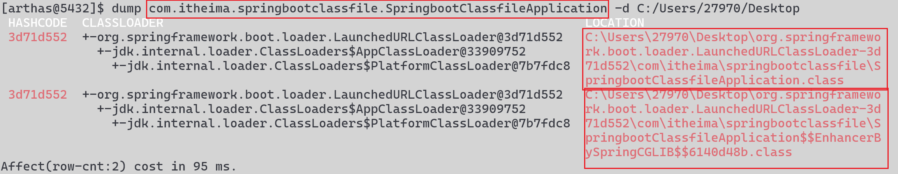

# Arthas

线上监控诊断工具

查看应用load, 内存, GC, 线程状态, 字节码信息

在不修改代码的情况下对业务进行诊断

java写的

## 启动

先启动项目文件

```shell
java -jar 
```

```shell
java -jar D:\IT_study\tools\arthas\arthas-boot.jar
```

如果有多个文件, 就用jps查出项目文件的进程号

```shell
jps -l
```

返回: 

```
12284 jdk.jcmd/sun.tools.jps.Jps
6556 .\springboot-classfile-0.0.1-SNAPSHOT.jar
```

然后加上参数执行Arthas

```shell
java -jar D:\IT_study\tools\arthas\arthas-boot.jar 6556
```

或者也可以不加, 在这里选择对应的项目, 输入`1`表示第1个项目

```
[INFO] JAVA_HOME: D:\IT_study\JDK\17
[INFO] arthas-boot version: 3.6.7
[INFO] Found existing java process, please choose one and input the serial number of the process, eg : 1. Then hit ENTER.
* [1]: 7256 .\springboot-classfile-0.0.1-SNAPSHOT.jar
```

启动成功

```
[INFO] arthas home: C:\Users\27970\.arthas\lib\3.7.2\arthas
[INFO] Try to attach process 7256
Picked up JAVA_TOOL_OPTIONS:
[INFO] Attach process 7256 success.
[INFO] arthas-client connect 127.0.0.1 3658
  ,---.  ,------. ,--------.,--.  ,--.  ,---.   ,---.
 /  O  \ |  .--. ''--.  .--'|  '--'  | /  O  \ '   .-'
|  .-.  ||  '--'.'   |  |   |  .--.  ||  .-.  |`.  `-.
|  | |  ||  |\  \    |  |   |  |  |  ||  | |  |.-'    |
`--' `--'`--' '--'   `--'   `--'  `--'`--' `--'`-----'

wiki       https://arthas.aliyun.com/doc
tutorials  https://arthas.aliyun.com/doc/arthas-tutorials.html
version    3.7.2
main_class
pid        7256
time       2024-05-12 19:08:24
```

然后这个智障给我们下载了文件到C盘

```
[INFO] arthas home: C:\Users\27970\.arthas\lib\3.7.2\arthas
```

Alibaba是这样流氓的

换一种方式启动

```shell
 C:\Users\27970\.arthas\lib\3.7.2\arthas\as-service.bat -pid 9476 --ignore-tools
```

java获取当前pid

```java
long pid = ProcessHandle.current().pid();
System.out.println("pid = " + pid);
```

## 功能

[命令列表](https://arthas.aliyun.com/doc/commands.html)

-   监控面板
-   查看字节码信息
-   方法监控
-   类的热部署
-   内存监控
-   垃圾回收监控
-   应用热点定位

## 监控面板

[dashboard](https://arthas.aliyun.com/doc/dashboard.html)

| 参数名称 | 参数说明                                       |
| -------: | :--------------------------------------------- |
|        i | 可选, 刷新实时数据的时间间隔 (ms)，默认 5000ms |
|        n | 可选, 刷新实时数据的次数                       |

```shell
dashboard -i 500 -n 3 
```



## 生成字节码文件

[dump](https://arthas.aliyun.com/doc/dump.html)

|         参数名称 | 参数说明                                            |
| ---------------: | :-------------------------------------------------- |
|  *class-pattern* | 类名表达式匹配, com.harvey.*, 若需要正则匹配见参数E |
|                c | 可选, 类所属 ClassLoader 的 hashcode                |
| classLoaderClass | 可选, 指定执行表达式的 ClassLoader 的 class name    |
|                d | 可选, 设置字节码文件的目标目录                      |
|                E | 可选, 开启正则表达式匹配，默认为通配符匹配          |

```shell
[arthas@5432]$ dump java.lang.String -d C:/Users/27970/Desktop # 一定要是左斜杠, 这垃圾Arthas
 HASHCODE  CLASSLOADER  LOCATION                                                                   null                   C:\Users\27970\Desktop\java\lang\String.class                               Affect(row-cnt:1) cost in 48 ms.
```



类的字节码文件和类加载器的字节码文件

## 反编译已加载类的源码

>   反编译指定已加载类的源码

[jad](https://arthas.aliyun.com/doc/jad.html)

`jad` 命令将 JVM 中实际运行的 class 的 byte code 反编译成 java 代码，便于你理解业务逻辑

-   在 Arthas Console 上，反编译出来的源码是带语法高亮的，阅读更方便
-   当然(?)，反编译出来的 java 代码可能会存在语法错误，但不影响你进行阅读理解

|         参数名称 | 参数说明                                        |
| ---------------: | :---------------------------------------------- |
|  *class-pattern* | 类名表达式匹配                                  |
|                C | 可选, 类所属 ClassLoader 的 hashcode            |
| classLoaderClass | 可选,指定执行表达式的 ClassLoader 的 class name |
|                E | 可选,开启正则表达式匹配，默认为通配符匹配       |

