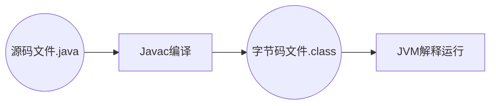

# JVM

[文档下载](https://docs.oracle.com/en/java/javase/index.html)

JDK17: 

[JDK工具命令](https://docs.oracle.com/en/java/javase/17/docs/specs/man/index.html)

[JVM参数](https://docs.oracle.com/en/java/javase/17/docs/specs/man/java.html)

>   Java Virtual Machine

查看默认的虚拟机配置参数

```shell
java -XX:PrintCommandLineFlags -version
```

虚拟机参数, 在程序启动时打印所有虚拟机配置的值

```shell
-XX:+PrintFlagsFinal
```


## Java源代码运行原理



## JVM作用

### 解释

字节码文件包含一系列的**字节码指令**

字节码指令无法在计算机上直接运行, 计算机只能识别**机器码**

把JVM把字节码指令翻译成机器码称为**解释**

对于不同的操作系统, 其命令集也不同, 所以, 在不同的操作系统上运行不同的JVM虚拟机, 能保证Java源代码的**跨平台性**

### 内存管理

-   自动将对象, 方法等分配内存
-   自动的垃圾回收机制, 回收不再使用的对象

### 即时编译

>   Just In Time JIT

对**热点代码**进行优化, 提升执行效率

由于Java需要将字节码**解释**成字节码, 终究还是比传统的编译型语言(C/C++)执行效率要低的

-   **热点代码**:
    1.  JVM不会反复将这段代码翻译成机器码
    2.  JVM虚拟机在发现一段代码被多次调用之后, 直接将翻译后的机器码保存在内存中
    3.  下一次执行, 就直接从内存中调用这段代码, 省去了反复编译的过程, 提高了效率

## JVM版本


|名称							|作者			|支持版本						|社区活跃度<br>github star	|特性																								|适用场景|
| ---- | ---- | ---- | ---- | ---- | ---- |
|HotSpot (Oracle JDK版)			|Oracle			|所有版本						|高(闭源)					|使用最广泛，稳定可靠，社区活跃<br>JIT支持<br>Oracle JDK默认虚拟机									|默认|
|HotSpot (Open JDK版)			|Oracle			|所有版本						|中(16.1k)					|同上<br>开源，Open JDK默认虚拟机																	|默认<br>对JDK有二次开发需求|
|GraalVM						|Oracle			|11, 17,19<br>企业版支持8		|高（18.7k）				|多语言支持<br>高性能、JIT、AOT支持																	|微服务、云原生架构<br>需要多语言混合编程|
|Dragonwell JDK龙井				|Alibaba		|标准版 8,11,17<br>扩展版11,17	|低(3.9k)					|基于OpenJDK的增强<br>高性能、bug修复、安全性提升<br>JWarmup、ElasticHeap、Wisp特性支持				|电商、物流、金融领域<br>对性能要求比较高|
|Eclipse OpenJ9 (原 IBM J9)		|IBM			|8,11,17,19,20					|低(3.1k)					|高性能、可扩展<br>JIT、AOT特性支持																	|微服务、云原生架构|


### *Java虚拟机规范*

*Java虚拟机规范* 由Oracle制定, 内容包含java虚拟机在设计和是现实时需要遵守的规范

主要包含class字节码文件的定义, 类和接口的加载初始化, 指令集等内容

-   *规范* 是对虚拟机的设计要求, 而不是对Java的设计要求

    虚拟机应可以运行在其他语言如`Groovy`, `Scala`生成的字节码文件之上

[Java Language and Virtual Machine Specifications](https://docs.oracle.com/javase/specs/)

