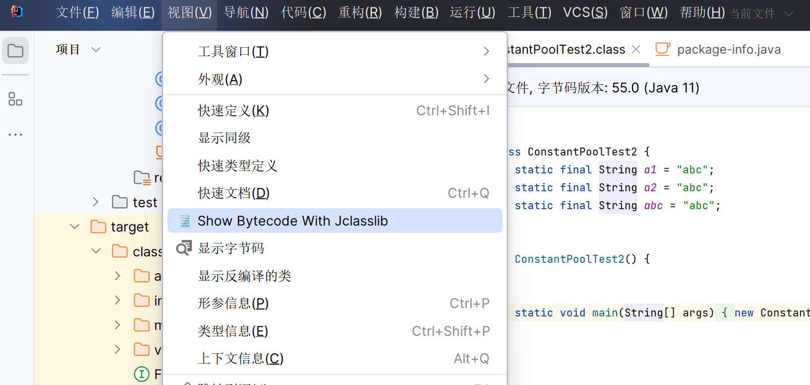
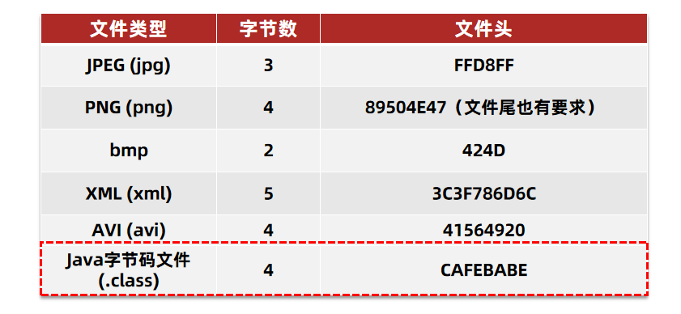
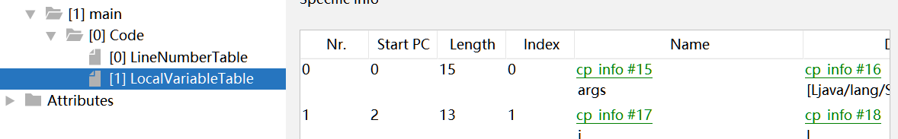

# 字节码文件

字节码文件以二进制形式存贮


Notepad++的十六进制插件对文件进行简单查看


Idea依靠插件之类的, 还是能反编译一下


## 字节码文件查看器

### javap

>   JDK自带的命令行反编译工具

```powershell
javap -v filepath
```


```java
Classfile /C:/Users/27970/Desktop/jvm/1、基础篇代码/day01_/jvm/target/classes/method/Demo1.class
  Last modified 2024年5月12日; size 530 bytes
  MD5 checksum b625dd552074ff6c8220a1ea2940ff8d
  Compiled from "Demo1.java"
public class method.Demo1
  minor version: 0
  major version: 55
  flags: (0x0021) ACC_PUBLIC, ACC_SUPER
  this_class: #4                          // method/Demo1
  super_class: #5                         // java/lang/Object
  interfaces: 0, fields: 0, methods: 2, attributes: 1
Constant pool:
   #1 = Methodref          #5.#21         // java/lang/Object."<init>":()V
   #2 = Fieldref           #22.#23        // java/lang/System.out:Ljava/io/PrintStream;
   #3 = Methodref          #24.#25        // java/io/PrintStream.println:(I)V
   #4 = Class              #26            // method/Demo1
   #5 = Class              #27            // java/lang/Object
   #6 = Utf8               <init>
   #7 = Utf8               ()V
   #8 = Utf8               Code
   #9 = Utf8               LineNumberTable
  #10 = Utf8               LocalVariableTable
  #11 = Utf8               this
  #12 = Utf8               Lmethod/Demo1;
  #13 = Utf8               main
  #14 = Utf8               ([Ljava/lang/String;)V
  #15 = Utf8               args
  #16 = Utf8               [Ljava/lang/String;
  #17 = Utf8               i
  #18 = Utf8               I
  #19 = Utf8               SourceFile
  #20 = Utf8               Demo1.java
  #21 = NameAndType        #6:#7          // "<init>":()V
  #22 = Class              #28            // java/lang/System
  #23 = NameAndType        #29:#30        // out:Ljava/io/PrintStream;
  #24 = Class              #31            // java/io/PrintStream
  #25 = NameAndType        #32:#33        // println:(I)V
  #26 = Utf8               method/Demo1
  #27 = Utf8               java/lang/Object
  #28 = Utf8               java/lang/System
  #29 = Utf8               out
  #30 = Utf8               Ljava/io/PrintStream;
  #31 = Utf8               java/io/PrintStream
  #32 = Utf8               println
  #33 = Utf8               (I)V
{
  public method.Demo1();
    descriptor: ()V
    flags: (0x0001) ACC_PUBLIC
    Code:
      stack=1, locals=1, args_size=1
         0: aload_0
         1: invokespecial #1                  // Method java/lang/Object."<init>":()V
         4: return
      LineNumberTable:
        line 3: 0
      LocalVariableTable:
        Start  Length  Slot  Name   Signature
            0       5     0  this   Lmethod/Demo1;

  public static void main(java.lang.String[]);
    descriptor: ([Ljava/lang/String;)V
    flags: (0x0009) ACC_PUBLIC, ACC_STATIC
    Code:
      stack=2, locals=2, args_size=1
         0: iconst_0
         1: istore_1
         2: iload_1
         3: iinc          1, 1
         6: istore_1
         7: getstatic     #2                  // Field java/lang/System.out:Ljava/io/PrintStream;
        10: iload_1
        11: invokevirtual #3                  // Method java/io/PrintStream.println:(I)V
        14: return
      LineNumberTable:
        line 5: 0
        line 6: 2
        line 8: 7
        line 9: 14
      LocalVariableTable:
        Start  Length  Slot  Name   Signature
            0      15     0  args   [Ljava/lang/String;
            2      13     1     i   I
}
SourceFile: "Demo1.java"

```


### jclasslib

#### 下载安装

[jclasslib (github.com)](https://github.com/ingokegel/jclasslib/releases)

#### 页面概览


#### Idea插件




## 基础信息

魔数, 字节码文件对应的Java版本号, 访问标识(public, final等) 父类和接口


**主版本号**:

-   编译字节码的JDK版本

-   **计数**
-   **访问标识**


### 魔数

>   Magic

字节码文件前几位的数据所组成的数



对于Java


cafe? 咖啡馆! 就是那群人故意的

Babe? 啊?


一个文件的拓展名并不决定文件的时机编码格式

要确定一个文件是否真的是一个字节码文件, 即使它的`.class`是被伪装的, 即使`.class`被人为抹去了

还得看文件的内容里的标识

之中标识就是**魔数**

对于Java的字节码文件的标识(魔数), 即是CAFE

### 主次版本号

编译字节码文件的JDK版本号

-   主版本号用来标识大版本号
    -   JDK1.0-JDK1.1使用了45.0-45.3
    -   JDK1.2是46
    -   之后每升级一个大版本就加1
-   次版本号是当主版本号相同时作为区分的不同版本标识
-   一般只关心主版本号

用来判断当前字节码版版本和运行时JDK是否兼容


翻译: 

```
这个需要至少JDK8, 你这个环境是JDK6, 低运行环境别运行高版本字节码文件
```

1.  升级JDK
    -   容易引发其他兼容性版本, 需要大量测试
2.  降低第三方依赖的版本/更换依赖
    -   妈的资源难找啊,SpringBoot只支持17以上版本你怎么说?


## 常量池

字符串常量, 类或接口名, 成员名

避免相同的内容重复地定义

```java
public static final String a1 = "我爱北京天安门";
public static final String a2 = "我爱北京天安门";
public static void main(String[] args) {
    ConstantPoolTest constantPoolTest = new ConstantPoolTest();
}
```
两个字段都指向同一个`info#8`


`info#8`存放了存放常量内存空间的地址


`info#8`指向了`info#27`, `info#27`是存放字符串值的内存空间


-   Q: 为什么不让字段都指向`info#27`呢?

    A: String常量还和别的常量不一样

    ​	字节码文件被运行的时候需要把**字节码文件的常量池**里的**String类型**的内容加载到**字符串常量池**中, 

    ​	所以要保留`info#8`的`String`类型信息

-   Q: 为什么不把字段都指向`info#8`, `info#8` 里直接存放String字段呢?

    A: 如果字段类型是int等的话, 就是这么做的, 直接指向的`CONSTANT_Integer_info`内容存放int值

    ​	但是, 字节码文件还需要存各种标识符, 其类型也是字符串

    ​	如果标识符和常量字符串值相同, 标识符直接指向`info#27`(**符号引用**), 字符串指向`info#8`, `info#8`再指向`info#27`

    ​	如果让标识符也指向`info#27`再通过`info#8`, 那就不合适了, 因为字段名, 方法名, 类名等, 不能直接指定就是字符串


## 字段


## 方法


### 操作数栈

>   operand stack,

临时存放数据

```java
int a = 1 + 2
```

1.  1->stack
2.  2->stack
3.  stack.pop(2)+stack.pop(1)->stack
4.  stack.pop->a

### 局部变量表

存放方法中的局部变量, 数组结构

从参数列表开始, 再是函数内部变量




### 查看方法执行过程

对源码编译成自变量指令, 解释器解释执行

```java
int i=0;
i = i++;

System.out.println(i);
```


以查看`i++`的执行过程为例


```assembly
# 0->stack
iconst_0 	# 将0放入操作数栈
# stack->table[1]
istore_1 	# 从操作数栈中弹出value(int), 局部变量(int) <1> 的值设置为value。

# table[1]->stack
iload_1 	# 局部变量(int) <1> 的值(int)被推送到操作数栈上。
# table[1]+1->table[1] , 居然不是table[1]->stack, stack+1->stack, stack->table[1]?
iinc 1 by 1	# 后一个const <1>首先被符号扩展为 int，然后对前一个index <1> 处的局部变量按该量递增
# stack->i
istore_1	# 从操作数栈中弹出value(int), 局部变量(int) <1> 的值设置为value。


# sout, 略
getstatic #2 <java/lang/System.out : Ljava/io/PrintStream;>
iload_1 
invokevirtual #3 <java/io/PrintStream.println : (I)V>
return
```


## 属性

源码的文件名, 内部类的列表等

