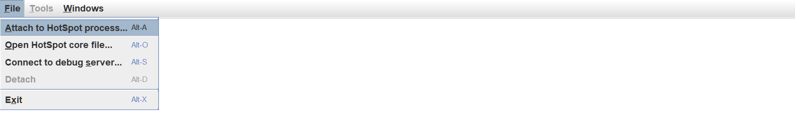
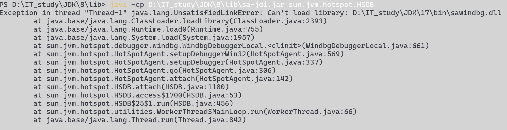

# 生命周期

1.  Loading
2.  Linking
    1.  验证
    2.  准备
    3.  解析
3.  Initialization
4.  Using
5.  Unloading

## Trace配置

开启打印类的周期的配置

```shell
-XX:+TraceClassLoading -XX:+TraceClassUnloading
```


## 加载

1.  **类加载器**根据类的全限定名通过不同的渠道以二进制流的方式获取字节码信息

    不同渠道的二进制流:

    -   本地字节码文件
    -   网络传输过来的类, Applet技术
    -   动态代理生成的类

2.  将字节码中的信息保存到**方法区**

    -   在不同版本中, 方法区所在的内存区域不同, 方法区至是一个逻辑概念, 而不是物理存在的

        早期版本使用永久带, 近期版本使用原空间

3.  在**方法区**中生成对象`InstanceKlass`, C++编写

    -   基本信息
    -   常量池
    -   字段
    -   方法
    -   使用多态会有虚方法表

4.  在**堆**中生成一个`java.lang.Class`对象, 保证了`InstanceKlass`的封装和安全性

    -   类
    -   字段
    -   方法
    -   静态资源在JDK8之后保存在堆区而不是方法区

### hsdb

JDK自带, 擦好看Java虚拟机的内存结构信息

位于**JDK8**安装目录下的`lib/sa-jdi.jar`中

JDK11,17还没有!?

```powershell
java -cp D:\IT_study\JDK\8\lib\sa-jdi.jar sun.jvm.hotspot.HSDB
```



输入PID

然后Tools->Object Histogram(对象查看器)

JDK8 有, JDK11, 17, 21都没有

然而我使用了JDK17作为环境变量, 还有JDK17编译的项目, 就忍痛割爱了




## 连接

### 验证

字节码信息是否符合Java虚拟机规范

1.  文件格式校验, Magic: CAFEBABE
2.  主次版本号
3.  元信息验证
    -   例如一个类必有父类(隐式的Object)
4.  方法内的字节码指令的指令是否符合语法规则
5.  符号引用验证
    -   例如是否引用了其他类的private类
6.  等

### 校验版本

```java
return (major >= JAVA_MIN_SPORTED_VERSION) &&
    (majore <= max_version) && (
	(majore != max_version)||
    (minor <= JAVA_MAX_SUPPORTED_MINOR_VERSION));
	// major 主版本号
	// minor 次版本号, JDK12以后启用, JDK12以前JAVA_MAX_SUPPORTED_MINOR_VERSION为0
	// JAVA_MIN_SPORTED_VERSION JDK1.0即42
	// max_version, JDK8中是52, 52-44=8
```


### 准备

给静态变量赋初值

```java
public class Sudent{
    public static int value = 1;
    public static final int CONST_VALUE = 1;
}
```

1.  在**堆**上创建Class对象

2.  为**堆**上的**静态**字段**value**值赋值**0**

    -   暂时不赋值1, 0是int类型的默认初值

    -   防止出现内存区域上残存的值

    为**堆**上的**静态常量**直接赋值**1**

3.  若**静态常量**没有指定初始值, 则必须在初始化阶段的静态代码块中赋初值


### 解析

将常量池中的**符号引用**替换成指向内存的**直接引用**

-   符号引用

    -   在字节码文件内使用符号引用

    

-   直接引用

    -   让变量直接指向数据的内存空间
    -   提高效率

## 初始化


1.  执行**静态代码块**中的代码和静态字段处的代码

    -   静态字段在静态代码块前的情况

        ```java
        public static int value = 1;
        public static final int CONST_VALUE;
        
        static {
            System.out.println("value = " + value); // 1
            // System.out.println("CONST_VALUE = " + CONST_VALUE); 编译报错
            CONST_VALUE = 2;
            value = 2;
            System.out.println("value = " + value); // 2
            System.out.println("CONST_VALUE = " + CONST_VALUE); // 2
        }
        ```

    -   静态字段在静态代码块后的情况

        ```java
        static {
            // System.out.println("value = " + value); 编译报错
            // System.out.println("CONST_VALUE = " + CONST_VALUE); 编译报错
            value  = 2; // 不被采用
            CONST_VALUE = 2;
            // System.out.println("value = " + value); 编译报错
            // System.out.println("value = " + CONST_VALUE); 编译报错
        }
        
        public static final int CONST_VALUE;
        public static int value = 1;
        ```

    -   静态代码块和静态字段在类中是**等价且有序**的

2.  初始化阶段会执行字节码文件中的`clinit`(Cl(ass)+INIT)部分

    

### 观察初始化

配置虚拟机参数

```shell
-XX:+TraceClassLoading
```

JDK17依旧没有这个功能???

### 初始化的时机

如果一个类还未被初始化, 在以下情况下初始化

1.  在访问一个类的静态成员时, 类被初始化

    访问一个类的静态常量成员, 且该成员在字段处就被**常数**赋值, 类不被初始化

    但是静态常量被赋值的对象不是一个常数情况下还是会有初始化阶段

    ```java
    public static final int value = Integer.valueOf(1);
    ```

    

    

    特别的, 在这种情况下, value应该在CONST_VALUE之前, 否则编译报错

    

2.  调用`Class.forName`

    ```java
    private static native Class<?> forName0(String name, boolean initialize,
                                            ClassLoader loader,
                                            Class<?> caller)
        throws ClassNotFoundException;
    ```

3.  `new` 来创建对象

    **数组的创建不会执行初始化**

    ```java
     ClassInitTest[] array = new ClassInitTest[20];
    ```

    

4.  执行Main方法的当前类(在Main方法的执行之前)

### 构造器初始化和匿名代码块初始化

在每次创建对象时执行下列初始化

```java
public ClassInitTest() {
    System.out.println("Construct");
    System.out.println("num = " + num); // 3
    num = 2;
    System.out.println("num = " + num); // 2
}
private int num = ClassLoadApplication.show();

{
    System.out.println("Inner Block");
    System.out.println("num = " + num); // 1
    num = 3;
    System.out.println("num = " + num); // 3
}
```

```java
public class ClassLoadApplication {
    public static int show() {
        System.out.println("show");
        return 1;
    }
}
```

```
show
Inner Block
num = 1
num = 3
Construct
num = 3
num = 2
```

1.  字段处的代码执行

2.  匿名代码块的代码执行

    -   **匿名代码块的代码不能在字段的声明之前**

    

3.  构造器的代码执行

### Clinit不生成的情况

即在解析阶段能做完类的所有工作, 不需要Init阶段, 就不会有Clinit


-   无静态代码块且
    -   没有**静态变量**

    -   **静态变量**只声明不赋值

    -   有**静态常量**在声明阶段就赋常量值

        

### 继承与初始化阶段

如果父类和子类都没有被

-   从子类访问父类的静态成员, 不会触发子类的初始化
-   子类的初始化调用之前会先调用父类的初始化

