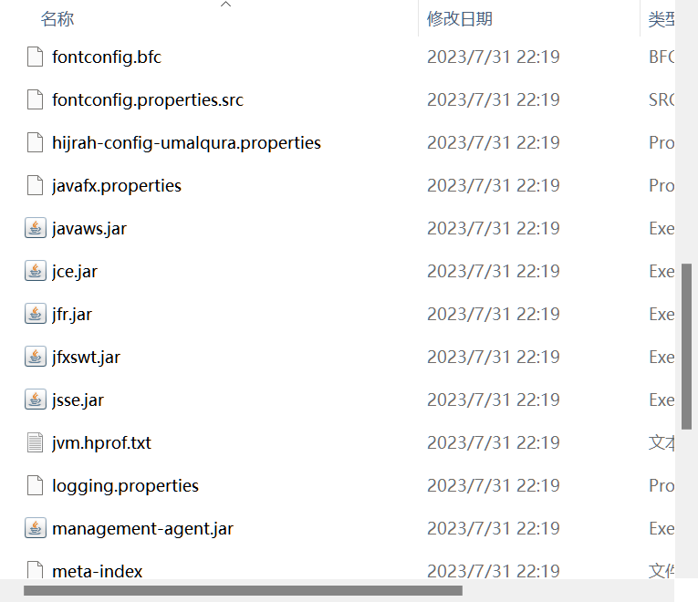
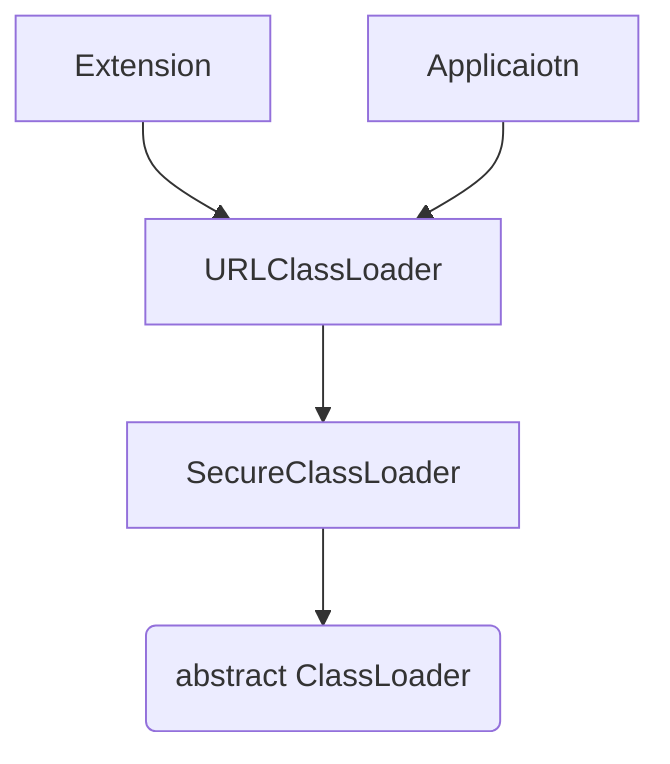

# 类加载器

>   ClassLoader
>
>   JVM 提供给应用程序区实现获取类和接口字节码数据的技术

类加载器负责获取字节码文件, 生产方法区的`InstanceKlass`对象和堆上的`Class`对象还是由JVM完成

本处介绍JDK8以下版本的类加载器

## 类加载器的应用

-   SPI机制
-   类的热部署
-   Tomcat类的隔离
-   使用Arthas不停机解决程序问题


## 虚拟机底层实现的类加载器

源代码位于Java虚拟机的源码中, 实现语言与虚拟机底层的语言一致, 比如Hotspot使用C++, Eclipse OpenJ9 (IBM)使用C

加载java程序中的基础类如`java.lang.String`, 确保其可靠性

### 启动类加载器

>   `Bootstrap`

Java中最核心的类, 启动`java.lang.String`

## 查看类加载器

[classloader](https://arthas.aliyun.com/doc/classloader.html)

```shell
classloader
```

可以展示继承树，urls 等。

可以让指定的 classloader 去 getResources，打印出所有查找到的 resources 的 url

对于`ResourceNotFoundException`比较有用。

|           参数名称 | 参数说明                                         |
| -----------------: | :----------------------------------------------- |
|                  l | 可选, 按类加载实例进行统计                       |
|                  t | 可选, 打印所有 ClassLoader 的继承树              |
|                  a | 慎选, 列出所有 ClassLoader 加载的类              |
|                `c` | 可选, ClassLoader 的 hashcode                    |
| `classLoaderClass` | 可选, 指定执行表达式的 ClassLoader 的 class name |
|              `c r` | 可选, 用 ClassLoader 去查找 resource             |
|         `c: load:` | 可选, 用 ClassLoader 去加载指定的类              |


## JDK提供或自定义的类加载器


上图是JDK17编译的Springboot项目查看到的类加载器


JDK中默认提供了多种处理不同渠道的类加载器

也可以自定义类加载器

这些类加载器继承`ClassLoader`

### 扩展类加载器

>   `Extension`

加载Java中**比较**通用的拓展类


### 应用程序类加载器

>   `Applicaion`

加载应用使用的类

例如自己写的类


## Bootstrap

>   启动类加载器

### 作用

由Hotspot虚拟机提供的, C++编写的类加载器

默认加载Java安装目录`JDK8/jre/lib`下的类文件,JDK11,JDK17等都没有这个包



其中`rt.jar`中包含由`java.lang.String`, `Integer`, `Long`, `Date`


```cpp
ClassLoader classLoader = String.class.getClassLoader();
System.out.println("classLoader = " + classLoader); // null
```

不允许在Java中获取启动类加载器, 以确保封装性


### 查看类加载器

`sc -d`

查看 JVM 已加载的类信息

```shell
sc -d java.lang.String
```

显示为空, 是启动类加载器

### 配置启动类加载器加载路径

JVM参数

新增一个由启动类加载器加载Jar包, 将自己的jar包也交由启动类加载器加载

```shell
-Xbootclasspath/a:jarfilepath
```

-   `/a`在原有`jre`目录的基础上新增加一个Jar包

```shell
-Xbootclasspath/a:D:/JDK8/jre/myjar/jarname.jar
```

这样即使这个类不在项目里, 也可以初始化这个类

### 应用场景

一些偏底层功能, 所有用这个JDK的项目都需要使用到

## Extension和Application

>   拓展类加载器和应用类加载器

都位于`sun.misc.Launcher`中

是一个静态的内部类, 继承自URLCalssLoader

具备通过目录或者指定Jar包将字节码文件加载到内存中

### 继承关系



-   `ClassLoader`
    -   定义类加载器的具体行为模式
        -   类的加载阶段
        -   获取二进制文件类的信息
        -   调用JVM底层方法闯将方法区和堆上的对象
    -   通过JNI调用底层Java虚拟机方法
-   `SecureClassLoader`
    -   证书认证
    -   安全性提升
-   `URLClassLoader`
    -   依据目录或Jar包获取字节码信息

### Extension

拓展类加载器

加载`jre/lib/ext`

下有一些通用, 但是不常用不必需的类例如`ScriptEnviroment`, 加载`JavaScript`运行环境

#### 配置拓展类加载器加载路径

JVM参数

新增一个由启动类加载器加载Jar包, 将自己的jar包也交由启动类加载器加载

```shell
-Djava.net.dirs="D:/JDK8/jre/ext;D:/myjar/jarpath"
```

-   在windows下, 用`;`分割jar包, 在Mac和Linux下, 用`:`分割

###Application

加载自己项目中的类和maven工程(第三方依赖)中的类

Arthas

```shell
classloader -c ClassLoaderHashCode
```

打印所有由该类加载器加载的Jar包


应用程序类加载器也会加载扩展类目录下的Jar包(类的双亲委派机制)