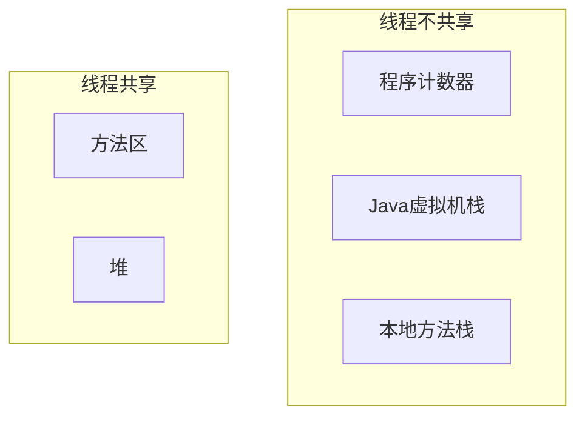

# 运行时数据区

Java虚拟机在运行Java程序过程中管理的内存区域

## 组成部分

```mermaid
graph TD
subgraph 线程不共享
	程序计数器
	Java虚拟机栈
	本地方法栈
end
subgraph 线程共享
	方法区
	堆
end
```

-   **线程不共享**:
    -   各个线程都会有一套自己的内存区域
    -   安全性高
    -   线程回收, 就可以释放这一片内存
-   **线程共享**
    -   存在线程安全问题

## 应用场景

内存飙高

内存溢出(OutOfMemery)

内存调优

