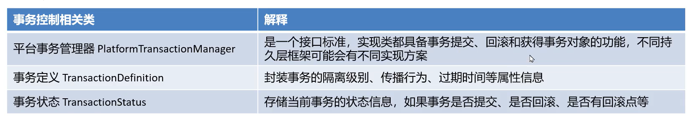

# Spring事务编程

-   MySql(JDBC)有一套自己的控制事务
-   MyBatis有一套自己的控制事务
-   ...
-   不同的技术对事物的控制api是不一样的
-   Spring提供了同一套事物规范(接口)

## 编程式控制事务

-   编程(之前学的,api)
-   耦合

## 声明式控制事务

-   配置的方式
-   简单
-   解耦合(更换事物的控制的时候,配置方式可能会不变)

## 事物编程相关类

-   PlatformTransactionManager
    -   平台管理器
-   TransactionDefinition
    -   事物定义
-   TransactionStatus
    -   事物状态

不同的底层实现,可能会提供不同的实现

MyBatis->

DataSourceTaransactionManager

事物本事过期时间

不可能一直等,服务器就挂了(并发过高)

事物的几个状态(脏读,不可重复读,幻读)

事物状态在不同节点会有不同的状态信息,不同节点不同状态下的信息,

事物的状态是动态的,事物的定义是静态的