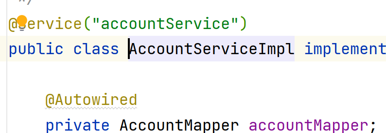
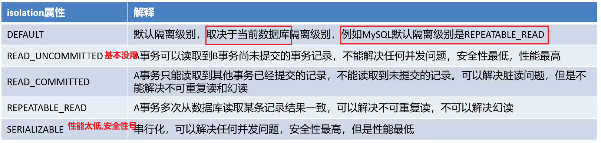
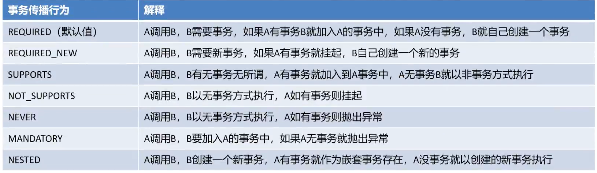

# 步骤

-   导入Spring声明相关坐标(**O了**)

    ```xml
    <dependency>
        <groupId>org.springframework</groupId>
        <artifactId>spring-jdbc</artifactId>
        <version>5.2.13.RELEASE</version>
    </dependency>
    ```

    内含org.springframework:spring-tx:5.2.13事物包

    tx(transection事物)

-   配置目标类AccountService(**O了**)

    

-   使用advisor配置切面(接口实现)

    -   advisor->需要Spring提供好的advice
    -   advice->需要事务管理器**transactionManager**
    -   **transactionManager**(是个Bean,在~org.springframework.jdbc.datasource~包里)->需要DataSource
    -   DataSource->前面配好了,使用包扫描

    ```xml
    <?xml version="1.0" encoding="UTF-8"?>
    <beans xmlns="..."
           xsi:schemaLocation="...">
    
        <!--这节课用注解,以前的部分就导入好了-->
        <context:component-scan base-package="com.harvey"/>
    
        <!--事务管理器,不同的平台,事务方式不一样,就需要不同的事务管理器-->
        <!--事务管理器是实现了PlatformTransactionManager接口的类-->
        <bean id="transactionManager"
              class="org.springframework.jdbc.datasource.DataSourceTransactionManager">
            <!--我们用的是JDBC,就用DataSourceTransactionManager-->
            
            
            <!--DataSourceTransactionManager是需要注入DataSource的(看源码)-->
            <property name="dataSource" ref="dataSource"/>
        </bean>
    
    
        <!--配置Spring提供好的Advice-->
        <tx:advice id="txAdvice" transaction-manager="transactionManager">
            <tx:attributes>
                <tx:method name="*"/>
            </tx:attributes>
        </tx:advice>
    
    
    
        <aop:config>
            <!--配切点表达式-->
            <aop:pointcut id="txPrintCut"
                          expression="execution(* com.harvey.service.impl.*.*(..))"/>
    
            <!--配置织入关系 通知advice-ref引用Spring提供好的advice-->
            <aop:advisor advice-ref="txAdvice" pointcut-ref="txPrintCut"/>
        </aop:config>
    </beans>
    ```

## 我把命名空间另外写了一份

```xml
<?xml version="1.0" encoding="UTF-8"?>
<beans xmlns="http://www.springframework.org/schema/beans"
       xmlns:xsi="http://www.w3.org/2001/XMLSchema-instance"
       xmlns:context="http://www.springframework.org/schema/context"
       xmlns:aop="http://www.springframework.org/schema/aop"
       xmlns:tx="http://www.springframework.org/schema/tx"
       xsi:schemaLocation=
               "http://www.springframework.org/schema/beans
                http://www.springframework.org/schema/beans/spring-beans.xsd
                http://www.springframework.org/schema/context
                http://www.springframework.org/schema/context/spring-context.xsd
                http://www.springframework.org/schema/aop
                http://www.springframework.org/schema/aop/spring-aop.xsd
                http://www.springframework.org/schema/tx
                http://www.springframework.org/schema/tx/spring-tx.xsd">
```

-   应该是现阶段所有需要的的命名空间了.......吧?

## 事务增强参数 : tx:attributes

```xml
<!--配置Spring提供好的Advice-->
<tx:advice id="txAdvice" transaction-manager="transactionManager">
    <tx:attributes>
        <tx:method name="*"/>
    </tx:attributes>
</tx:advice>
```
### name(唯一一个硬性要配的)

>方法名称.*表示通配符

name="transferMoney"表示单个方法

name="add*"表示以add开头的方法

name="*"表示所有方法


遇到一个方法会进行怠惰匹配(懒汉匹配)

例如:

```xml
<tx:advice id="txAdvice" transaction-manager="transactionManager">
    <tx:attributes>
        <tx:method name="add*" />
        <!--方法从上往下匹配,遇到匹配的直接定性-->
        <tx:method name="update*" />
        <tx:method name="del*" />
        <tx:method name="select*" />
        <!--用*保底,干掉被遗漏的方法-->
        <tx:method name="*" />

    </tx:attributes>
</tx:advice>
```


-   那么问题来了,你看这name是对方法的筛选,这

    ```properties
    expression="execution(* com.harvey.service.impl.*.*(..))"
    ```

    切点表达式也是对方法的筛选...这.....

-   诶呀!你看看过程嘛

    ```xml
    <aop:config>
        <aop:pointcut id="txPrintCut"
                      expression="execution(* com.harvey.service.impl.*.*(..))"/>
        <aop:advisor advice-ref="txAdvice" pointcut-ref="txPrintCut"/>
    </aop:config>
    ```
    **切点表达式玩剩下**的才会给到txadvice再给name做进一步的筛选的嘛

-   意义也不同!

    -   切点表达式筛选的是啥?
        -   是**哪些方法需要被增强(事务管理)**
    -   name筛选的是啥?
        -   是**哪些方法应该被怎样的事务管理(不同的参数配置)**


###isolation

>   事务的隔离级别(脏读,幻读,不可重复读),解决事务并发问题

-   isolation的五个参数



### timeout

>   超时时间

-   默认-1表示永远在申请,不论数据库有没有连好
-   单位是秒

### read-only

>   是否只读

-   一般用false
-   **查询操作且需要提高效率**,可以用true

###propagation

>   事务的传播行为(事务嵌套问题)

-   A调用B,那么上面的设置听谁的?

    

    -   一般记默认值就行(B一定要有事务)
    -   偶尔用SUPPORTS
    -   A挂起,表示B不用A的,See GoodBye

