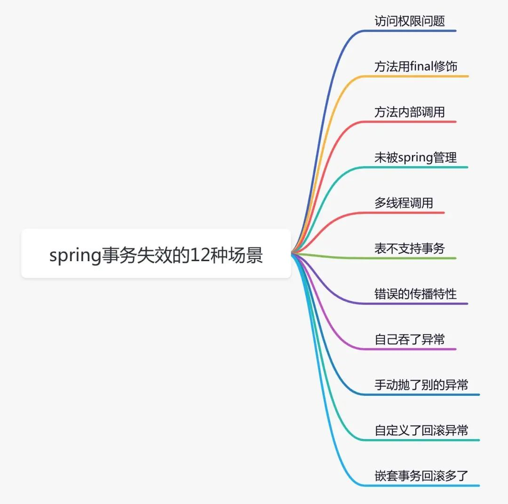

# @Transactional

康康源码先

```java
public @interface Transactional {
    @AliasFor("transactionManager")
    String value() default "";

    @AliasFor("value")
    String transactionManager() default "";

    Propagation propagation() default Propagation.REQUIRED;

    Isolation isolation() default Isolation.DEFAULT;

    int timeout() default -1;

    boolean readOnly() default false;

    Class<? extends Throwable>[] rollbackFor() default {};

    String[] rollbackForClassName() default {};

    Class<? extends Throwable>[] noRollbackFor() default {};

    String[] noRollbackForClassName() default {};
}
```

## 目标:替代xml文件

```xml
<bean id="transactionManager"
      class="org.springframework.jdbc.datasource.DataSourceTransactionManager">
    <property name="dataSource" ref="dataSource"/>
</bean>

<tx:advice id="txAdvice" transaction-manager="transactionManager">
    <tx:attributes>
        <tx:method name="*"
                   isolation="DEFAULT"
                   read-only="false"
                   timeout="-1"
                   propagation="REQUIRED"/>
    </tx:attributes>
</tx:advice>

<aop:config>
    <aop:pointcut id="txPrintCut"
                  expression="execution(* com.harvey.service.impl.*.*(..))"/>
    <aop:advisor advice-ref="txAdvice" pointcut-ref="txPrintCut"/>
</aop:config>
```

### 针对的对象

-   因为这个增强类是承上启下的,你细品

```xml
<tx:advice id="txAdvice" transaction-manager="transactionManager">
    <tx:attributes>
        <tx:method name="*"
                   isolation="DEFAULT"
                   read-only="false"
                   timeout="-1"
                   propagation="REQUIRED"/>
    </tx:attributes>
</tx:advice>
```

## 使用@Transactional

1.  注解在方法上
    -   这个方法被事务管理
2.  注解在类上
    -   这个类上的所有方法皆被管理
3.  都配了的
    -   优先使用方法上的注解

### 注解配事务方法

```java
@Override
@Transactional(
        transactionManager="",
        isolation = Isolation.DEFAULT,
        propagation = Propagation.REQUIRED,
        readOnly = false,
        timeout = -1)
public void transMoney(String outAccountName, String inAccountName, int money) {
        accountMapper.decrMoney(outAccountName,money);
        accountMapper.incrMoney(inAccountName,money);
}
```

### xml

-   包扫描
-   创建事务管理器的Bean
-   扫描被注解的事务方法

```xml
<?xml version="1.0" encoding="UTF-8"?>
<beans xmlns="http://www.springframework.org/schema/beans"
       xmlns:xsi="http://www.w3.org/2001/XMLSchema-instance"
       xmlns:context="http://www.springframework.org/schema/context"
       xmlns:tx="http://www.springframework.org/schema/tx"
       xsi:schemaLocation=
               "http://www.springframework.org/schema/beans
                http://www.springframework.org/schema/beans/spring-beans.xsd
                http://www.springframework.org/schema/context
                http://www.springframework.org/schema/context/spring-context.xsd
                http://www.springframework.org/schema/tx
                http://www.springframework.org/schema/tx/spring-tx.xsd">

    <context:component-scan base-package="com.harvey"/>

    <bean id="transactionManager"
          class="org.springframework.jdbc.datasource.DataSourceTransactionManager">
        <property name="dataSource" ref="dataSource"/>
    </bean>

    <tx:annotation-driven/>
</beans>
```

#### 小细节

```xml
<bean id="transactionManager666"
      class="org.springframework.jdbc.datasource.DataSourceTransactionManager">
    <property name="dataSource" ref="dataSource"/>
</bean>

<tx:annotation-driven transaction-manager="transactionManager666"/>
```

-   参数**transaction-manager**可以在**transactionManager**的id(或第一个name)是**transactionManager**的时候不写

## 全注解(配置类)

当下的任务:

-   包扫描(早些时候配过了)
-   创建事务管理器的Bean
-   扫描被注解的事务方法

主要是

```java
@EnableTransactionManagement//自动让事务方法执行
public class SpringConfig {
    //transactionManager的Bean,这个名字不用给自动事务的注解参数
    @Bean
    public DataSourceTransactionManager transactionManager(DataSource dataSource){
        DataSourceTransactionManager transactionManager = new DataSourceTransactionManager();
        transactionManager.setDataSource(dataSource);
        return transactionManager;
    }
    ...
}
```

```java
@Configuration
@MapperScan("com.harvey.mapper")
@ComponentScan("com.harvey")
@PropertySource("classpath:jdbc.properties")
@EnableTransactionManagement
public class SpringConfig {
    private DruidDataSource dataSource;

    @Bean
    public DataSourceTransactionManager transactionManager(DataSource dataSource){
        DataSourceTransactionManager transactionManager = new DataSourceTransactionManager();
        transactionManager.setDataSource(dataSource);
        return transactionManager;
    }

    @Bean
    public DataSource dataSource(
            @Value("${jdbc.driverClassName}") String driverClassName,
            @Value("${jdbc.url}") String url,
            @Value("${jdbc.username}") String username,
            @Value("${jdbc.password}") String password
    ) {
        this.dataSource = new DruidDataSource();
        dataSource.setDriverClassName(driverClassName);
        dataSource.setUrl(url);
        dataSource.setUsername(username);
        dataSource.setPassword(password);
        return dataSource;
    }

    @Bean
    public SqlSessionFactoryBean sqlSessionFactoryBean(DataSource dataSource) {
        SqlSessionFactoryBean sqlSessionFactoryBean = new SqlSessionFactoryBean();
        sqlSessionFactoryBean.setDataSource(dataSource);
        return sqlSessionFactoryBean;
    }
}
```

### 事务失效的几种情况



事务不生效

-   访问权限

    -   spring 要求被代理方法必须是`public`的。

-   `finnal`

    -   知道 spring 事务底层使用了 aop，也就是通过 jdk 动态代理或者 cglib，帮我们生成了代理类，在代理类中实现的事务功能。但如果某个方法用 final 修饰了，那么在它的代理类中，就无法重写该方法，而添加事务功能。

-   方法内部调用

    -   使用的`this.method()`调用方法, 而不是用Spring提供的增强类调用的增强方法, 也不会被事务增强

    -   解决

        ```java
        ((ServiceA)AopContext.currentProxy()).method(user);
        ```

-   未被 spring 管理

    -   `@Controller`、`@Service`、`@Component`、`@Repository`

-   线程

    -   两个方法不在同一个线程中，获取到的**数据库连接**不一样

-   表不支持事务

事务不回滚

-   错误传播特性

-   自己捕获异常

    -   要让Spring捕获数据库连接抛出的异常

-   手动抛出别的异常

    -   要让Spring捕获数据库连接抛出的异常

-   自定义回滚异常

    -   要让做如下配置

        ```java
        @Transactional(rollbackFor = BusinessException.class)
        public void add(UserModel userModel) throws Exception {
           saveData(userModel);
           updateData(userModel);
        }
        ```

-   嵌套事务的回滚

    -   嵌套的事务里的事务也会回滚

