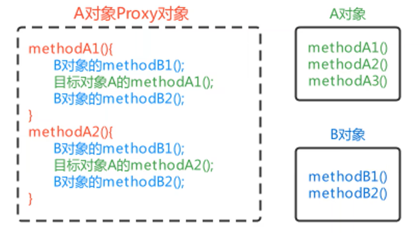

1.  BeanPostProfessor---Bean后处理器
2.  Bean最终要储存到singletonObjects(单例池)当中
3.  Bean要从单例池当中去获取
4.  如果我们存到单例池当中的不是Bean对象本身
5.  而是Bean对象对应的那个Proxy代理对象,就是我们经过增强过的类
6.  那我们在getBean()获取的就是一个Proxy对象
7.  这个Proxy对象里的方法是增强过了的

所以我们在写代码的时候要做这么几样工作

1.  准备一个**目标对象**(这里是Service)
2.  准备一个**增强对象**
3.  准被一个**BeanPostProfessor**
4.  BeanPostProfessor里产生目标对象的Proxy对象,里面用**增强对象**包装**目标对象**
5.  将Proxy装入**单例池**当中
6.  测试

