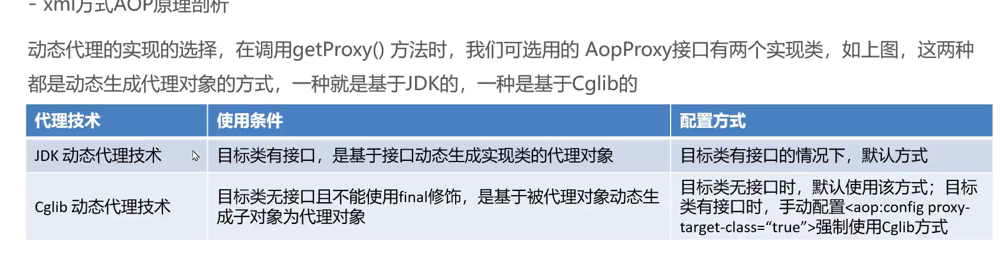
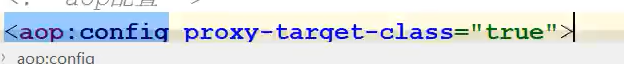
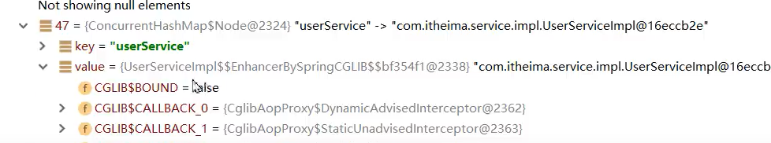
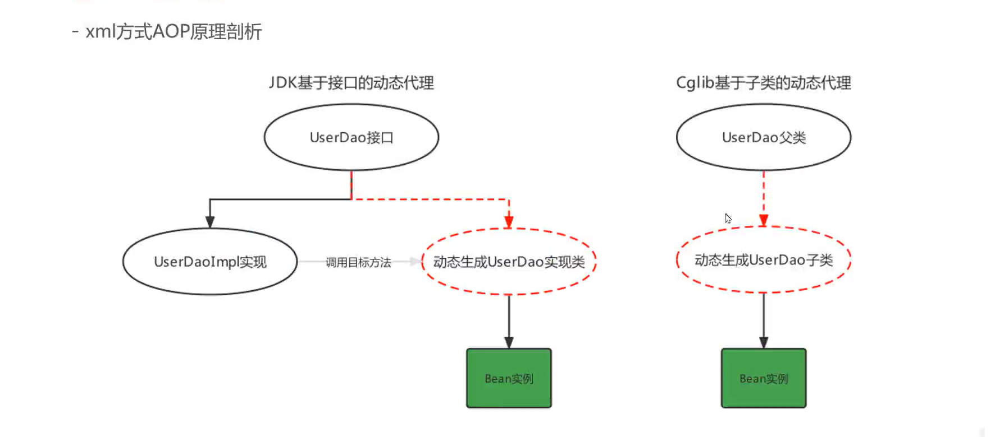
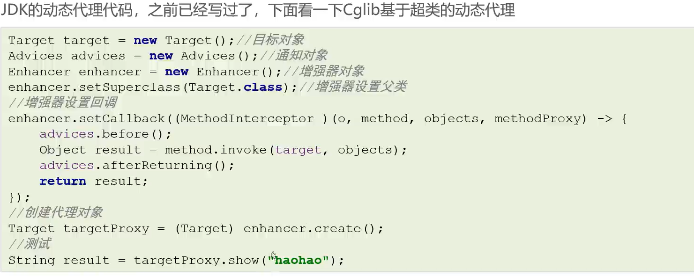

 

基于JDK


基于Cglib




-   默认false,基于JDK
-   








-   ```java
    class App2 {
        public static void main(String[] args) {
            new App2().getProxyByCGlib().show2();
        }
        public UserServiceImpl getProxyByCGlib() {
            //基于父类(目标类)生成Proxy
    
            //目标对象
            UserServiceImpl userService = new UserServiceImpl();
    
            //通知对象(增强对象)
            MyAdvice myAdvice = new MyAdvice();
    
            //编写CGlib方法
            Enhancer enhancer = new Enhancer();
            //设置父类
            enhancer.setSuperclass(userService.getClass());
            //设置回调
            enhancer.setCallback(
                    //MethodInterceptor是参数Callback的子接口
                    new MethodInterceptor() {
                @Override
                public Object intercept(
                        Object o, Method method,
                        Object[] objects,
                        MethodProxy methodProxy
                ) throws Throwable {
                    myAdvice.before();
                    Object result =  method.invoke(userService,objects);
                    myAdvice.afterReturning();
                    return result;
                }
            });
    
    
            // 生成代理对象
            return (UserServiceImpl) enhancer.create();
        }
    }
    ```

    

-   测试结果

```text
构造函数
构造函数
before
show2
after-returning
```

## 注意

那种方式直接关系到能否用**getBean(XXXXImpl.class)**~其实也没啥好注意的~

  　　1. service方法添加**@Transactional注解或者加入其它的aop**拦截配置，**没有实现任何接口**。
       -   service是代理类，并且是**CGLIB类型代理**
  　　2. service方法添加**@Transactional注解或者加入其它的aop**拦截配置，**实现了接口**。
       -   service是代理类，并且是**jdk 动态代理**
  　　3. serice方法没有添加@Transactional注解或者其它的aop拦截配置。 
       -   serivce不是代理类，而是**普通类**

