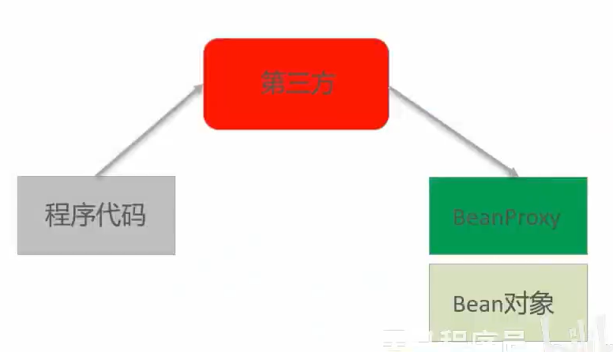
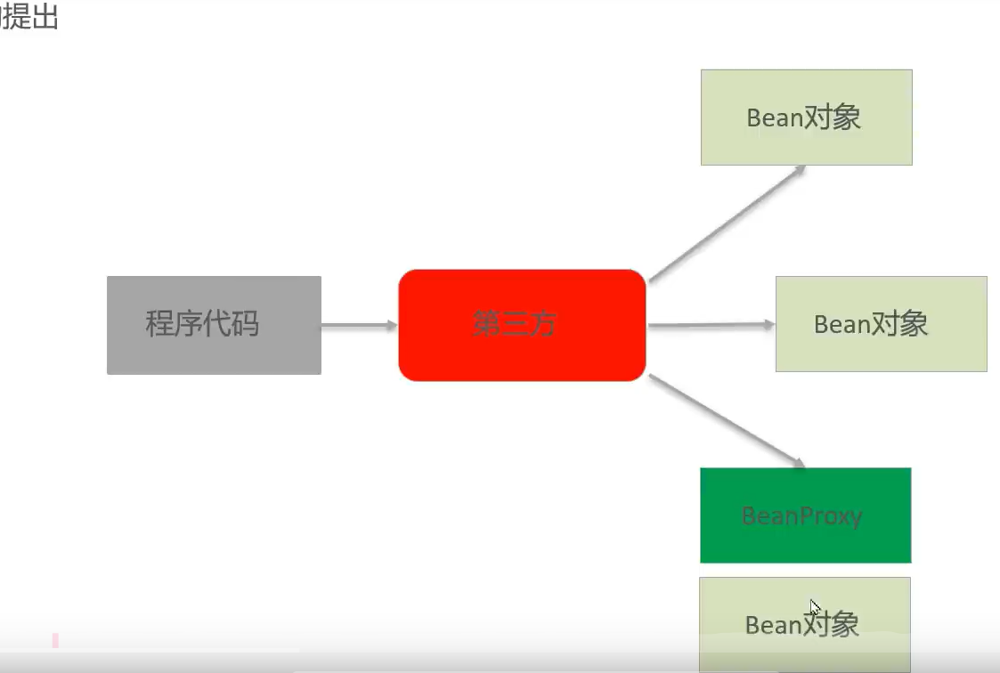
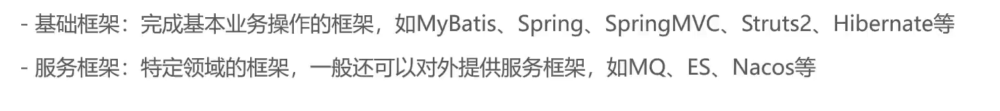

# 三种思想

实务操作和日志操作

程序代码找第三方Bean对象

Bean的代理对象增强过帮我们解决耦合的问题

-   BeanProxy是代理的Bean对象,是加强后的Bean对象

## IoC

>    Inversion of Control

-   控制反转
    -   强调原来在程序中创建Bean的**权利反转给第三方**

## DI

>   Dependency Injection

-   依赖注入
    -   强调Bean之间的关系,由第三方负责去设置

## AOP

>   Aspect Oriented Programing

-   面向切面编程
    -   功能的横向切取,主要靠Proxy实现
    -   面向对象编程是纵向设计一个Bean,AOP是横向抽取功能的思想

# 框架(Framework)

帮我们把基本功能做好,抽取重复,耦合(?)的部分

## 特点

-   基于基础技术之上,从众多业务中抽取的通用的解决方案
-   半成品,使用框架规定的语法开发可以提高开发效率,可以用简单的代码就完成复杂的基础业务
-   框架内部使用大量**设计模式** , 算法 , 底层代码操作技术
-   具有拓展性,由拓展的接口让你去修改

## 框架分类

-   基础框架
-   服务框架

