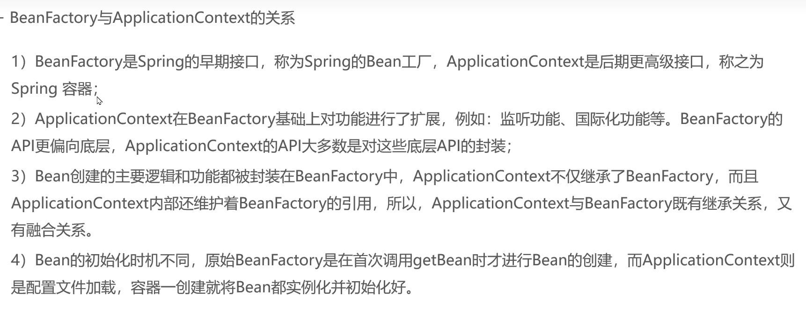
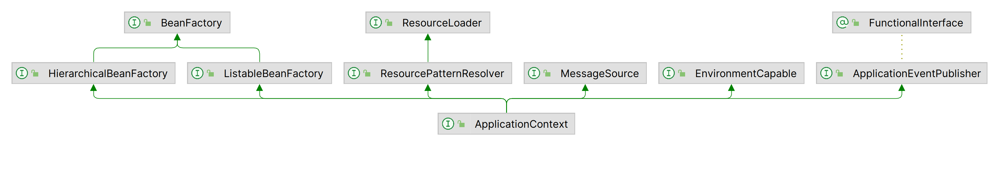
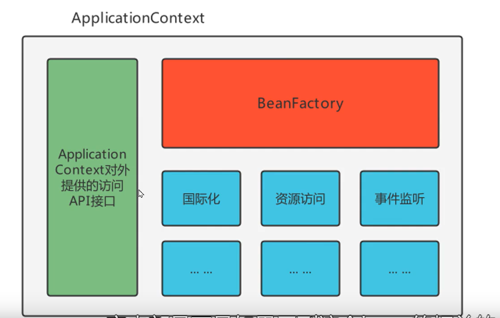
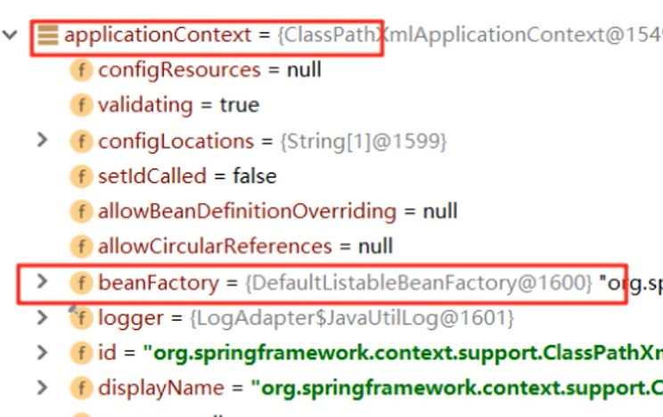
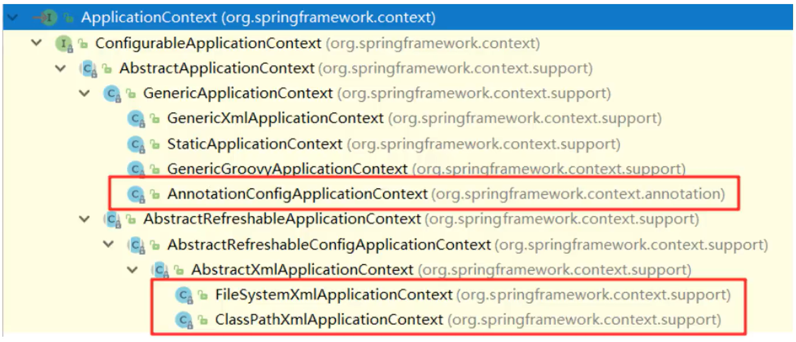
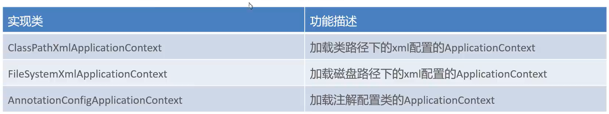

# BeanFactory和ApplicationContext的关系





对于4)

-   BeanFactory

	```java
	@Test
	public void testFactory() {
	    DefaultListableBeanFactory beanFactory = new DefaultListableBeanFactory();
		XmlBeanDefinitionReader reader = new XmlBeanDefinitionReader(beanFactory);
	reader.loadBeanDefinitions("beans.xml");
  	UserService userService =(UserService) beanFactory.getBean("userService");

	    UserDao userDao =(UserDao) beanFactory.getBean("userDao");//	这一步创建对象
	}
	```

-   对于ApplicationContest

    ```java
    @Test
    public void test(){
        ApplicationContext applicationContext =
            new ClassPathXmlApplicationContext("beans.xml");//这一步就完成创建
    
    
        UserService userService = (UserService) applicationContext.getBean("userService");
        TestLogger.LOGGER.info(""+userService);
    }
    ```

-   可以在UserService的无参构造里加一句打印测试上面的事情





-   ApplicationContext内部维护着一个BeanFactory

# BeanFactory的继承体系


## DefaultListableBeanFactory

-   看上面张图的第二个框灰色的字
-   ApplicationContext里维护的就是它

```java
private final Map<String, BeanDefinition> beanDefinitionMap;
```

-   BeanDefinition
    -   Bean定义对象,对xml文件标签里的内容进行解析,并封装到一个实体类里


## ApplicationContext的继承体系



-   XMl配置方案
-   注解(Annotation)配置方案



-   配置文件放在D盘了,你用FileSystemXMLApplicationContext
    -   翻译:一辈子用不到几回

