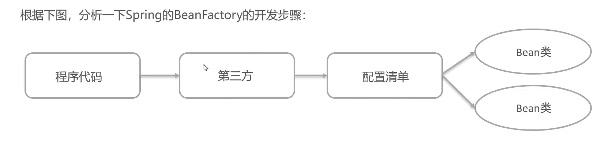

1.    第三方->BeanFactory,导入Jar包或Maven坐标

2.    定义UserService接口及其UserServiceImpl实现类

3.    配置清单->beans.xml

      ```xml
      <?xml version="1.0" encoding="UTF-8"?>
      <beans xmlns="http://www.springframework.org/schema/beans"
             xmlns:xsi="http://www.w3.org/2001/XMLSchema-instance"
             xsi:schemaLocation="http://www.springframework.org/schema/beans http://www.springframework.org/schema/beans/spring-beans.xsd">
          <bean id="userService" class="com.harvey.Impl.UserServiceImpl"/>
      </beans>
      ```

4.    测试文件

## 配置清单

```xml
<?xml version="1.0" encoding="UTF-8"?>
<beans xmlns="http://www.springframework.org/schema/beans"
       xmlns:xsi="http://www.w3.org/2001/XMLSchema-instance"
       xsi:schemaLocation="http://www.springframework.org/schema/beans http://www.springframework.org/schema/beans/spring-beans.xsd">
    <bean id="userService" class="com.harvey.Impl.UserServiceImpl"/>
</beans>
```

-   只有`<bean id="userService" class="com.harvey.Impl.UserServiceImpl"/>`是需要自己写的
    -   id是唯一标识
    -   class后是全类名,指向配置的类

## 测试文件

```java
@Test
public void testFactory() {
    //创建工厂对象
    DefaultListableBeanFactory beanFactory = new DefaultListableBeanFactory();
    //创建读取(xml文件)器
    XmlBeanDefinitionReader reader = new XmlBeanDefinitionReader(beanFactory);
    //读取配置文件给工厂
    reader.loadBeanDefinitions("beans.xml");
    //根据id获取Bean对象,这一步不强转,类型擦出了也没事
    UserService userService =(UserService) beanFactory.getBean("userService");
    TestLogger.LOGGER.info(""+userService);
}
```

## Dao的BeanFactory实现

### 创建UserDao接口和实现类


### Bean.xml

加上

```java
<bean id="userDao" class="com.harvey.Impl.UserDaoImpl"/>
```


### 测试类


```java
//创建工厂对象
DefaultListableBeanFactory beanFactory = new DefaultListableBeanFactory();
//创建读取(xml文件)器
XmlBeanDefinitionReader reader = new XmlBeanDefinitionReader(beanFactory);
//读取配置文件给工厂
reader.loadBeanDefinitions("beans.xml");
//根据id获取Bean对象,这一步不强转,类型擦出了也没事
UserService userService =(UserService) beanFactory.getBean("userService");
TestLogger.LOGGER.info(""+userService);

//根据id获取Bean对象,这一步不强转,类型擦出了也没事
UserDao userDao =(UserDao) beanFactory.getBean("userDao");
TestLogger.LOGGER.info(""+userDao);
```

-   测试类只要加上代码

    ```java
    //根据id获取Bean对象,这一步不强转,类型擦出了也没事
    UserDao userDao =(UserDao) beanFactory.getBean("userDao");
    TestLogger.LOGGER.info(""+userDao);
    ```

    就行


### Service层调用Dao层的实现

-   这个是这样子的

-   那么我们就需要给ServiceImpl方法一个SetDao

    ```java
    public class UserServiceImpl implements UserService {
        private UserDao userDao;
    
        //Bean工厂去调用 从容器中获取userDao设置到此处
        public void setUserDao(UserDao userDao){
            this.userDao = userDao;
            System.out.println("BeanFactory去调用该方法获取userDao设置到此处" + userDao);
        }
    
    }
    ```

然后,运行测试类....setUserDao怎么没有启动啊?
**废话!你都没有给userService调用setUserDao了吗???啊???**

#### 用BeanFactory实现

在beans.xml里配置

```xml
<bean id="userService" class="com.harvey.Impl.UserServiceImpl"/>
```

改成

```xml
<bean id="userService" class="com.harvey.Impl.UserServiceImpl">
    <!--name是set方法的属性名称,适合setUserDao是一致的-->
    <!--如果com.harvey.Impl.UserServiceImpl里是setXxx,这里就是xxx(小写变化)-->
    <!--ref是引用,找个id(底下的那个userDao),设置给属性名为userDao的方法-->
    <!--如果下面<bean id = "xxx">,这里ref = "xxx" -->
    <property name="userDao" ref="userDao"/>

</bean>
```

# 为了什么?

拒绝new一个userService

拒绝new一个userDao

为的就是IoC,用Factory帮我们做

