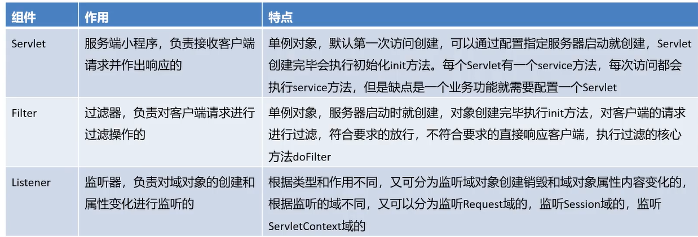

## 特点与生命周期

### Servlet

-   Tomcat
-   单例
    -   UserServlet
    -   BillServelt
-   服务器启动时不创建,客户端访问时创建,然后缓存放入容器
    -   缓存之后在容器找
    -   像延迟加载的Bean


### Filter

放行与不放行

对象创建init()

### Listener

三大域对象(一共四个)

Request

Session

ServletContext/Application 代表整个Web应用->服务器启动时创建

-   监听域对象的创建与销毁


```java
package com.harvey.web.listener;

import ...

/**
 * ...
 */
@WebListener
public class ContextLoaderListener  implements ServletContextListener {
    @Override
    public void contextInitialized(ServletContextEvent sce) {
        // 1. 创建Spring容器
        ApplicationContext applicationContext =
                new AnnotationConfigApplicationContext(SpringConfig.class);
        // 存入Application域
        sce.getServletContext().setAttribute("applicationContext",applicationContext);
    }
    @Override
    public void contextDestroyed(ServletContextEvent sce) {}
}
```


```java
package com.harvey.web.servlet;

import ...

/**
 * ...
 */
@WebServlet(value = "/accountServlet")
public class AccountServlet extends HttpServlet {
    @Override protected void doGet(){...}
    @Override protected void doPost(){...}

    protected void parseWebString(HttpServletRequest request,
                                  HttpServletResponse response)
            throws ServletException, IOException {
        ApplicationContext applicationContext = (ApplicationContext) request.getServletContext().getAttribute("applicationContext");
        AccountService accountService = applicationContext.getBean(AccountService.class);
        accountService.transMoney("tom", "lucy", 10);
        response.getWriter().write("OK");
    }
}
```

-   存在的问题
    -   配置类/(xml文件的名字)写死了
        -   配置配置类的名字???????????????????
    -   applicationContext的键"applicationContext"写死了
        -   解决:写一个方法,返回applicationContext,而不是使用键来返回值

### 改进

#### 配置类/(xml文件的名字)写死了

>   由于我使用了全注解,而他又不讲全注解,我这里就只能大概的写一下xml的配置方法


```xml
<?xml version="1.0" encoding="UTF-8" ?>
<web-app xmlns="http://xmlns.jcp.org/xml/ns/javaee"
         xmlns:xsi="http://www.w3.org/2001/XMLSchema-instance"
         xsi:schemaLocation="http://xmlns.jcp.org/xml/ns/javaee
         http://xmlns.jcp.org/xml/ns/javaee/web-app_4_0.xsd"
         version="4.0">

    <context-param>
        <param-name>contextConfigLocationXml</param-name>
        <param-value>classpath:application-context.xml</param-value>
    </context-param>
	...
```

-   Listener

```java
@Override
public void contextInitialized(ServletContextEvent sce) {
    // 0.获取contextConfigLocationClass配置类
    ServletContext servletContext = sce.getServletContext();
    CONTEXT_CONFIG_LOCATION_XML = servletContext.getInitParameter("contextConfigLocationClass");
    // 模拟解析配置文件的名称的过程
    CONTEXT_CONFIG_LOCATION_XML = CONTEXT_CONFIG_LOCATION_XML.substring("classpath".length());
    
    // 1. 创建Spring容器
    ApplicationContext applicationContext =
            new AnnotationConfigApplicationContext(CONTEXT_CONFIG_LOCATION_XML);
    // 存入Application域

    servletContext.setAttribute("applicationContext",applicationContext);
}
```


-   也大概模仿了一下配置类的写法

-   ```xml
        <context-param>
            <param-name>ConfigClassPath</param-name>
            <param-value>classpath:com.harvey.config.SpringConfig</param-value>
        </context-param>
    ```

-   ```java
    package com.harvey.web.listener;
    
    import ...
    
    /**
     * ...
     */
    @WebListener
    public class ContextLoaderListener  implements ServletContextListener {
    
        @Override
        public void contextInitialized(ServletContextEvent sce) {
            // 0.解析web.xml文件,获取ConfigClassPath
            String configClassPath = sce.getServletContext().getInitParameter("ConfigClassPath");
            Class<?> config;
            Assert.notNull(configClassPath, "Location pattern must not be null");
            try{
                if (configClassPath.startsWith("classpath:")) {
                    configClassPath =  configClassPath.substring("classpath:".length());
                    config = Class.forName(configClassPath);
                }else {
                    //告诉他路径格式不对,错误发生在web.xml,配置类的路径应该以classpath:开头
                    throw new ClassNotFoundException("Wrong path pattern:"+configClassPath+"." +
                            "Error occurs in web.xml." +
                            "The path to the configuration class should start with \"classpath:\".");
                }
            }catch (ClassNotFoundException e) {
                throw new RuntimeException(e);
            }
    
            // 1. 创建Spring容器
            ApplicationContext applicationContext =
                    new AnnotationConfigApplicationContext(config);
    
            // 2. 存入Application域
            sce.getServletContext().setAttribute("applicationContext",applicationContext);
        }
    
        @Override
        public void contextDestroyed(ServletContextEvent sce) {
        }
    }
    ```


#### applicationContext的键"applicationContext"写死了


-   Util

    ```java
    package com.harvey.utils;
    
    import ...
    
    /**
     * ...
     */
    public class WebApplicationContextUtils {
        public static ApplicationContext getWebApplicationContext(ServletContext servletContext){
            return (ApplicationContext) servletContext.getAttribute("applicationContext");
        }
    }
    ```

-   Servlet

    ```java
    protected void parseWebString(HttpServletRequest request,
                                  HttpServletResponse response)
            throws ServletException, IOException {
        ApplicationContext applicationContext =
                WebApplicationContextUtils.getWebApplicationContext(request.getServletContext());
        AccountService accountService = applicationContext.getBean(AccountService.class);
        accountService.transMoney("tom", "lucy", 10);
        response.getWriter().write("OK");
    }
    ```
