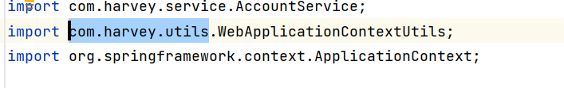
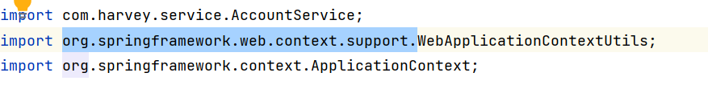

# Spring集成Web

## 导入坐标

```xml
<dependency>
    <groupId>org.springframework</groupId>
    <artifactId>spring-web</artifactId>
    <version>5.3.29</version>
</dependency>
```


## 需求

-   Spring管理Listener
-   Spring提供返回 ApplicationContext的工具类


### Listener替换成Spring-web的

-   web.xml

    ```xml
    <listener>
        <listener-class>org.springframework.web.context.ContextLoaderListener</listener-class>
    </listener>
    ```

-   然后记得注掉自己的Listener的@WebListener,吃了不少苦头qwq

### XML配置

-   application-context.xml

    ```xml
    <?xml version="1.0" encoding="UTF-8"?>
    <beans xmlns="http://www.springframework.org/schema/beans"
           xmlns:xsi="http://www.w3.org/2001/XMLSchema-instance"
           xmlns:context="http://www.springframework.org/schema/context"
           xsi:schemaLocation=
                   "http://www.springframework.org/schema/beans
                    http://www.springframework.org/schema/beans/spring-beans.xsd
                    http://www.springframework.org/schema/context
                    http://www.springframework.org/schema/context/spring-context.xsd">
            <context:component-scan base-package="com.harvey"/>
    
    </beans>
    ```

    

-   Web.xml

```xml
<!--contextConfigLocation是内定的-->
<context-param>
    <param-name>contextConfigLocation</param-name>
    <param-value>classpath:application-context.xml</param-value>
</context-param>
```

-   classpath:居然还是必须加的?!

### 核心配置类配置

-   你看上面的写死的contextConfigLocation是不是很怪?

-   看看源码:

    ```java
    org.springframework.web.context.ContextLoaderListener->
    public void contextInitialized(ServletContextEvent event) {
    	public WebApplicationContext initWebApplicationContext(ServletContext servletContext) {
    		protected WebApplicationContext createWebApplicationContext(ServletContext sc) {
                protected Class<?> determineContextClass(ServletContext servletContext) {
                    //这里有啥?
                    String contextClassName = servletContext.getInitParameter("contextClass");
                    //就是这句话决定了配置类的名字是啥
                }
            }
        }
    }
    ```


-   我们要搞一个类,AnnotationConfigWebApplicationContext的子类,注册我们的配置类

    ```java
    package com.harvey.config;
    
    import org.springframework.web.context.support.AnnotationConfigWebApplicationContext;
    
    /**
     * ...
     */
    public class MyAnnotationConfigWebApplicationContext extends AnnotationConfigWebApplicationContext {
        public MyAnnotationConfigWebApplicationContext() {
            super();
            this.register(SpringConfig.class);
        }
    }
    ```


-   web.xml要这么写配置核心配置类:

    ```xml
    <context-param>
        <param-name>contextClass</param-name>
        <param-value>com.harvey.config.MyAnnotationConfigWebApplicationContext</param-value>
    </context-param>
    ```

    

### Spring提供返回 ApplicationContext的工具类

-   使用Spring提供的工具类替代自己的工具类






