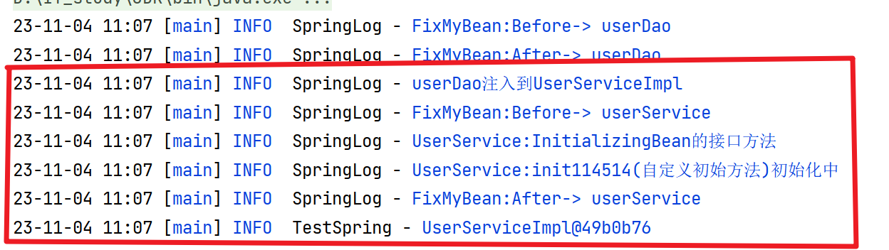

# 初始化阶段

## 内容

**Bean创建之后还仅仅是个“半成品”**，

-   还需要对Bean实例的属性进行填充
-   执行一些Aware接口方法
-   执行BeanPostProcessor方法
-   执行InitializingBean接口的初始化方法
-   执行自定义初始化init方法
-   等。

该阶段是Spring**最具技术含量和复杂度**的阶段,涉及

-   Aop增强功能
-   Spring的注解功能
-   等

## 步骤

1.  Bean实例的属性填充
2.  Aware接口属性注入(不重要?)
3.  BeanPostProcessor的before（）方法回调 
4.  InitializingBean接口的初始化方法回调 
5.  自定义初始化方法init回调
6.  BeanPostProcessor的after（）方法回调 

### 后四步起承上文

## 属性注入的三种情况

1.  普通注入(注入String,int等)
2.  注入Bean对象,如果没有,先暂停,先去创建注入的resource
3.  双向对象引用属性

## Bean的循环引用问题

Service需要注入Dao,Dao需要注入Service;

[循环引用问题](.\Day06🤩-Bean的循环引用.md)

