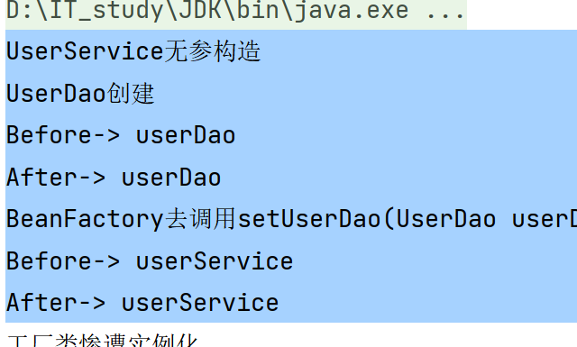
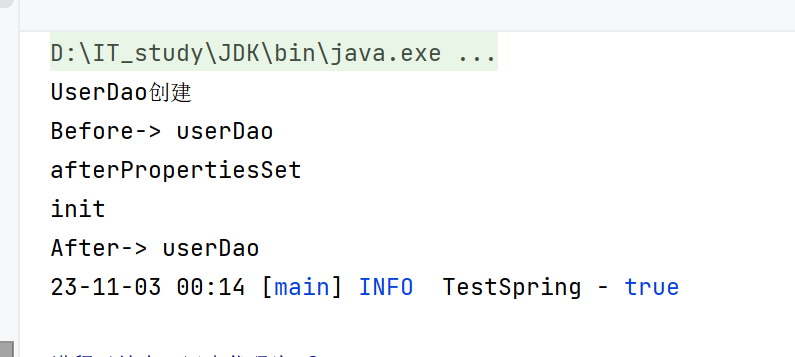
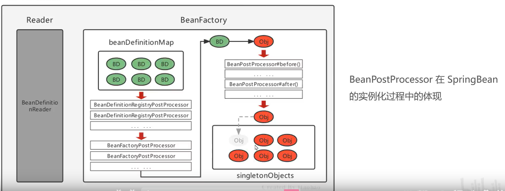

# Bean后处理器

>   BeanPostProcessor接口

-   在Bean创建对象**之后**

-   存储到单例池**之前**

-   定义BeanPostProcessor- 拓展点

>   实现这个接口,就会被识别


## 看看BeanPostProcessor源码

```java
public interface BeanPostProcessor {
    @Nullable
    default Object postProcessBeforeInitialization(Object bean, String beanName) 
        throws BeansException {
        return bean;
    }

    @Nullable
    default Object postProcessAfterInitialization(Object bean, String beanName) 
        throws BeansException {
        return bean;
    }
}
```

-   @Nullable--可以不被实现


### 试验


-   ```java
    public class FixMyBean implements BeanPostProcessor {
        @Override
        public Object postProcessBeforeInitialization(Object bean, String beanName) throws BeansException {
            System.out.println("Before-> "+beanName);
            if(bean instanceof UserDaoImpl){
                UserDaoImpl userDao = (UserDaoImpl) bean;
                userDao.setFlag(!userDao.isFlag());
            }
            return bean;
        }
    
        @Override
        public Object postProcessAfterInitialization(Object bean, String beanName) throws BeansException {
            System.out.println("After-> "+beanName);
            return bean;
        }
    }
    ```

-   测试

    ```java
    @Test
    public void testFixMyBean(){
        try (ClassPathXmlApplicationContext applicationContext =
                     new ClassPathXmlApplicationContext("beans.xml")){
            UserDaoImpl userDao = (UserDaoImpl) applicationContext.getBean("userDao");
            TestLogger.info(userDao.isFlag());
        }
    }
    ```

-   结果

    

### 执行顺序与生命周期

#### 初试

```java
public class UserDaoImpl implements UserDao, InitializingBean {
	......

    public UserDaoImpl() {
        System.out.println("UserDao创建");
    }

    public void init(){
        System.out.println("init");
    }
    @Override
    public void afterPropertiesSet() throws Exception {
        System.out.println("afterPropertiesSet");
    }
}
```

```xml
<bean id="userDao"
      class="com.harvey.Impl.UserDaoImpl"
      init-method="init"/>
```

-   结果:

    

## 实践:用动态代理对Bean进行时间日志增强


```java
public class TimeLogBeanProcessor implements BeanPostProcessor {
    //使用动态代理对Bean进行增强
    // 返回proxy对象,
    // 进而存储到单例池SingletonObjects中
    @Override
    public Object postProcessBeforeInitialization(Object bean, String beanName) 
        throws BeansException {
        SimpleDateFormat sdf = new SimpleDateFormat("yyyy-MM-dd hh:mm:ss.SSS");
        return Proxy.newProxyInstance(
                bean.getClass().getClassLoader(),
                bean.getClass().getInterfaces(),
                (proxy, method, args) -> {
                    // 1. 输出开始时间
                    Log.info(sdf.format(new Date()) + "开始"+beanName);
                    // 2.执行目标方法
                    Object o = method.invoke(bean, args);
                    // 3.输出结束时间
                    Log.info(sdf.format(new Date()) + "结束"+beanName);
                    return o;
                }
        );

    }


    @Override
    public Object postProcessAfterInitialization(Object bean, String beanName) throws BeansException {
        return bean;
    }
}
```


## 注意!

-   Beans.xml里配置了init()的,找不到init()了


## 生命周期

-   


