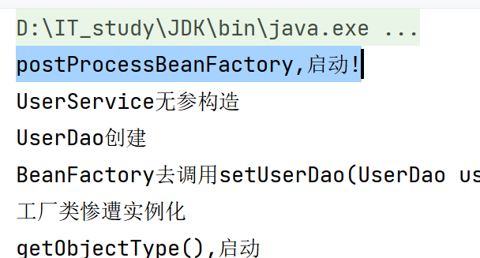
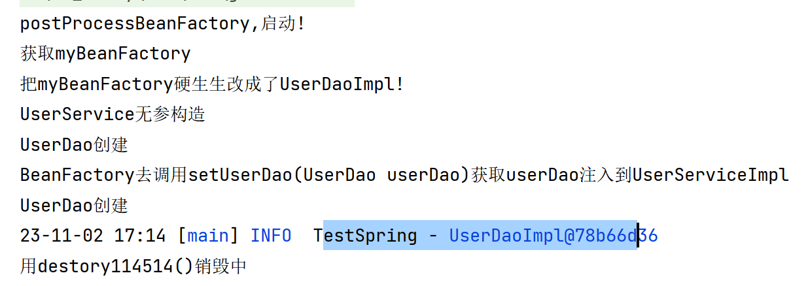

# Spring后处理器


## 概述

>   需求: 对外拓展点
>
>   工具: 后处理器

### 拓展点

>   Spring帮我们配好的东西,不能满足我们的需求,就需要我们自己接入Bean的实例化过程之中

-   目的: 动态注册/修改BeanDefinition以及动态修改Bean\
-   方式: 动态代理

### 后处理器

-   BeanFactoryPostProcessor
    -   Bean**工厂**后处理器
    -   在BeanDefinitionMap填充完毕,Bean实例化之前执行
    -   所有Bean的实例化,只会调用一次
-   BeanPostProcessor
    -   Bean后处理器
    -   在**Bean实例化之后,填充到单例池singletonObjects之前执行**
    -   每个Bean实例化之后都会执行一次


## 入门使用

-   接口规范

-   凡实现BeanFactoryPostProcessor且**交由Spring管理**者

    -   Spring就会回调该接口的方法,对BeanDefinition注册和修改

    -   看看源码

        ```java
        @FunctionalInterface
        public interface BeanFactoryPostProcessor {
            void postProcessBeanFactory(
                ConfigurableListableBeanFactory var1
            ) throws BeansException;
        }
        ```

### 修改

-   小试牛刀:

    com.harvey.processor.FixUserService.java

    ```java
    package com.harvey.processor;
    
    import ...
    
    /**
     * ...
     **/
    public class FixUserService implements BeanFactoryPostProcessor {
        @Override
        public void postProcessBeanFactory(ConfigurableListableBeanFactory factory) throws BeansException {
            System.out.println("postProcessBeanFactory,启动!");
        }
    }
    ```

-   beans.xml

  ```xml
  <!--
      不用写id,
      Spring检测到就会Bean存储信息,
      一反射就会发现他实现了BeanFactoryPostProcessor
      然后就会执行
  -->
  <bean class="com.harvey.processor.FixUserService"/>
  ```

-   输出结果:

    

  -   SO FAST

-   然后真改(为了更好的举例子,我们把对象换成了MyBeanFactory):

-   com.harvey.processor.FixMyBeanFactory.java

    ```java
    package com.harvey.processor;
    
    import ...
    
    /**
     * ...
     **/
    public class FixMyBeanFactory implements BeanFactoryPostProcessor {
        @Override
        public void postProcessBeanFactory(
            ConfigurableListableBeanFactory factory
        ) throws BeansException {
            System.out.println("postProcessBeanFactory,启动!");
            BeanDefinition myBeanFactory = factory.getBeanDefinition("myBeanFactory");
            //不管xml里是id还是name!getBean("用到是什么名字"),这里就填什么名字
    
            System.out.println("获取myBeanFactory");
    
            myBeanFactory.setBeanClassName("com.harvey.Impl.UserDaoImpl");
            //看看我这一手优秀的操作
    
            System.out.println("把myBeanFactory硬生生改成了UserDaoImpl!");
        }
    }
    ```

-   bean.xml

    ```xml
    <bean class="com.harvey.processor.FixMyBeanFactory"/>
    ```

-   test

    ```java
    public class BeanFactoryTest {
        @Test
        public void testFactory() {
            try (ClassPathXmlApplicationContext applicationContext =
                         new ClassPathXmlApplicationContext("beans.xml")){
                TestLogger.info(applicationContext.getBean("myBeanFactory"));
            }
        }
    }
    ```

-   输出结果

    

 

### 注册

```java
@Override
public void postProcessBeanFactory(ConfigurableListableBeanFactory factory) throws BeansException {
    //动态注册BeanDefinition-RootDao
    System.out.println("postProcessBeanFactory,启动!");
    Class<RootDaoImpl> clazz = RootDaoImpl.class;
    BeanDefinition beanDefinition =
            new RootBeanDefinition();
            //这个Root可是和我一点关系够没有哦
    beanDefinition.setBeanClassName(clazz.getName());
    System.out.println(clazz);

    // 为什么一定要用强转?
    // factory的register...()方法只能将Bean注入objectSingleton里,和这里的目的不一样
    // DlbFactory是ClbFactory的子类,强的很,
    // 能注入到beanDefinitionMap里,GOOD
    DefaultListableBeanFactory dlbFactory = (DefaultListableBeanFactory) factory ;

    dlbFactory.registerBeanDefinition(
            "rootDao",
            beanDefinition
    );
    System.out.println("Fix Finished");
}
```

-   DefaultListableBeanFactory方法多,但是这样还不够!
-   周瑜! 我们要去看看专门用来注册的类

### 动态注册-BeanDefinitionRegistryPostProcessor

```java
public interface BeanDefinitionRegistryPostProcessor extends BeanFactoryPostProcessor {
    void postProcessBeanDefinitionRegistry(BeanDefinitionRegistry var1) throws BeansException;
}
```


-   RegisterMyBean接口

    ```java
    public class RegisterMyBean implements BeanDefinitionRegistryPostProcessor {
        public void myMethod(){
            System.out.println("RegisterMyBean:MyMethod,不会启动qwq");
        }
        @Override
        public void postProcessBeanDefinitionRegistry(BeanDefinitionRegistry registry) throws BeansException {
            System.out.println("RegisterMyBean:Registry,启动!");
        }
    
        @Override
        public void postProcessBeanFactory(ConfigurableListableBeanFactory factory) throws BeansException {
            System.out.println("RegisterMyBean:Factory,启动!");
        }
    }
    ```

-   xml就一句话

    ```xml
    <bean class="com.harvey.processor.RegisterMyBean"/>
    ```

-   输出结果

    


## 最终实战! 使用后处理器编写@MyComponent注解实现自动注册Bean

-   为啥你这标题取得这么中二?


```java
package com.harvey.annotation;

import ...


/**
 * 需求:
 * 每次在写完一个类之后,都要去.xml文件里配置
 * 这种配置常常很没有技术含量,是个重复工作
 * 配置需要在两个界面来回切换,效率低下,让人心烦气躁
 * 全类名的复制很麻烦
 *
 * @author : HarveyBlocks
 * @version : 1.0
 * @className : RegisterMyBean
 * @date : 2023/11/02 21:00
 */
@Target(ElementType.TYPE)
@Retention(RetentionPolicy.RUNTIME)
public @interface MyComponent {
    String value() default "";
}
```

```java
package com.harvey.utils;

import ...

public class MyComponentUtil implements BeanDefinitionRegistryPostProcessor {
    private static final String BASE_PACKAGE = "com/harvey";

    @Override
    public void postProcessBeanDefinitionRegistry(BeanDefinitionRegistry registry) throws BeansException {
        //通过扫描工具,扫描指定包及其子包下所有的类,收集使用@MyComponent注解的类
        Map<String, Class> beanMap = null;
        try {
            beanMap = BaseClassScanUtils.scanMyComponentAnnotation(BASE_PACKAGE);
        } catch (IOException | ClassNotFoundException e) {
            Log.error(e);
        }
        //循环注册
        beanMap.forEach((beanName, bean) -> {
            //获得beanClassName
            String className = bean.getName();
            //创建Bean Definition
            BeanDefinition beanDefinition = new RootBeanDefinition();
            beanDefinition.setBeanClassName(className);
            //注册
            registry.registerBeanDefinition(beanName, beanDefinition);
        });
    }

    @Override
    public void postProcessBeanFactory(ConfigurableListableBeanFactory configurableListableBeanFactory) throws BeansException {

    }
}
```


-   这是辅助工具类,只需了解用法,具体原理再说


```java
package com.harvey.utils;

import ...

/**
 * @author : HarveyBlocks
 * @version : 1.0
 * @className : BaseClassScanUtils
 * @date : 2023/11/03 21:30
 **/
public class BaseClassScanUtils {

    // 创建容器存储使用了指定注解的Bean字节码对象
    private static final String RESOURCE_PATTERN = "/**/*.class";

    /**
     * @param basePackage 包名,其下的文件皆会被扫描
     * @return Map<String, Class> 容器存储使用了指定注解的Bean自解码对象
     */
    public static Map<String, Class> scanMyComponentAnnotation(String basePackage) throws IOException, ClassNotFoundException {
        Map<String, Class> annotationClassMap = new HashMap<>();
        //Spring工具类,可以获取指定路径下的全部类
        ResourcePatternResolver pathResolver = new PathMatchingResourcePatternResolver();

        String pattern =
                ResourcePatternResolver.CLASSPATH_URL_PREFIX +
                        ClassUtils.convertClassNameToResourcePath(basePackage) +
                        RESOURCE_PATTERN;
        Resource[] resources = pathResolver.getResources(pattern);
        // MetadataReader 的工厂类
        MetadataReaderFactory readerFactory = new CachingMetadataReaderFactory();
        for (Resource resource : resources) {
            // 用于读取类信息
            MetadataReader reader = readerFactory.getMetadataReader(resource);
            // 扫描到的class
            String className = reader.getClassMetadata().getClassName();
            Class clazz = Class.forName(className);
            if (clazz.isAnnotationPresent(MyComponent.class)) {
                // 获取注解是MyComponent的注解
                MyComponent annotation = (MyComponent) clazz.getAnnotation(MyComponent.class);
                String beanName = annotation.value();
                if (beanName != null && !beanName.isEmpty()) {
                    // 如果有指定beanName
                    annotationClassMap.put(beanName, clazz);
                    continue;
                }
                //如果没有或为"".那就吧当前类的类的类名作为beanName

                // 顺便搞成了首字母小写
                String classSimpleName = clazz.getSimpleName();
                beanName = classSimpleName.substring(0, 1).toLowerCase() +
                        classSimpleName.substring(1);
                annotationClassMap.put(beanName, clazz);
            }
        }

        return annotationClassMap;
    }

    //这样只要吧MyComponent2配置进去就OK啦

}
```

### 注意

-   我被你害惨啦


-   这里的pattern是相对路径,如果在test目录里调用了写了这段代码的方法(尽管这个方法是在下main目录下的),也会变成当前以test为根目录(也很好理解)

```java
String pattern = ResourcePatternResolver.CLASSPATH_URL_PREFIX +
        ClassUtils.convertClassNameToResourcePath(basePackage) +
        RESOURCE_PATTERN;
Resource[] resources = pathResolver.getResources(pattern);
```

