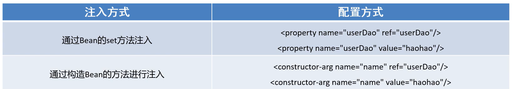
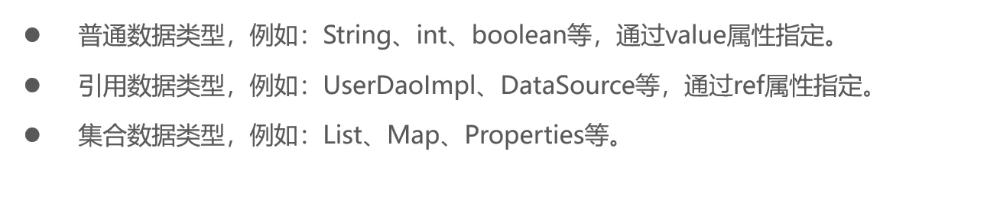
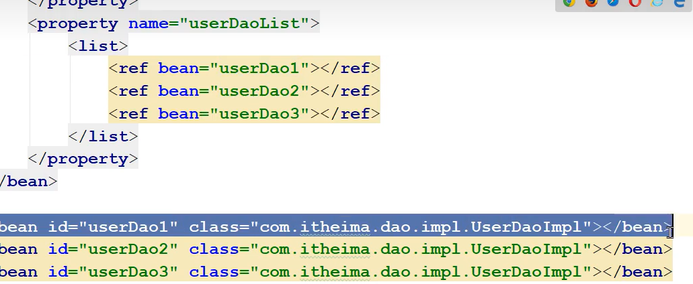
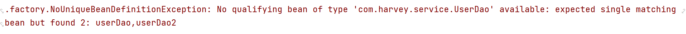

# 注入



-   ref->reference
-   对象引用就用ref="id"
-   普通数据就用value传递


## 注入的数据类型




### List的注入

-   UserServiceImpl.java

    ```java
    private List<String> strList;
    
    public void setStrList(List<String> strList) {
        this.strList = strList;
        System.out.println("setStrList()->"+strList);
    }
    public void show(){
        System.out.print("show()->");
        System.out.println(strList);
        System.out.println("<-show()");
    }
    ```


-   beans.xml

```xml
<bean id="userService" class="com.harvey.Impl.UserServiceImpl">
        <property name="userDao" ref="userDao"/>

        <property name="strList">
            <list>
                <value >aaa</value>
                <value >bbb</value>
                <value >ccc</value>
                <value >ddd</value>
                <value >eee</value>
                <value >fff</value>
                <value >ggg</value>
                <value >hhh</value>
                <value >iii</value>
                <value >jjj</value>
                <value >kkk</value>
                <value >lll</value>
                <value >mmm</value>
                <value >nnn</value>
                <value >ooo</value>
                <value >ppp</value>
                <value >qqq</value>

            </list>
        </property>
    </bean>
```

-   List也是一个属性(property)
-   使用子标签
-   List\<String\>,String是普通值,可以直接value




-   结果

    ```
    UserService无参构造
    BeanFactory去调用setUserDao(UserDao userDao)获取userDao注入到UserServiceImpl
    setStrList()->[aaa, bbb, ccc, ddd, eee, fff, ggg, hhh, iii, jjj, kkk, lll, mmm, nnn, ooo, ppp, qqq]
    23-10-31 10:57 [main] INFO  TestSpring - 成功创建UserServiceImpl@157632c9
    show()->
    strList=[aaa, bbb, ccc, ddd, eee, fff, ggg, hhh, iii, jjj, kkk, lll, mmm, nnn, ooo, ppp, qqq]
    ```

    

### Set\<UserDao\>,Map\<UserService\>的注入

-   UserServiceImpl.java

```java
public void show(){
    System.out.println("show()->");
    System.out.println("userDaoSet="+userDaoSet);
    System.out.println("map="+map);
}

public void setUserDaoSet(Set<UserDao> userDaoSet) {
    this.userDaoSet = userDaoSet;
    System.out.println("setUserDaoSet()->"+userDaoSet);
}

private Set<UserDao> userDaoSet;
private Map<String,UserService> map;

public void setMap(Map<String, UserService> map) {
    this.map = map;
    System.out.println("setMap()->"+map);
}
```

-   Beans.xml

    ```xml
    <bean id="userService" class="com.harvey.Impl.UserServiceImpl">
        <property name="userDao" ref="userDao"/>
    
        <property name="userDaoSet">
            <set>
                <ref bean="userDao"/>
                <ref bean="userDao"/>
                <ref bean="userDao"/>
                <ref bean="userDao"/>
                <ref bean="userDao"/>
                <ref bean="userDao"/>
                <ref bean="userDao1"/>
                <ref bean="userDao2"/>
                <ref bean="userDao1"/>
                <ref bean="userDao2"/>
                <ref bean="userDao1"/>
                <ref bean="userDao2"/>
                <ref bean="userDao1"/>
                <ref bean="userDao2"/>
            </set>
        </property>
        <property name="map">
            <map>
                <entry key="US1" value-ref="userService"/>
                <entry key="US2" value-ref="userService"/>
                <entry key="US1" value-ref="userService"/>
            </map>
        </property>
    
    </bean>
    
    <bean id="userDao" class="com.harvey.Impl.UserDaoImpl"/>
    <bean id="userDao1" class="com.harvey.Impl.UserDaoImpl"/>
    <bean id="userDao2" class="com.harvey.Impl.UserDaoImpl"/>
    ```

    

-   输出结果

    ```
    UserService无参构造
    UserDao创建
    UserDao创建
    UserDao创建
    BeanFactory去调用setUserDao(UserDao userDao)获取userDao注入到UserServiceImpl
    setUserDaoSet()->[UserDaoImpl@15bb6bea, UserDaoImpl@8b96fde, UserDaoImpl@2d2e5f00]
    setMap()->{US1=UserServiceImpl@157632c9, US2=UserServiceImpl@157632c9}
    23-10-31 10:57 [main] INFO  TestSpring - 成功创建UserServiceImpl@157632c9
    show()->
    userDaoSet=[UserDaoImpl@15bb6bea, UserDaoImpl@8b96fde, UserDaoImpl@2d2e5f00]
    map={US1=UserServiceImpl@157632c9, US2=UserServiceImpl@157632c9}
    ```

    

### Properties的注入

-   key(String):key(String)的键值对

```xml
<property name="properties">
    <props>
        <prop key="key">value1</prop>
        <prop key="key2">value2</prop>
    </props>
</property>
```


## 自动装配

-   这是手动装配

    ```xml
    <property name="properties">
        <props>
            <prop key="key">value1</prop>
            <prop key="key2">value2</prop>
        </props>
    </property>
    ```


>   自动装配是使用autowire属性去配置自动注入方式

### 属性值

-   byName
    -   通过属性名自动装配,即去匹配id="xxx"(name="xxx")是否一致
-   byType
    -   通过Bean的类型从容器中匹配,匹配出多个相同的Bean类型时**报错**

[感觉有点关系](Day03🥱-get方法.md)

### byName的使用

-   这里的**name**是取别名,不取别名就是**id**


-   UserServiceImpl.java

    ```java
    private UserDao userDao;
    
    //Bean工厂去调用 从容器中获取userDao设置到此处
    public void setUserDao(UserDao userDao){
        this.userDao = userDao;
        System.out.println("BeanFactory去调用setUserDao(UserDao userDao)获取userDao注入到UserServiceImpl");
    }
    ```

-   Beans.xml

    ```java
    <bean id="userService" class="com.harvey.Impl.UserServiceImpl" autowire="byName"/>
    
    <bean id="userDao" class="com.harvey.Impl.UserDaoImpl"/>
    ```

    -   输出结果(show()方法)

        ```
        show()->
        UserDaoImpl@2d2e5f00
        ```

    对Bean.xml进行小改动:

    ```xml
    <bean id="userService" class="com.harvey.Impl.UserServiceImpl" autowire="byName"/>
    
    <bean id="userDao2" class="com.harvey.Impl.UserDaoImpl"/>
    ```

    -   输出结果

        ```
        show()->
        null
        ```

-   **原因:**

    -   和**方法名setUserDao()还是setUserDao2()唯一相关**

### byType的使用

```xml
<bean id="userService" class="com.harvey.Impl.UserServiceImpl" autowire="byType"/>

<bean id="userDao" class="com.harvey.Impl.UserDaoImpl"/>
```

```xml
<bean id="userService" class="com.harvey.Impl.UserServiceImpl" autowire="byType"/>

<bean id="userDao2" class="com.harvey.Impl.UserDaoImpl"/>
```

-   都没有问题

```xml
<bean id="userService" class="com.harvey.Impl.UserServiceImpl" autowire="byType"/>

<bean id="userDao" class="com.harvey.Impl.UserDaoImpl"/>
<bean id="userDao1" class="com.harvey.Impl.UserDaoImpl"/>
<bean id="userDao2" class="com.harvey.Impl.UserDaoImpl"/>
```

-    出大问题

    