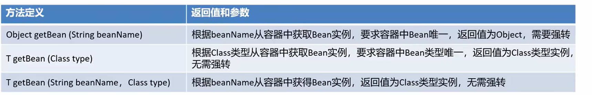
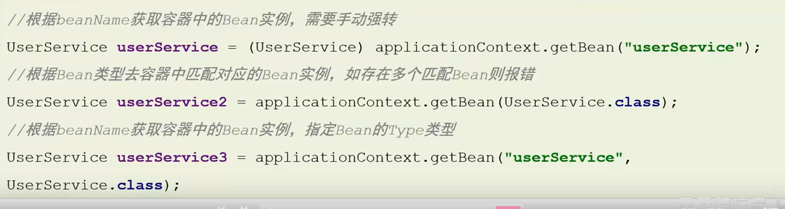

# Spring的get方法







-   你已经写过了

    ```java
    UserService userService = (UserService) applicationContext.getBean("userService");
    ```
    ```java
	UserService userService = (UserService) beanFactory.getBean("myBeanFactory");
	```
	
-   你还是没记住

