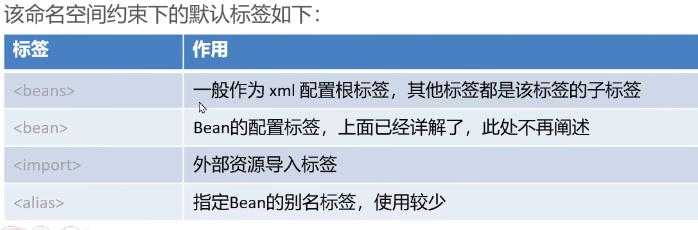
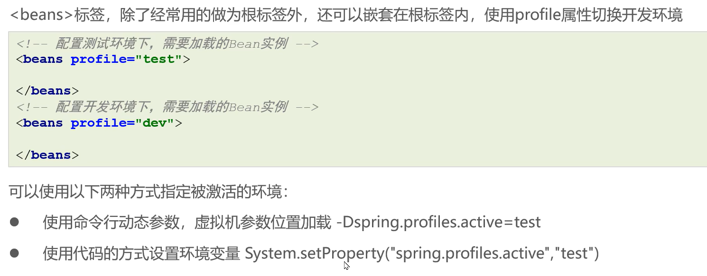
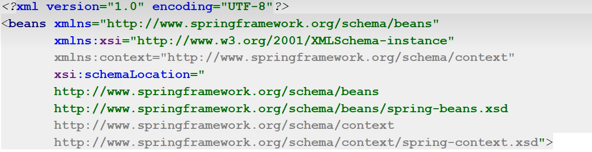
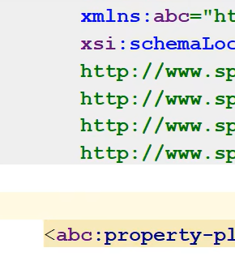
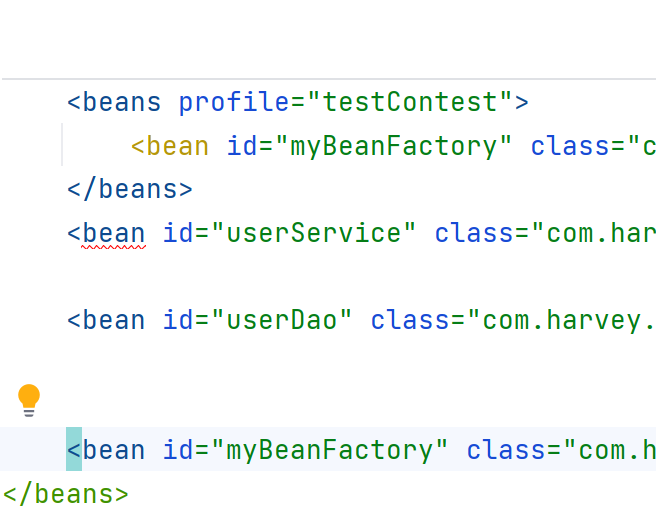

# 命名空间

## Spring的xml的标签

-   分为两类
    -   默认标签
    -   自定义标签


### 默认标签

>   不用导入其他命名约束的标签 ,如\<bean\>标签




#### \<beans\>创造环境

>   beans可以嵌套beans



-   指定环境

```java
//指定环境
System.setProperty("spring.profiles.active","testContest");
```

####


```java
//指定环境
System.setProperty("spring.profiles.active","testContest");

{...}

UserService userService = (UserService) beanFactory.getBean("myBeanFactory");
TestLogger.LOGGER.info("userService成功创建"+userService);
UserService userService2 = (UserService) beanFactory.getBean("userService");
TestLogger.LOGGER.info("userService2成功创建"+userService2);
```

-   公共的部分和指定的环境都生效


#### \<import\>导入其它配置文件

-   到时候配置文件有很多,读取配置文件的时候,读每一个就很离谱

```java
reader.loadBeanDefinitions("beans.xml");
```

-   可以把配置文件放到一个主配置文件里面,只要加载主配置文件就可以了


-   这么写就可以啦,当然要排在\<beans\>之前了啦

```xml
<import resource="smallBeans.xml"/>
```


#### \<alias\>取别名

```xml
<alias name="userDao" alias="UserDao"/>
```


### 自定义标签

>   引入其他命名空间约束,并通过前缀引用的标签



-   解释一下这个**context**:

    -   一言以蔽之,是自己取的别名,所以:

        

        abc也没事

        但是,约定俗成是context
    
-   "http://www.springframework.org/schema/beans"←这是虚拟网址,指向的是jar包

```xml
<beans xmlns="http://www.springframework.org/schema/beans"
       xmlns:xsi="http://www.w3.org/2001/XMLSchema-instance"
       xmlns:context="http://www.springframework.org/schema/context"
       xsi:schemaLocation=
               "http://www.springframework.org/schema/beans
                http://www.springframework.org/schema/beans/spring-beans.xsd
                http://www.springframework.org/schema/context
                http://www.springframework.org/schema/context/spring-beans.xsd">
    <context:property-placeholder></context:property-placeholder>
```



-   这样报错

## 引入第三方命名空间

看看自定义标签


1.  配置maven依赖

2.  写个虚拟网址(网址是啥百度)

    ```xml
    <beans xmlns="http://www.springframework.org/schema/beans"
           xmlns:xsi="http://www.w3.org/2001/XMLSchema-instance"
           xmlns:第三方名="第三方的虚拟网址"
           xsi:schemaLocation=
                   "http://www.springframework.org/schema/beans
                    http://www.springframework.org/schema/beans/spring-beans.xsd
                    第三方的虚拟网址">
        <第三方名:第三方的标签/>
    ```

    

